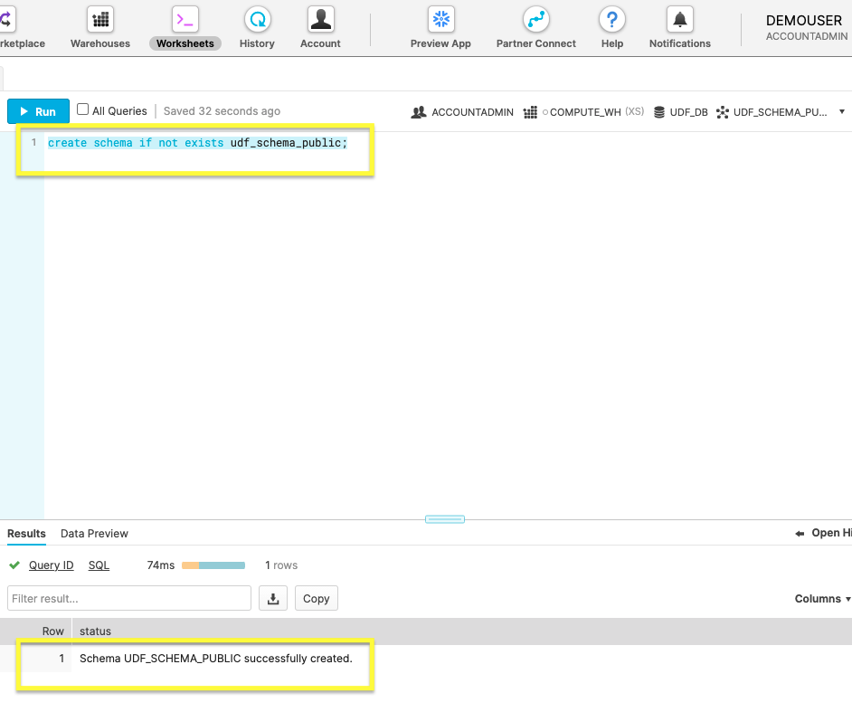
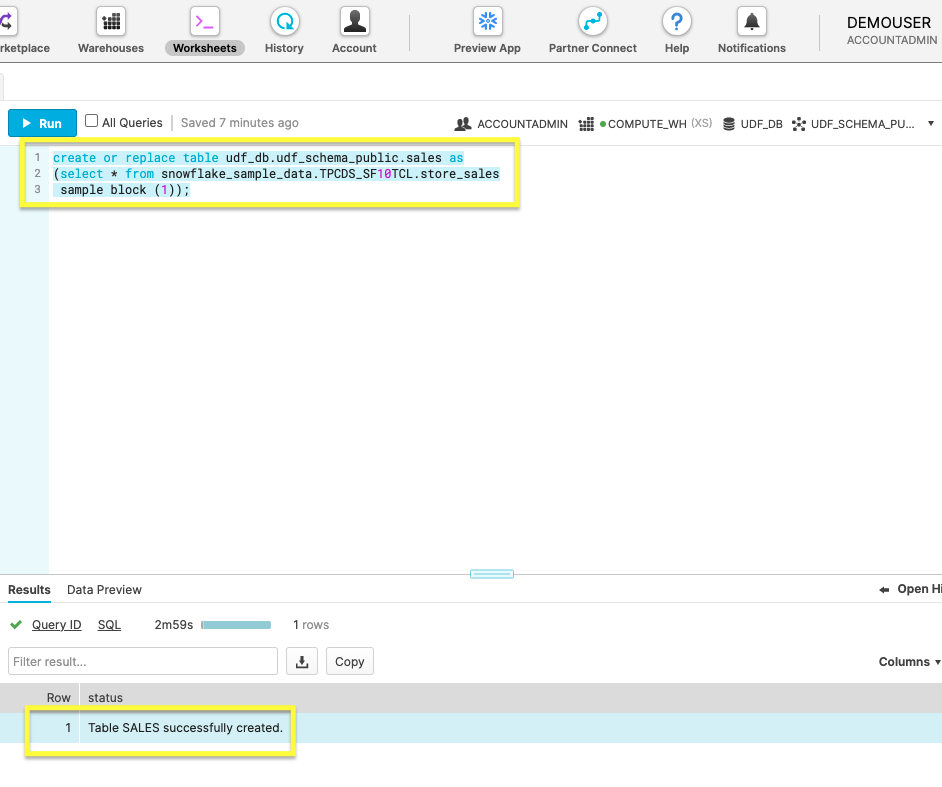
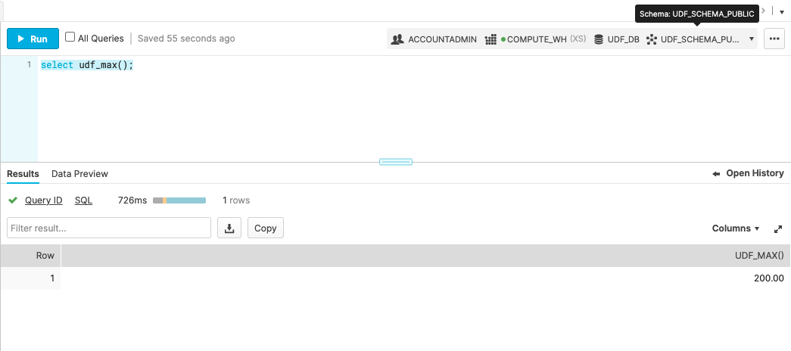
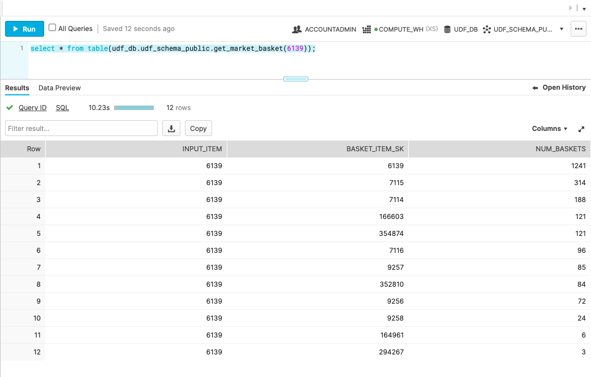

summary: Guide to getting started with user-defined functions
Id: Getting_Started_With_User-Defined_Functions
categories: getting-started, sql
environments: Web
status: Draft
feedback link: https://github.com/Snowflake-Labs/devlabs/issues
tags: Getting Started, SQL

# Getting Started With User-Defined Functions

## Overview

Duration: 0:05:00

Sometimes the built-in system functions don't offer answers to the specific questions your organization has. Custom functions are necessary when managing and analyzing data. Snowflake provides a way to make diverse functions on the fly with user-defined functions.

This guide will walk you through getting set up with Snowflake and becoming familiar with creating and executing user-defined functions(UDFs) and user-defined table functions(UDTFs).

Review the material below and start with the essentials in the following section.

### Prerequisites

- Quick Video [Introduction to Snowflake](https://www.youtube.com/watch?v=fEtoYweBNQ4&ab_channel=SnowflakeInc.)

### What You’ll Learn

- Snowflake account and user permissions
- Make database objects
- Query with a user-defined scalar function
- Query with a user-defined table function
- Delete database objects
- Review secure user-defined function

### What You’ll Need

- [Snowflake](https://signup.snowflake.com/) Account

### What You’ll Build

- Database objects and user-defined functions to query those objects.

<!-- ------------------------ -->

## Begin With the Basics

Duration: 0:05:00

First, we'll go over how to create your Snowflake account and manage user permissions.

1.  Create a Snowflake Account

Snowflake lets you try out their services for free with a [trial account](https://signup.snowflake.com/). Follow the prompts to activate your account via email.

2.  Access Snowflake’s Web Console

`https://<account-name>.snowflakecomputing.com/console/login`

Log in to the [web interface](https://docs.snowflake.com/en/user-guide/connecting.html#logging-in-using-the-web-interface) from your browser. The URL contains your [account name](https://docs.snowflake.com/en/user-guide/connecting.html#your-snowflake-account-name) and potentially the region.

3.  Increase Your Account Permission


Switch the account role from the default <code>SYSADMIN</code> to <code>ACCOUNTADMIN</code>.

With your new account created and the role configured, you're ready to begin creating database objects in the following section.

<!-- ------------------------ -->

## Generate Database Objects

Duration: 0:10:00

With your Snowflake account at your fingertips, it's time to create the database objects.

Within the Snowflake web console, navigate to **Worksheets** and use a fresh worksheet to run the following commands.

1. **Create Database**

```SQL
create or replace database udf_db;
```

Build your new database named `udf_db` with the command above.


The **Results** displays a status message of `Database UDF_DB successfully created` if all went as planned.

2. **Make Schema**

```SQL
create schema if not exists udf_schema_public;
```

Use the above command to whip up a schema called ‘udf_schema_public.



The **Results** show a status message of `Schema UDF_SCHEMA_PUBLIC successfully created`.

3. **Copy Sample Data Into New Table**

```SQL
create or replace table udf_db.udf_schema_public.sales as
(select * from snowflake_sample_data.TPCDS_SF10TCL.store_sales
 sample block (1));
```

Create a table named ‘sales’ and import the sales data with this command. Bear in mind, importing the sample data will take a longer time to execute than the previous steps.



The **Results** will display a status of `Table SALES successfully created` if the sample data and table made it.

With the necessary database objects created, it’s time to move onto the main course of working with a UDF in the next section.

<!-- ------------------------ -->

## Execute Scalar User-Defined Function

Duration: 0:10:00

With the database primed with sample sales data, we're _almost_ ready to try creating a scalar UDF. Before diving in, let’s first understand more about UDF naming conventions.

If the function name doesn't specify the database and schema(e.x. `udf_db.udf_schema_public.udf_name`) then it defaults to the active session. Since UDFs are database objects, it's better to follow their [naming conventions](https://docs.snowflake.com/en/sql-reference/udf-overview.html#naming-conventions-for-udfs). For this quick practice, we'll rely on our active session.

1. **Create UDF**

```SQL
create function udf_max()
  returns NUMBER(7,2)
  as
  $$
    select max(SS_LIST_PRICE) from udf_db.udf_schema_public.sales
  $$
  ;
```

The [SQL function](https://docs.snowflake.com/en/sql-reference/functions/min.html#min-max) `max` returns the highest value in the column `SS_LIST_PRICE`.


The image shows the successful creation of the function `udf_max`.

2. **Call the UDF**

```SQL
select udf_max();
```

Summon your new UDF with the [SQL command](https://docs.snowflake.com/en/sql-reference/sql/select.html) `select`.



Pictured above is the returned **Results**.

Now that you've practiced the basics of creating a UDF, we'll kick it up a notch in the next section by creating a UDF that returns a new table.

<!-- ------------------------ -->

## Query With User-Defined Table Function

Duration: 0:10:00

After creating a successful scalar UDF, move onto making a function that returns a table with a UDTF(user-defined table function).

1. **Create a UDTF**

```SQL
create or replace function
udf_db.udf_schema_public.get_market_basket(input_item_sk number(38))
returns table (input_item NUMBER(38,0), basket_item_sk NUMBER(38,0),
num_baskets NUMBER(38,0))
as
 'select input_item_sk, ss_item_sk basket_Item, count(distinct
ss_ticket_number) baskets
from udf_db.udf_schema_public.sales
where ss_ticket_number in (select ss_ticket_number from udf_db.udf_schema_public.sales where ss_item_sk = input_item_sk)
group by ss_item_sk
order by 3 desc, 2';
```

The code snippet above creates a function that returns a table with a market basket analysis.


2. **Run the UDTF**

```SQL
select * from table(udf_db.udf_schema_public.get_market_basket(6139));
```

Just like for the scalar UDF, this will execute your function.



Returned is the market basket analysis table based on the sample sales data.

You've practiced making UDTFs and have become familiar with UDFs. In the last section, we'll delete our unneeded database objects.

<!-- ------------------------ -->

## Cleanup

Duration: 0:05:00

We've covered a lot of ground! Before we wrap-up, drop the practice database objects created in this guide.

1. **Drop Table**

```SQL
drop table if exists sales;
```

Begin by dropping the child object before dropping parent database objects. Use the command above to start by removing the table.


Ensure you've successfully dropped the table in the **Results** section.

2. **Drop Schema**

```SQL
drop schema if exists udf_schema_public;
```

The command above drops the schema `udf_schema_public`.


The **Results** return should display `UDF_SCHEMA_PUBLIC successfully dropped`.

3. **Drop Database**

```SQL
drop database if exists udf_db;
```

Complete the process by dropping the parent object `udf_db`.


Verify the database is entirely gone by checking the **Results** for `UDF_DB successfully dropped`.

<!-- ------------------------ -->

## Conclusion and Next Steps

Duration: 0:05:00

You have a good handle on UDFs by practicing both scalar and table functions. With our database objects cleared, it's time to look ahead.

Consider the potential in a sharable and [secure](https://docs.snowflake.com/en/sql-reference/udf-secure.html#secure-udfs) user-defined function. You can learn how to share user-defined functions, such as the market basket analysis table, following this post about [the power of secure UDFs](https://www.snowflake.com/blog/the-power-of-secure-user-defined-functions-for-protecting-shared-data/).

### What we've covered

- Registered a Snowflake account
- Configured role permissions
- Produced database objects
- Queried with a custom UDF
- Composed a table to analyze data with a UDTF
- Eliminated database objects
