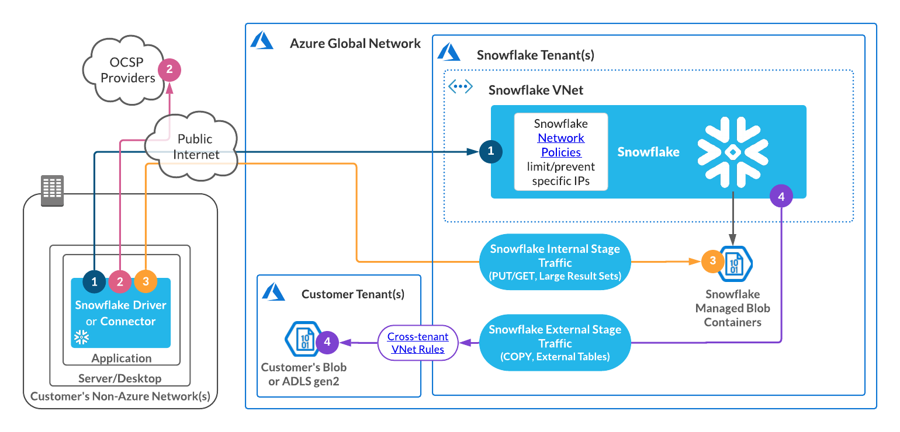
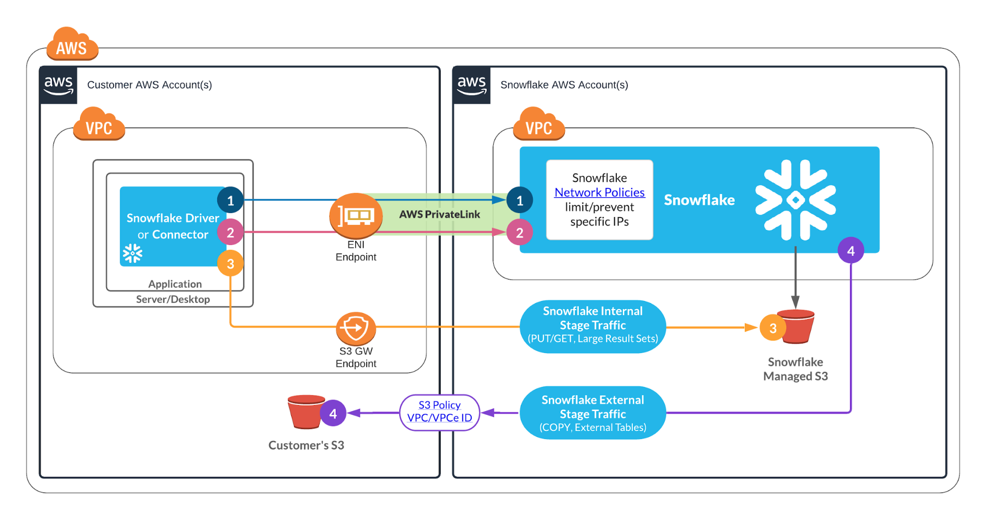

summary: Security - Network Architecture Pattern
id: security_network_architecture_pattern
categories: patterns
tags: patterns, security, network
status: Published

# Security - Network Architecture Pattern

## INTENDED AUDIENCE

This document is for Enterprise and Solution Architects who want to
understand the connectivity capabilities and best practices of Snowflake
and Snowflake Partner technologies. This document is
not intended for use by implementation teams, although an
implementation example is provided. 

## PATTERN SUMMARY

SaaS-style cloud data platforms present a number of network
connectivity challenges. This is especially true with regards to
security. In the past, traditional data platforms lived in the deepest,
 most interior parts of the organization's networks and benefited from
layered security defenses that built up over time. With data workloads
migrating to the cloud, architects have had to rethink data security.
"Zero Trust" security models are popular for applications, but are they
the right choice to protect the data itself? Understandably, architects
are wary.

This document seeks to allay Enterprise and Solution Architects'
concerns. In the following pages, we present connectivity patterns that
architects can combine as needed to address different security
requirements.

Three security measures comprise these connectivity patterns. These
include:

1.  **Leveraging Snowflake's out-of-the-box network security**. All
    Snowflake communications have multiple layers of built-in security
    (described below). This is the default,
    "do-nothing-extra" security option, which is the most common
    choice among Snowflake customers.
2.  **Layering on built-in Network Policies**. In addition to
    out-of-the-box security, security-sensitive organizations typically
    implement Network Policies to specify which IP addresses can connect
    to the Snowflake data platform. 
3.  **Integrating CSP capabilities that may add more security to network
    connectivity**. A smaller number of organizations choose to
    use cloud service provider features such as private networking if
    they determine it's appropriate. 

Alone or in combination, these measures comprise network connectivity
patterns that are extremely secure.

## WHEN TO USE 

Consider patterns that incorporate Network Policies or private
networking if any of the following requirements describe your
organization: 

1.  Your organization requires SaaS and other cloud platforms to
    restrict communications to only your organization's authorized
    networks
2.  Your organization is bound by third-party regulatory guidance to
    only allow specific kinds of ingress and egress communications with
    cloud providers 
3.  Your organization wants to run sensitive workloads that require
    more stringent security controls that include controls specific to
    networking
4.  Your organization is bound by legal or contractual agreements that
    require specific network controls 

If your organization does not [have one or more of these
requirements, then the out-of-the-box Snowflake network security
controls are likely more than sufficient to meet your needs. 

## PATTERN DETAILS

All Snowflake network connectivity architectures include five basic
connections:

1.  The connection between the Snowflake driver/connector and
    the Snowflake account URL, e.g. `acme.us-east-1.snowflakecomputing.com`
    
2.  The connection between the Snowflake driver/connector and one or
    more OCSP providers, e.g. `ocsp.digicert.com`

3.  The connection between the Snowflake driver/connector and the
    Snowflake Internal Stage,
    e.g. `randomname1stg.blob.core.windows.net`
4.  The connection between the Snowflake service and the customer-owned
    cloud storage e.g. a customer's GCS bucket
5.  The connection between the users' browsers and the Snowflake Apps
    layer e.g. `apps.snowflake.com`

This document describes the first three connections in detail. The
first and fifth connections are functionally equivalent in this context.
A full discussion of the fourth connection, which is connectivity from
Snowflake to your organization's resources, will be covered in a
separate article.

There are two types of data flowing on these network paths: 

-   The first is the organization's data (aka customer data[),
    which is the information the organization is interested in
    protecting. 
-   The second is OCSP (Online Certificate Status Protocol)
    information, which is used to validate certificates used to
    establish TLS 1.2 tunnels for network communications. Only the OCSP
    traffic uses an unencrypted channel over port 80. There are patterns
    where your organization may use TLS inspection of some kind, which
    may make this OCSP communication moot, but those discussions are out
    of scope for this document.

The first and most common pattern is to leverage Snowflake's
out-of-the-box connectivity. This uses TLS 1.2 encryption for all
customer data communications. It also leverages OCSP checking to ensure
the validity and integrity of the certificates being used for
establishing the TLS tunnels. In Figure 1, you see a diagram showing
connections 1, 2, 3, and 4. (As 4 and 5 are out of scope, we will focus
on parts 1, 2, and 3.)

 
 Figure 1. Diagram of Snowflake's out-of-the-box network
 connectivity. Azure is shown, but the pattern is the same for AWS,
 Azure, and GCP. The only thing that changes are the CSP component
 names.

A common misconception is that connectivity to the Snowflake Internal
Stage is optional, but it's not. However, using an External Stage,
which leverages the customer's cloud storage for use with Snowflake,
is optional. (The External Stage connection is labeled as number four
in Figure 1). There is no action needed to use this pattern of
communication other than to not actively block any aspect of the
connectivity. 

The second pattern is to  add Snowflake Network Policies to the
out-of-the-box connectivity shown in Figure 1. The full scope of options
for [Network Policies is discussed at length in the Snowflake
documentation(https://docs.snowflake.com/en/user-guide/network-policies.html&sa=D&ust=1608660555636000&usg=AOvVaw0fln45ribJ65YZRAZd3B09).
For this discussion we will only note a few details that could affect
architectural considerations:

1.  Network Policies use IP CIDR ranges as inputs, and contain both
    Allow
2.  One can apply a Network Policy to the entire Snowflake account, to
    specific integrations that have endpoints for network communications 
    exposed on channel 1 e.g.
    [SCIM](https://docs.snowflake.com/en/user-guide/scim-okta.html%23managing-scim-network-policies&sa=D&ust=1608660555637000&usg=AOvVaw0TwE5tPJz7HWyKKAhghe7X),
    or to specific Snowflake Users. The most specific Policy always
    wins. 
3.  There can be only one active Network Policy in any given context at
    one time (e.g. only one per account, integration, or
    user).

The third pattern incorporates integration with Cloud Service Provider
(CSP) private networking options. Right now the integrations available
are with [AWS
PrivateLink](https://docs.snowflake.com/en/user-guide/admin-security-privatelink.html&sa=D&ust=1608660555637000&usg=AOvVaw3DS8Sw1mfTxXHH-mQUUDkj) and
[Azure Private
Link](https://docs.snowflake.com/en/user-guide/privatelink-azure.html&sa=D&ust=1608660555637000&usg=AOvVaw0xFGBgO9lxih6LxWZYi60m).
These offerings from the CSPs offer a point-to-point, client-side
initiated private network channel for communications. They do not have
the downsides of VPN or peering, but still offer a point-to-point
network channel. Figure 2 offers a view of how this alters the
connectivity. 

Figure 2. Diagram showing Snowflake network connectivity integrated
with CSP private networking. AWS is shown, but the pattern is the same
for Azure and GCP. The only thing that changes are the CSP component
names.

Figure 2 shifts the origin of communication from a network outside the
CSP to one inside the CSP, but it is also possible to accomplish this
integration if communicating from outside the CSP network
(e.g. from on premises). This uses more network components to
form a connection between the organization's network and the CSP's
(e.g. [AWS Direct Connect and BGP settings), but those components
are not Snowflake specific and therefore out of scope for this
discussion. 

From a technical point of view, the communications happening for parts
1, 2, and 3 of the Snowflake network pattern do not change in the
PrivateLink integration pictured in Figure 2. What changes is that the
Snowflake driver or connector is told to connect to a privately hosted
DNS address in the CSP infrastructure, which then points to a private
endpoint in the organization's CSP private network. The Snowflake
driver or connector is making an altered DNS call because the settings
tell it to, and then everything that follows is the normal functioning
of DNS and routing. The Snowflake driver or connector is unaware of all
the DNS and routing work, and therefore there is full support for this
in all of the platforms for which Snowflake has drivers or connectors.

## PATTERN EXAMPLE

Let's look at a real world example of how a customer applied all of
these approaches in the same deployment. This customer is in the
pharmaceutical industry and had many different workloads on Snowflake,
and, as a result, many different users consuming data from the platform.
The main challenge the customer had to overcome was simultaneously
meeting the needs of the many employees they had in the field using
reports and other ad hoc information, with the highly regulated
information that was being loaded, unloaded, and used in complicated
server-side analytics in order to produce the data users would consume.
The core of the challenge was serving the users without forcing them to
use cumbersome VPN connections or other client-side infrastructure to
get their laptops and other devices onto the private networks where the
CSP private networking integrations would live. 

The solution was to set up multiple paths to the Snowflake Data
Platform that would be used in different conditions. The key insight was
when the architects involved realized that the users who were outside
the corporate networks were never handling sensitive information in an
unmasked form. Since the real information---and therefore the real
risk---was not being exposed, the out-of-the-box Snowflake networking
protections more than met the customer's minimum network security
policies for non-protected information. Most of their users were able to
use default networking for consuming reports and other information in
the field. 

Where there was data loading, unloading, and large scale analytics going
on that did handle sensitive information in its unmasked form, the
organization leveraged two extra controls in combination. First, they
used Snowflake built-in Network Policies to lock down all the service
account users doing this work so that they could only communicate from
their cloud private networks where all the processing was taking place.
Second, they integrated these communications with their CSP's private
networking features to ensure that the channels were all point-to-point
and client-side initiated. 

Certain users had access that straddled the barrier between information
in its masked and unmasked forms. The most challenging was the growing
number of data scientists this organization was supporting. These users
would design models and do engineering on masked data, but then do large
scale training and apply their work using unmasked data. Because they
needed to move between two network contexts, they would use their
personal accounts with the same network connectivity as all other users
in the field. But they also had to access service accounts that were
restricted to running server-side using CSP private-networking
integrated networking. To access these accounts, they used VPN
connectivity to connect to systems running in their CSP private
networks. Other users that also needed both sets of access used similar
approaches.

## GUIDANCE 

### MISAPPLICATIONS TO AVOID 

1.  Any design where a Network Policy is being used for every user
    is likely on the wrong path based on all evidence at the time
    of this writing. 
2.  Many organisations will attempt to apply CSP private networking
    technologies to many communication channels where it provides little
    additional security, but does add a lot of operational overhead.
    Consider CSP private networking only where large volumes of data or
    extremely sensitive data is flowing.

### INCOMPATIBILITIES

1.  At the time of this writing, SAML-based SSO can only be used
    on either public URL or private URL (for CSP private networking
    integration) Snowflake endpoints at one time. This will be addressed
    in future releases.

## RELATED RESOURCES

- Snowflake community posts
 - [Setup Considerations When Integrating AWS PrivateLink with Snowflake](https://community.snowflake.com/s/article/Setup-Considerations-When-Integrating-AW S-PrivateLink-With-Snowflake&sa=D&ust=1608660555642000&usg=AOvVaw0 KBxtnlWlRTigNdRvsnmvH) 
 - [HOWTO: Troubleshoot PrivateLink Configuration for Snowflake](https://community.snowflake.com/s/article/HowTo-Troubleshoot-Privatelink-configuration-for-Snowflake&sa=D&ust=1608660555642000&usg=AOvVaw09an1usJu4boVLW6RZrJlg)
 - [HOWTO: Block a Specific IP in Snowflake](https://community.snowflake.com/s/article/How-to-block-a-specific-IP-address-using-Network-Policies-in-Snowflake&sa=D& ust=1608660555643000&usg=AOvVaw1d HDpoNWSqD-DvHmrdyOUL)
- Snowflake documentation
 - [Snowflake Network Policies](https://docs.snowflake.com/en/user-guide/network-policies.html&sa=D&ust=1608660555644000&usg=AOvVaw1HnlcIB716s1iY2eSwmLN1)
 - [Applying Network Policy to a specific SCIM integration](https://docs.snowflake.com/en/user-guide/scim-okta.html%23managing-scim-network-policies&sa=D&ust=1608660555645000&usg=AOvVaw1KoDtqquPq5rdvXiPIp)
   - e.g. [Okta in this case](https://docs.snowflake.com/en/user-guide/scim-okta.html%23managing-scim-network-policies&sa=D&ust=1608660555645000) 
 - [Snowflake AWS PrivateLink Integration](https://docs.snowflake.com/en/user-guide/network-policies.html&sa=D&ust=1608660555646000&usg=AOvVaw31CecZFXzAuqdn_LfXd82e) 
 - [Snowflake Azure Private Link Integration](https://docs.snowflake.com/en/user-guide/privatelink-azure.html&sa=D&ust=1608660555647000&usg=AOvVaw0tSUK-gnAAZU5cRcaTYVm3) 
 - [Summary of Snowflake Security Features](https://docs.snowflake.com/en/user-guide/admin-security.html&sa=D&ust=1608660555647000&usg=AOvVaw2BYQEouQULFaVQwAYCpL6y)
- Partner documentation 
 - [AWS PrivateLink Product Page](https://aws.amazon.com/privatelink/&sa=D&ust=1608660555648000&usg=AOvVaw16Wgd1tOdpAgnOMU3hiYII) 
 - [AWS PrivateLink Documentation](https://docs.aws.amazon.com/vpc/latest/userguide/what-is-amazon-vpc.html%23what-is-privatelink&sa=D&ust=1608660555649000&usg=AOvVaw1Q1lpnr0FYZf_X3kHthIya)
 - [Azure Private Link Product Page](https://azure.microsoft.com/en-us/services/private-link/&sa=D&ust=1608660555649000&usg=AOvVaw1xbD4uzi6A3RCbUYZ0KBiK)
 - [Azure Private Link Documentation](https://docs.microsoft.com/en-us/azure/private-link/private-link-overview&sa=D&ust=1608660555650000&usg=AOvVaw2BGDTLXGqLToQI-Svcljfh)
