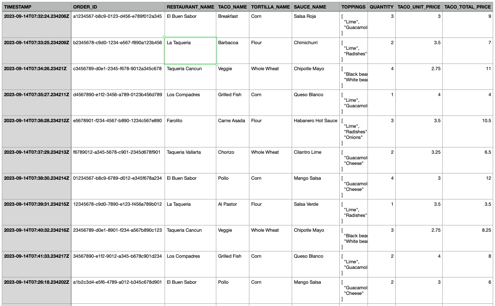
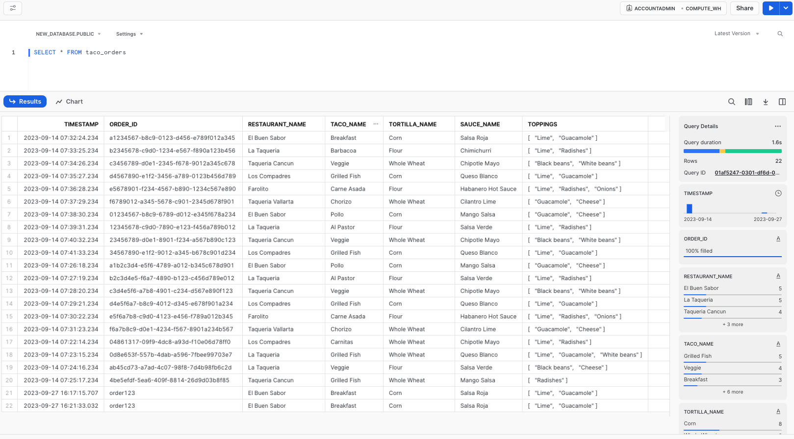

author: YK
id: a_comprehensive_guide_creating_graphql_api_on_top_of_snowflake_using_propel
summary: This guide teaches how to create a GraphQL API using Propel on Snowflake, focusing on setup, configuration, and development of a high-performance API.
categories: Getting-Started
environments: web
status: Published 
feedback link: https://github.com/Snowflake-Labs/sfguides/issues
tags: Getting Started, Data Science, Data Engineering, Twitter 

# A Comprehensive Guide: Creating GraphQL API on Top of Snowflake Using Propel

## **Introduction**

In this guide, we focus on using [Propel](https://www.propeldata.com/) to create a GraphQL API on top of Snowflake. While there are other methods to interface with Snowflake—such as Snowflake's REST API and language-specific connectors—this guide will concentrate on the Propel method. For a broader understanding of all three methods, refer to the comprehensive guide on Snowflake Medium: [Snowflake API: Comprehensive Guide to 3 Methods With Examples](https://medium.com/snowflake/snowflake-api-comprehensive-guide-to-3-methods-with-examples-c633f4eb35e1).

### **Overview of Using Propel**

Propel offers a seamless way to create fast, efficient GraphQL APIs over your Snowflake data. This method is particularly advantageous for scenarios demanding low latency and high concurrency, such as customer-facing analytics dashboards.

If you prefer a video overview, feel free to take a look at our interview with Snowflake's Daniel Myers on Snowflake's YouTube channel: [Using Propel To Accelerate The Process Of Creating Analytics For Web And Mobile Applications](https://www.youtube.com/watch?v=AO87CZOK7Ko).

### **Prerequisites**

- Basic understanding of Snowflake and GraphQL
- Access to Snowflake instance
- [A Propel account](https://console.propeldata.com/get-started/)

### **What You’ll Learn**

- Setting up data in Snowflake for Propel integration
- Configuring Propel to work with Snowflake
- Creating and testing GraphQL APIs on top of your Snowflake data

### **What You’ll Build**

- A low-latency, high-concurrency GraphQL API on top of Snowflake using Propel

Let's proceed.


<!-- ------------------------ -->
## **Setting Up Example Data (Optional)**

### **Overview**

This section provides a step-by-step guide to setting up example data in Snowflake. This step is optional, and if you already have data in Snowflake, you can use that for this tutorial.

### **Why Example Data?**

Setting up example data can be particularly useful for understanding how to integrate and manipulate data when creating a GraphQL API using Propel. It provides a practical example to work with, ensuring you can effectively follow the steps in this guide.

### **Example Data Description**

The example data simulates taco orders from various restaurants, with details like timestamp, restaurant name, taco type, toppings, and total price.



### **Setting Up Example Data**

Follow these steps to set up your example data:

1. **Create the Table:**
Run this SQL query in Snowflake to create a **`taco_orders`** table:
    
```sql
CREATE TABLE taco_orders (
    TIMESTAMP TIMESTAMP_NTZ,
    ORDER_ID STRING,
    RESTAURANT_NAME STRING,
    TACO_NAME STRING,
    TORTILLA_NAME STRING,
    SAUCE_NAME STRING,
    TOPPINGS VARIANT,
    QUANTITY INTEGER,
    TACO_UNIT_PRICE FLOAT,
    TACO_TOTAL_PRICE FLOAT
);
```
    
2. **Insert Sample Data:**
Execute this query to insert sample data into the **`taco_orders`** table:
    
```sql
INSERT INTO taco_orders 
(TIMESTAMP, ORDER_ID, RESTAURANT_NAME, TACO_NAME, TORTILLA_NAME, SAUCE_NAME, TOPPINGS, QUANTITY, TACO_UNIT_PRICE, TACO_TOTAL_PRICE) 
SELECT '2023-09-14T07:32:24.234208Z', 'a1234567-b8c9-0123-d456-e789f012a345', 'El Buen Sabor', 'Breakfast', 'Corn', 'Salsa Roja', ARRAY_CONSTRUCT('Lime', 'Guacamole'), 3, 3, 9 UNION ALL
SELECT '2023-09-14T07:33:25.234209Z', 'b2345678-c9d0-1234-e567-f890a123b456', 'La Taqueria', 'Barbacoa', 'Flour', 'Chimichurri', ARRAY_CONSTRUCT('Lime', 'Radishes'), 2, 3.5, 7 UNION ALL
SELECT '2023-09-14T07:34:26.234210Z', 'c3456789-d0e1-2345-f678-9012a345c678', 'Taqueria Cancun', 'Veggie', 'Whole Wheat', 'Chipotle Mayo', ARRAY_CONSTRUCT('Black beans', 'White beans'), 4, 2.75, 11 UNION ALL
SELECT '2023-09-14T07:35:27.234211Z', 'd4567890-e1f2-3456-a789-0123b456d789', 'Los Compadres', 'Grilled Fish', 'Corn', 'Queso Blanco', ARRAY_CONSTRUCT('Lime', 'Guacamole'), 1, 4, 4 UNION ALL
SELECT '2023-09-14T07:36:28.234212Z', 'e5678901-f234-4567-b890-1234c567e890', 'Farolito', 'Carne Asada', 'Flour', 'Habanero Hot Sauce', ARRAY_CONSTRUCT('Lime', 'Radishes', 'Onions'), 3, 3.5, 10.5 UNION ALL
SELECT '2023-09-14T07:37:29.234213Z', 'f6789012-a345-5678-c901-2345d678f901', 'Taqueria Vallarta', 'Chorizo', 'Whole Wheat', 'Cilantro Lime', ARRAY_CONSTRUCT('Guacamole', 'Cheese'), 2, 3.25, 6.5 UNION ALL
SELECT '2023-09-14T07:38:30.234214Z', '01234567-b8c9-6789-d012-e345f678a234', 'El Buen Sabor', 'Pollo', 'Corn', 'Mango Salsa', ARRAY_CONSTRUCT('Guacamole', 'Cheese'), 4, 3, 12 UNION ALL
SELECT '2023-09-14T07:39:31.234215Z', '12345678-c9d0-7890-e123-f456a789b012', 'La Taqueria', 'Al Pastor', 'Flour', 'Salsa Verde', ARRAY_CONSTRUCT('Lime', 'Radishes'), 1, 3.5, 3.5 UNION ALL
SELECT '2023-09-14T07:40:32.234216Z', '23456789-d0e1-8901-f234-a567b890c123', 'Taqueria Cancun', 'Veggie', 'Whole Wheat', 'Chipotle Mayo', ARRAY_CONSTRUCT('Black beans', 'White beans'), 3, 2.75, 8.25 UNION ALL
SELECT '2023-09-14T07:41:33.234217Z', '34567890-e1f2-9012-a345-b678c901d234', 'Los Compadres', 'Grilled Fish', 'Corn', 'Queso Blanco', ARRAY_CONSTRUCT('Lime', 'Guacamole'), 2, 4, 8 UNION ALL
SELECT '2023-09-14T07:26:18.234202Z', 'a1b2c3d4-e5f6-4789-a012-b345c678d901', 'El Buen Sabor', 'Pollo', 'Corn', 'Mango Salsa', ARRAY_CONSTRUCT('Guacamole', 'Cheese'), 2, 3, 6 UNION ALL
SELECT '2023-09-14T07:27:19.234203Z', 'b2c3d4e5-f6a7-4890-b123-c456d789e012', 'La Taqueria', 'Al Pastor', 'Flour', 'Salsa Verde', ARRAY_CONSTRUCT('Lime', 'Radishes'), 4, 3.5, 14 UNION ALL
SELECT '2023-09-14T07:28:20.234204Z', 'c3d4e5f6-a7b8-4901-c234-d567e890f123', 'Taqueria Cancun', 'Veggie', 'Whole Wheat', 'Chipotle Mayo', ARRAY_CONSTRUCT('Black beans', 'White beans'), 3, 2.75, 8.25 UNION ALL
SELECT '2023-09-14T07:29:21.234205Z', 'd4e5f6a7-b8c9-4012-d345-e678f901a234', 'Los Compadres', 'Grilled Fish', 'Corn', 'Queso Blanco', ARRAY_CONSTRUCT('Lime', 'Guacamole'), 1, 4, 4 UNION ALL
SELECT '2023-09-14T07:30:22.234206Z', 'e5f6a7b8-c9d0-4123-e456-f789a012b345', 'Farolito', 'Carne Asada', 'Flour', 'Habanero Hot Sauce', ARRAY_CONSTRUCT('Lime', 'Radishes', 'Onions'), 2, 3.5, 7 UNION ALL
SELECT '2023-09-14T07:31:23.234207Z', 'f6a7b8c9-d0e1-4234-f567-8901a234b567', 'Taqueria Vallarta', 'Chorizo', 'Whole Wheat', 'Cilantro Lime', ARRAY_CONSTRUCT('Guacamole', 'Cheese'), 4, 3.25, 13 UNION ALL
SELECT '2023-09-14T07:22:14.234198Z', '04861317-09f9-4dc8-a93d-f10e06d78ff0', 'Los Compadres', 'Carnitas', 'Whole Wheat', 'Chipotle Mayo', ARRAY_CONSTRUCT('Lime', 'Radishes'), 3, 3.25, 9.75 UNION ALL
SELECT '2023-09-14T07:23:15.234199Z', '0d8e653f-557b-4dab-a596-7fbee99703e7', 'La Taqueria', 'Grilled Fish', 'Whole Wheat', 'Queso Blanco', ARRAY_CONSTRUCT('Lime', 'Guacamole', 'White beans'), 4, 4, 16 UNION ALL
SELECT '2023-09-14T07:24:16.234200Z', 'ab45cd73-a7ad-4c07-98f8-7d4b98fb6c2d', 'La Taqueria', 'Veggie', 'Flour', 'Salsa Verde', ARRAY_CONSTRUCT('Black beans', 'Cheese'), 1, 2.75, 2.75 UNION ALL
SELECT '2023-09-14T07:25:17.234201Z', '4be5efdf-5ea6-409f-8814-26d9d03b8f85', 'Taqueria Cancun', 'Grilled Fish', 'Whole Wheat', 'Mango Salsa', ARRAY_CONSTRUCT('Radishes'), 4, 4, 16;
```
    
3. **Verify Data Insertion:**
To check the data, execute:
    
```sql
SELECT * FROM taco_orders;
```

This query will display the data you've inserted like this:


### **Using Your Own Data**

If you already have data in Snowflake, you can proceed with that data for the rest of this tutorial.

### **Next Steps**

With your data ready, either the example data or your own, you can move on to configuring Propel for creating your GraphQL API.

<!-- ------------------------ -->
## **Using Propel: Overview and Setup**

### **Introduction to Propel**

In this part of the guide, we'll explore using [Propel](https://www.propeldata.com/), an analytics platform with a semantic layer, to create a high-performance GraphQL API over your Snowflake data.

### **Advantages of Using Propel**

Propel offers significant benefits for handling Snowflake data in a GraphQL API:

1. **Low Latency:** With a separate caching and storage system, Propel significantly speeds up analytics data querying, typically achieving millisecond response times.
2. **High Concurrency:** The serverless architecture of Propel enables scaling to handle a virtually unlimited number of concurrent users or requests.
3. **Better Timezone Handling:** Propel simplifies the process of querying and serving data in different timezones, a crucial feature for global applications.
4. **Organized Code:** Propel reduces the complexity of managing multiple SQL queries, making multi-tenant use cases more manageable.

### **Ideal Use Cases**

Propel is particularly useful in scenarios demanding low latency and high concurrency, such as customer-facing analytics dashboards.

### **Setting Up Propel with Example Data**

To utilize Propel with the example taco order data:

1. **Confirm Data Setup:**
Ensure you have the example data by running: 
```sql
SELECT * FROM taco_orders;    
```
in the correct database and schema. This verifies that the example data has been properly created.


    
2. **Enable Change Tracking:**
Before setting up Propel, enable CHANGE_TRACKING on your **`taco_orders`** table (or your own table) with this query:
```sql
ALTER TABLE TACO_ORDERS SET CHANGE_TRACKING = TRUE;
```

### **Next Steps**

With your data setup confirmed and change tracking enabled, you're now ready to dive into configuring Propel to work with your Snowflake data.

<!-- ------------------------ -->
## Code Snippets, Info Boxes, and Tables
Duration: 2

Look at the [markdown source for this sfguide](https://raw.githubusercontent.com/Snowflake-Labs/sfguides/master/site/sfguides/sample.md) to see how to use markdown to generate code snippets, info boxes, and download buttons. 

### JavaScript
```javascript
{ 
  key1: "string", 
  key2: integer,
  key3: "string"
}
```

### Java
```java
for (statement 1; statement 2; statement 3) {
  // code block to be executed
}
```

### Info Boxes
> aside positive
> 
>  This will appear in a positive info box.


> aside negative
> 
>  This will appear in a negative info box.

### Buttons
<button>

  [This is a download button](link.com)
</button>

### Tables
<table>
    <thead>
        <tr>
            <th colspan="2"> **The table header** </th>
        </tr>
    </thead>
    <tbody>
        <tr>
            <td>The table body</td>
            <td>with two columns</td>
        </tr>
    </tbody>
</table>

### Hyperlinking
[Youtube - Halsey Playlists](https://www.youtube.com/user/iamhalsey/playlists)

<!-- ------------------------ -->
## Images, Videos, and Surveys, and iFrames
Duration: 2

Look at the [markdown source for this guide](https://raw.githubusercontent.com/Snowflake-Labs/sfguides/master/site/sfguides/sample.md) to see how to use markdown to generate these elements. 

### Images


### Videos
Videos from youtube can be directly embedded:
<video id="KmeiFXrZucE"></video>

### Inline Surveys
<form>
  <name>How do you rate yourself as a user of Snowflake?</name>
  <input type="radio" value="Beginner">
  <input type="radio" value="Intermediate">
  <input type="radio" value="Advanced">
</form>

### Embed an iframe


<!-- ------------------------ -->
## Conclusion
Duration: 1

At the end of your Snowflake Guide, always have a clear call to action (CTA). This CTA could be a link to the docs pages, links to videos on youtube, a GitHub repo link, etc. 

If you want to learn more about Snowflake Guide formatting, checkout the official documentation here: [Formatting Guide](https://github.com/googlecodelabs/tools/blob/master/FORMAT-GUIDE.md)

### What we've covered
- creating steps and setting duration
- adding code snippets
- embedding images, videos, and surveys
- importing other markdown files