summary: Getting Started With External Functions on AWS
id: getting_started_external_functions_aws
categories: Getting Started
status: Draft
Feedback Link: https://github.com/Snowflake-Labs/sfguides/issues
tags: Getting Started, SQL, Data Engineering, AWS, External Functions

# Getting Started With External Functions on AWS
<!-- ------------------------ -->
## Overview
Duration: 1

Snowflake's external functions feature allows you to create SQL functions that securely invoke externally implemented HTTPS endpoints. This means your functions can be implemented in any language and use any libraries. Using your functions with your data in Snowflake gives you quite a few options for processing your data. Using external functions, you can easily extend your data pipelines by calling out to external services, third-party libraries, or even your own custom logic, enabling exciting new use cases. Here are just a few of the examples you can use external functions for;

* external tokenization,
* geocoding,
* scoring data using pre-trained machine learning models,
* and much more!

This tutorial will walk you through the process of translating messages in a Snowflake table from English to Italian. You'll do so by using external functions to call an external library through AWS API Gateway.

### Prerequisites

- Some familiarity with AWS.

### What You'll Learn

- how to create a Lambda Function on AWS
- how to create an IAM role for Snowflake use
- how to create an AWS API Gateway
- how to secure an AWS API Gateway
- how to create an API Integration in Snowflake
- how to set up a trust relationship between Snowflake and IAM role
- how to create an external function in Snowflake
- how to call an external function

### What You'll Need

- An account with AWS, including privileges to:

- - Create AWS roles via IAM (identity and access management).
  - Create AWS Lambda functions.
  - Create an API Gateway endpoint.

- A Snowflake account in which you have `ACCOUNTADMIN` privileges or a role with the `CREATE INTEGRATION` privilege.

As you progress through the tutorial, you'll want to record the following information as you acquire them, so copy this list to a text editor:

Cloud Platform (IAM) Account Id:

Lambda Function Name:

New IAM Role Name:

Cloud Platform (IAM) Role ARN:

Proxy Service Resource Name:

Resource Invocation URL:

Method Request ARN:

API_AWS_IAM_USER_ARN:

API_AWS_EXTERNAL_ID:

### What You'll Build

- An example of using external functions to call an AWS Translate library to translate messages in Snowflake for English to Italian.

<!-- ------------------------ -->
## Creating a Lambda Function on AWS
Duration: 10

First, let's create a remote service implemented as a Python function executing in AWS Lambda. We'll be using a function written in Python that invokes the Amazon Translate API provided by Boto AWS SDK to return the Italian translation for a given input text string.

It accepts data in the same format that Snowflake sends and returns data in the same format that Snowflake reads.

First, you'll need to log in to [AWS Management Console](https://aws.amazon.com/console/). The first piece of information you'll need to record is your cloud platform account ID.

Follow these steps to grab your ID:

1. Go to your user in the upper right corner of AWS and click the drop-down and select My Account.
2. Under Account Settings, you'll see "Account ID,” note this above in" Cloud Platform (IAM) Account Id."


Once you have that written down, you need to create an AWS Lambda. To begin, go to the AWS main console,  then search and select Lambda.

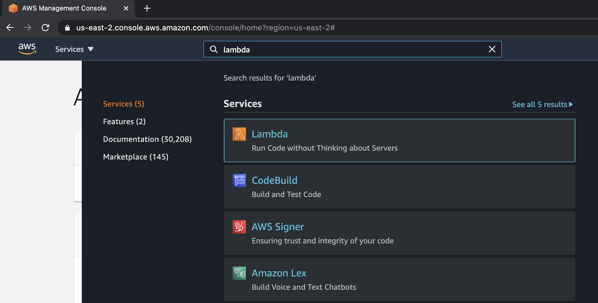

 Now that you're on the AWS Lambda Function page click the "Create Function" button on the top right corner.

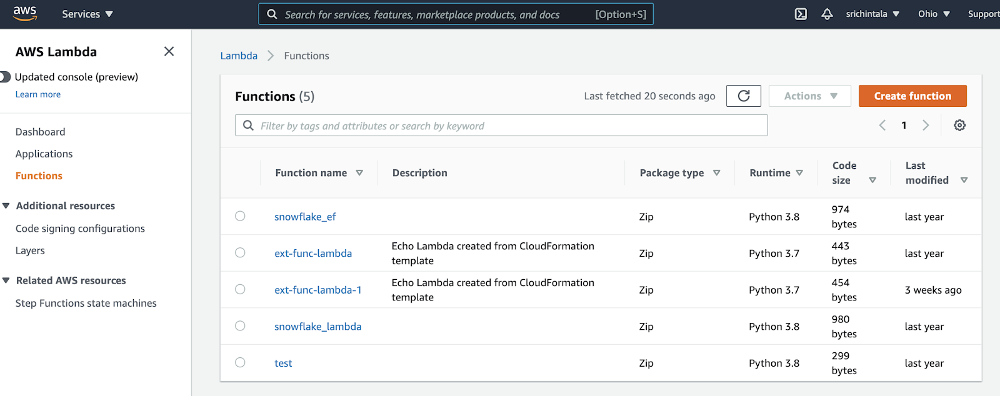

You should create the function with the following selected parameters:

* Select the default option: "Author from scratch"
* Give your Lambda a name. Record this name in the template on the line labeled "Lambda Function Name." We'll be using the name "translate_eng_italian".
* Select the language to use. For this example, choose Python 3.8.
* Expand "Choose or create an execution role" and select "Create a new role with basic Lambda permissions."

*Note that the role you are creating here is separate from both your cloud account role and your Snowflake role(s).*


After setting those parameters, click "Create Function." Creating a function will direct you to the following view:

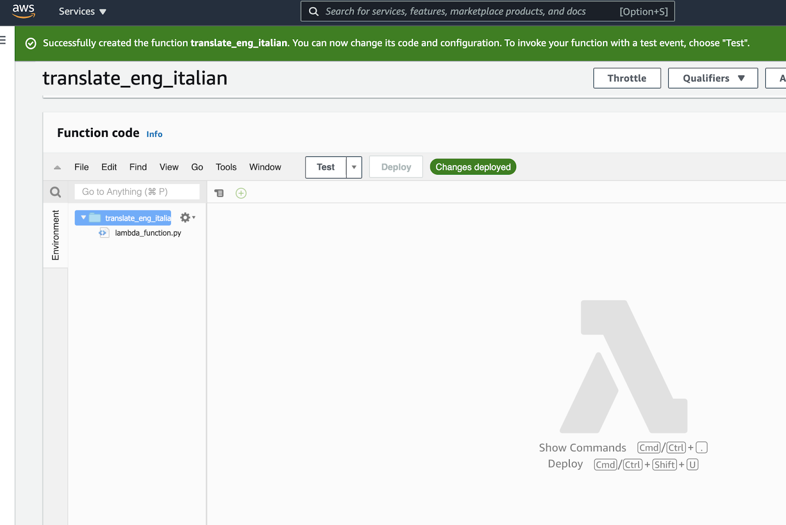

Within the folder named after your function, you should see a `lambda_function.py` file. Clicking on the file will open an editor. This is where you can write the code for your lambda function. Delete any existing code and paste the following python code into your lambda body:

```python
import json
import boto3

translate = boto3.client('translate')

def lambda_handler(event, context):

    # 200 is the HTTP status code for "ok".
    status_code = 200
    
    # The return value will contain an array of arrays (one inner array per input row).
    translated = [ ]
    
    try:
        # From the input parameter named "event", get the body, which contains
        # the input rows.
        event_body = event["body"]
    
        # Convert the input from a JSON string into a JSON object.
        payload = json.loads(event_body)
        
        # This is basically an array of arrays. The inner array contains the
        # row number, and a value for each parameter passed to the function.
        rows = payload["data"]
    
        # For each input row in the JSON object...
        for row in rows:
            translated_text = translate.translate_text(
            Text = row[1],
            SourceLanguageCode = 'en',
            TargetLanguageCode = 'it')["TranslatedText"]
            translated.append([row[0], translated_text])
    
        json_compatible_string_to_return = json.dumps({"data" : translated})
    
    except Exception as err:
        # 400 implies some type of error.
        status_code = 400
        # Tell caller what this function could not handle.
        json_compatible_string_to_return = event_body
    
    # Return the return value and HTTP status code.
    return {
        'statusCode': status_code,
        'body': json_compatible_string_to_return
    }
```

Once you've done so, simply click "Deploy."

The next step is to attach the required policies that will allow your Lambda Functions to call Amazon Translate.

From the "Permissions" tab, select the displayed execution role. This will open a new IAM tab.

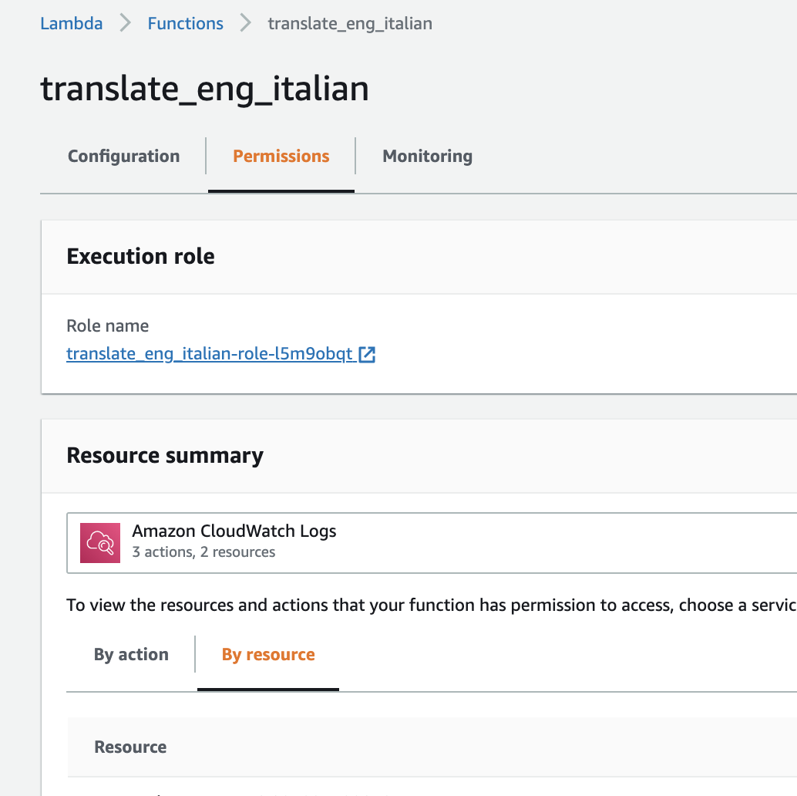

From the IAM tab, click on "Attach Policies."

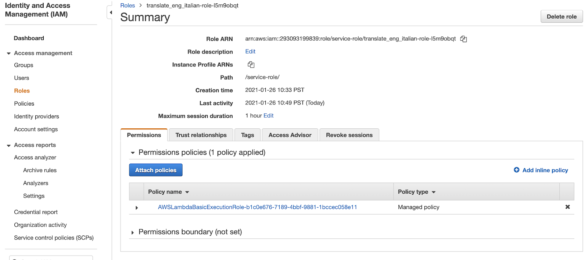

You'll be directed to a searchable list. Search for and select the "TranslateFullAccess" policy. Then, attach it by clicking "Attach Policy." This should successfully add the policy to the Lambda role.

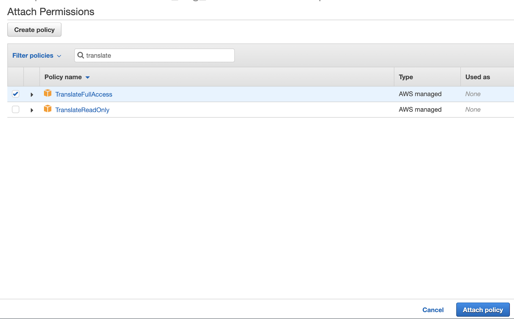

Now let's test your function!

To do so, first, go back to the Configuration tab in your Lambda console. Click the "Test" drop-down and select "Configure test events".

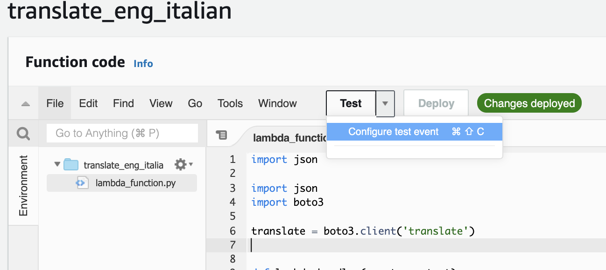  

You'll need to set up the parameters as such:

* Leave the "event template" as "hello-world".
* Give it a name, for example: "test".
* Replace any default data with the following test data.

```python
{
  "body": "{ \"data\": [ [ 0,  \"hello\" ], [ 1, \"how are you\" ] ] }"
}
```

  

Then click "create". Once you're back in the function console, click "Test". You should get results like this:


If everything has worked correctly, you now have an AWS Lambda function that you can use as the remote service for your external function!

<!-- ------------------------ -->
## Creating an IAM role for Snowflake use
Duration: 5

Now let's begin integrating it with Snowflake. First, go to the AWS main console. Search for and select IAM.


Then, click "Roles" on the left & click "Create role."


From the "Create role" view, set the following parameters:

* Choose "Another AWS account" when asked to select the type of trusted entity.
* Reference your template to past your Cloud Platform Account ID into the "Account ID" field under "Specify accounts that can use this role."

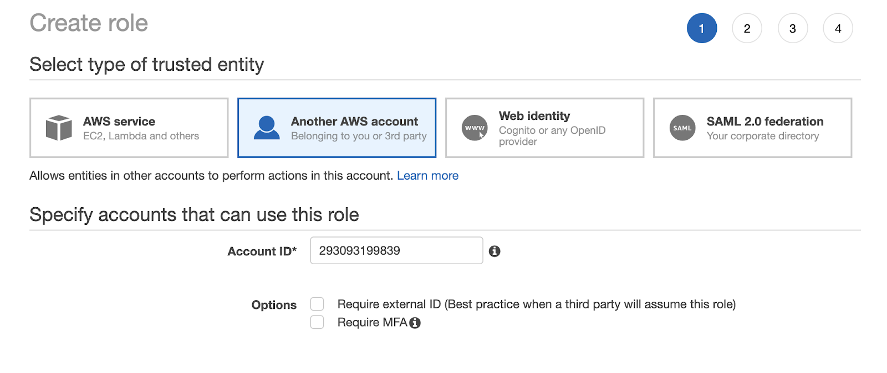

From there, click through the next steps of "Permissions" and Tags" without making any modifications.

Once you're on the "Review" view, enter a role name. We used the name "SFLambdaIAMRole." Make a note of this name in your template as "New IAM Role Name." Then, click "create role."

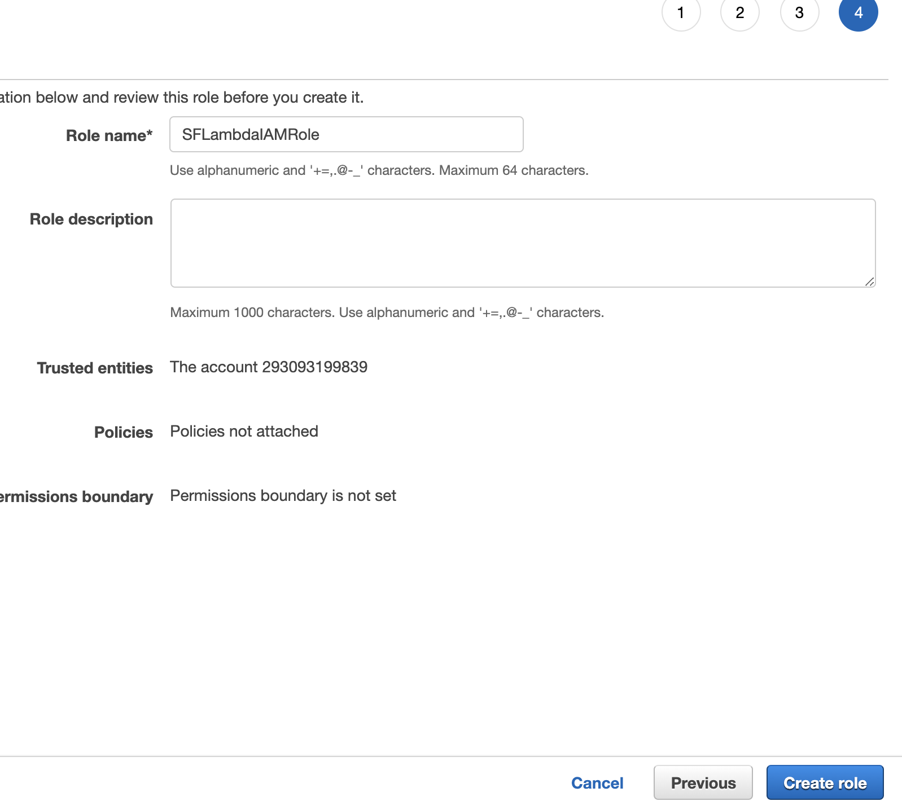

Now that y you've created the role, you'll want to record the ARN. Click on the role and record the ARN as "Cloud Platform (IAM) Role ARN" as found on your template.

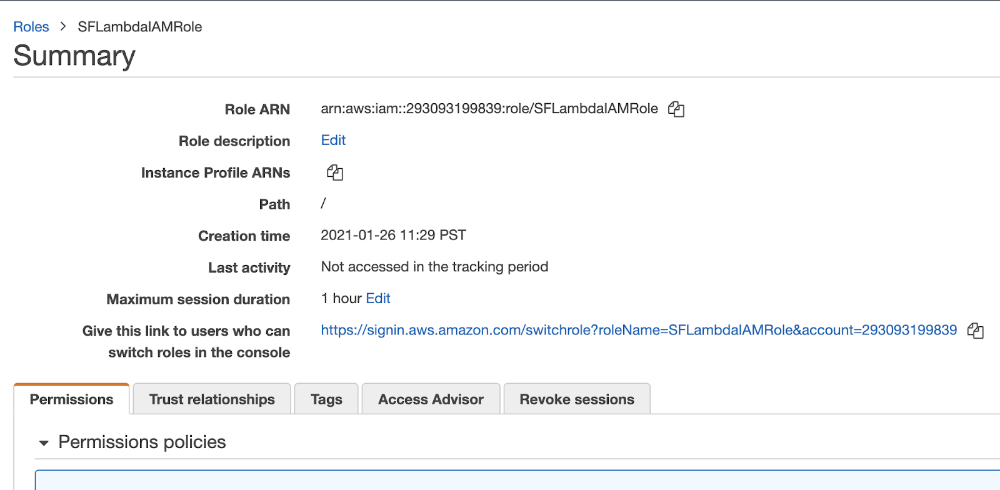

<!-- ------------------------ -->
## Creating an AWS API Gateway
Duration: 10

Now let's create an AWS API Gateway for our function. From the main AWS console, search for and select "API Gateway."


Next, you'll want to click the "Create API" button in the upper right corner.


That button will take you to a view where you will choose an API type. You'll want to select "REST API" and click on its "Build" button.


From this build page, set the parameters like so:

* Select "New API."
* Enter a name. We used "TranslateAPI."
* Make the endpoint type "Regional."

Once you do so, click "Create API."

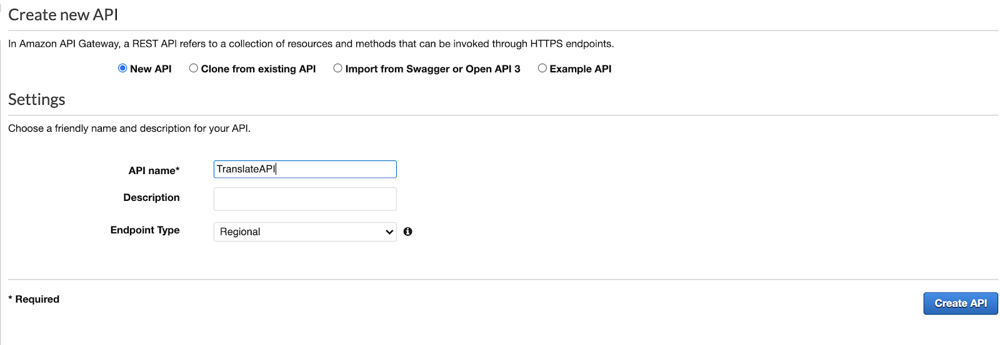

You will now be on a page that says "/Methods" at the top. From the "Actions" drop-down, select "Create Resource."

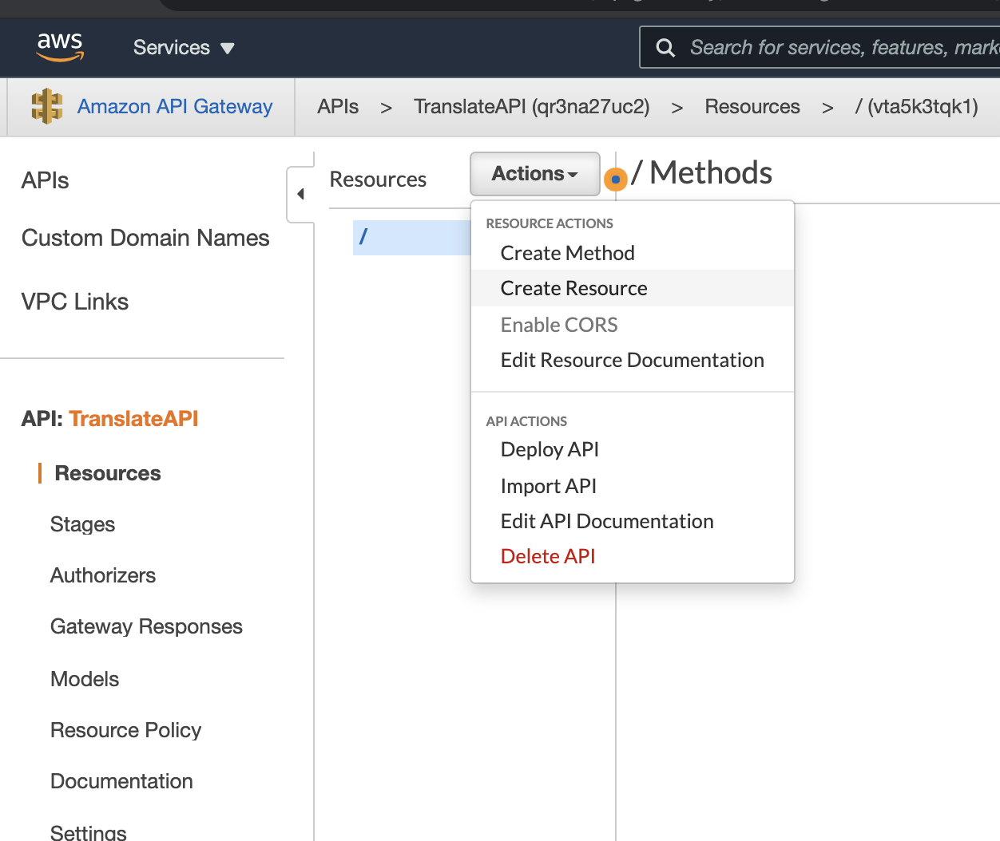

From the "New Child Resource" view, enter a name for the resource. Once you do so, record that name in your template under "Proxy Server Resource Name." Then, click "Create Resource."

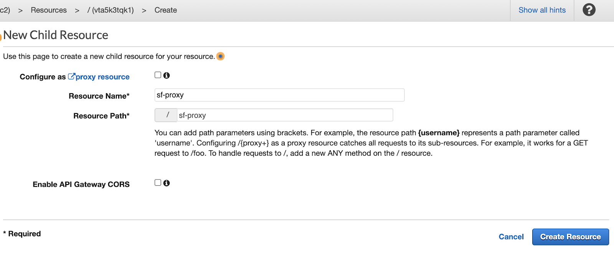

You should now be on a page where it says "/<your-proxy-server-resource-name> Methods." Click the "Actions" drop-down and select "Create Method."

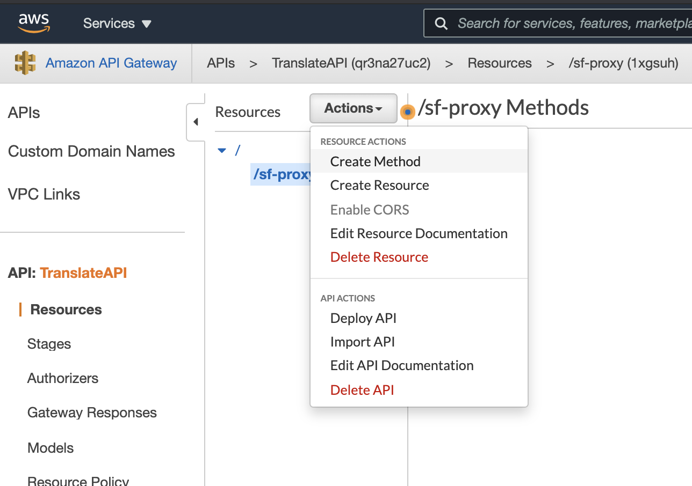

From the "Methods" view, select "POST" from the drop-down.

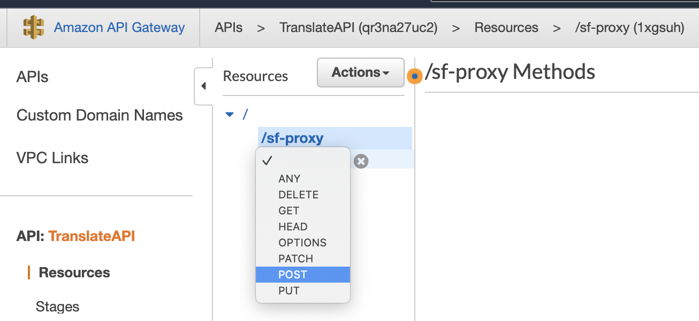

Click the check box to the right of the word "POST". Now that you're in the "POST - setup" view, set the parameters as such:

* The "Integration type" should be "Lambda Function."
* Click the checkbox "Use Lambda Proxy Integration."
* In the "Lambda Function" field, paste the Lambda Function Name that you recorded earlier in your template (ours was "translate_eng_italian")

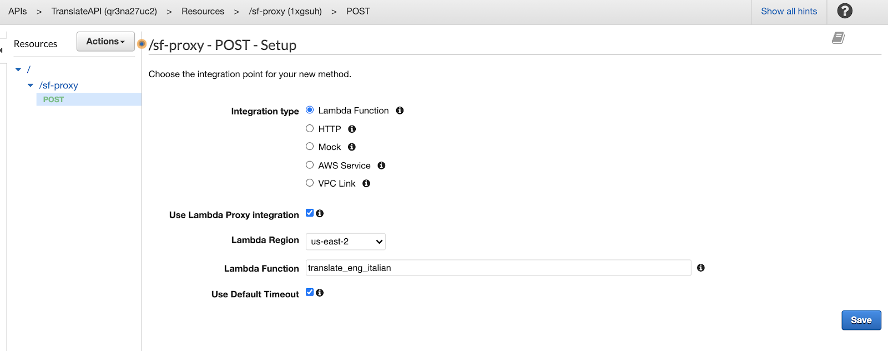

Make sure to click "Save." You might get a pop-up saying, "You are about to give API Gateway permission to invoke your Lambda function;" just press "OK."

The next step is to deploy the API. Click the Actions drop-down again and select "Deploy API."

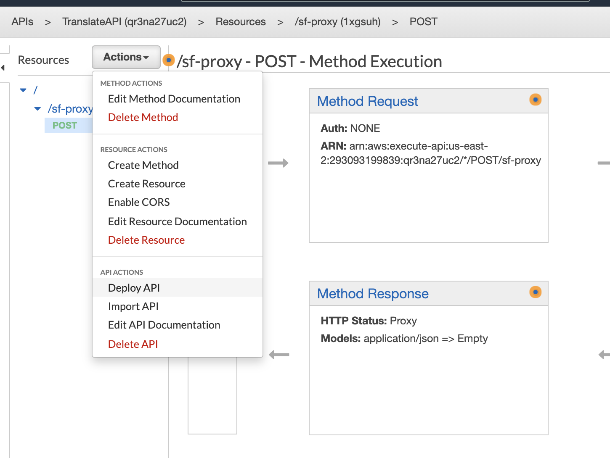

From the "Deploy API" view, set the parameters as such:

* Select "[New Stage]" in the drop-down for "Deployment stage."
* Enter a stage name. We used the name "test."

Then click the "Deploy" button.

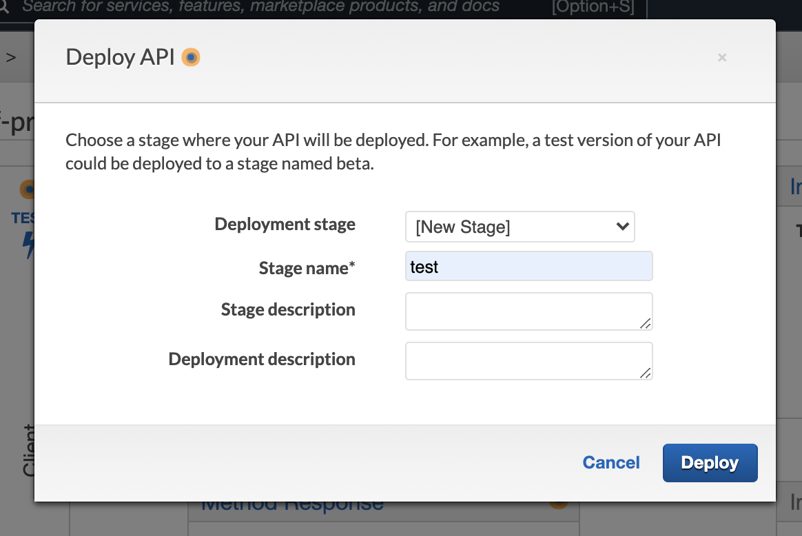

You will now be on the page "<your-stage-name> Stage editor." Under "Stages," expand until you see "POST" under your resource name.

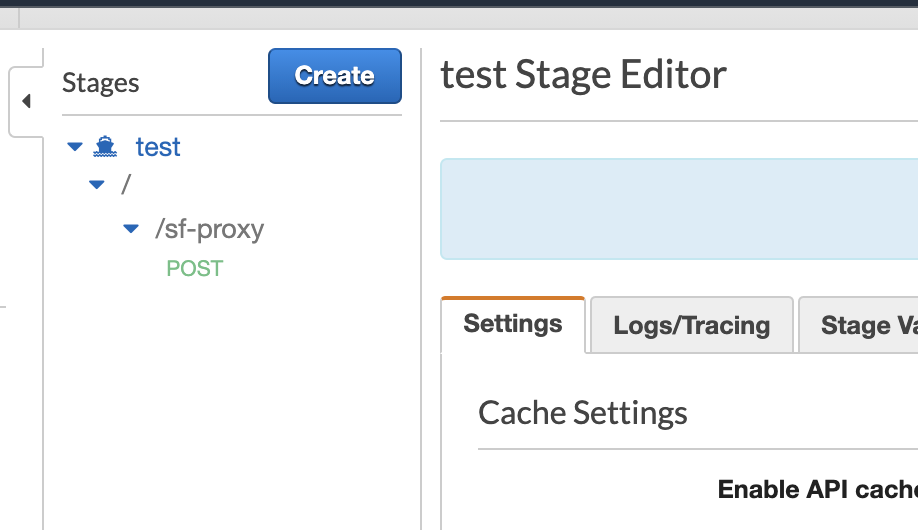

Click on "POST" and record the "Invoke URL" for the POST request as the "Resource Invocation URL" field in the template.

*Note: Make sure that the invocation URL includes the name of the resource; if it doesn't, you might have clicked on the invocation URL for the stage rather than the resource.*


We are now done creating the API Gateway!

<!-- ------------------------ -->
## Securing the AWS API Gateway Proxy
Duration: 5

Now that we have created the API Gateway, we need to secure the API Gateway so that only your Snowflake account can access it.

In the API Gateway console, go to your API POST method and click on "Method Request."


Inside the Method Request, click on the pencil symbol next to "Authorization" and choose "AWS_IAM." Click the checkmark just to the right to save.


Then, click on "Method execution." Find the ARN under "Method Request." Record it as the "Method Request ARN" in the template.

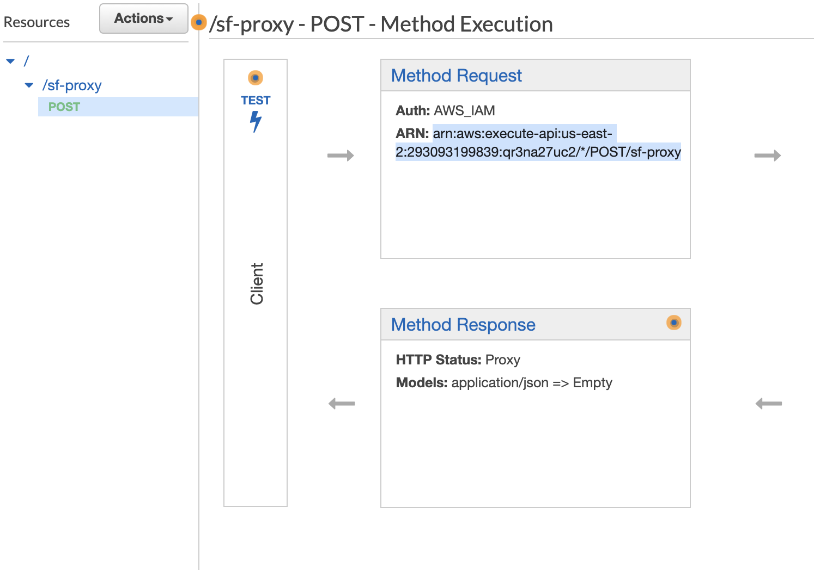

Next, go to "Resource Policy" from the right panel. You'll be setting the resource policy for the API Gateway to specify who is authorized to invoke the gateway endpoint. Once there, paste in this resource policy:

```json
{
    "Version": "2012-10-17",
    "Statement":
    [
        {
        "Effect": "Allow",
        "Principal":
            {
            "AWS": "arn:aws:sts::<12-digit-number>:assumed-role/<external_function_role>/snowflake"
            },
        "Action": "execute-api:Invoke",
        "Resource": "arn:aws:execute-api:us-west-2:123456789012:ljkfds890a/*/POST/MyResourceName"
        }
    ]
}
```
You'll need to customize a few of the parameters, however:

* Replace the `< 12-digit-number >` with your 12-digit number, "Cloud Platform (IAM) Account ID."
* Replace the `< external_function_role > `with the role name for the Cloud Platform (IAM) Role you created, which you recorded as "New IAM Role Nam.".
* In the `Resource` field, replace the resource with your "Method Request ARN."

Once you're done, click "Save."


With this taken care of, you can securely redeploy the API. Do so by clicking on "API Name," "Actions," then "Deploy API." Select the stage you created earlier and click deploy.

<!-- ------------------------ -->
## Creating an API Integration in Snowflake
Duration: 5

Now let's begin integrating that API with Snowflake! We'll be moving over to the Snowflake console, but don't close out of your AWS console just yet; you'll need to come back to it later.

First, open up a Snowflake session, typically a GUI session. You need to use a Snowflake role with `ACCOUNTADMIN` privileges or a role with the `CREATE INTEGRATION` privilege. One way to get there is to enter the following:

```sql
use role has_accountadmin_privileges;
```

Now that you have the proper privileges, type the `CREATE API INTEGRATION` command as shown, with a few user-specific edits:

```sql
create or replace api integration my_aws_api_integration
  api_provider = aws_api_gateway
  api_aws_role_arn = '< new_IAM_role_ARN >'
  api_allowed_prefixes = ('https://')
  enabled = true
;
```

Edit the command above like so:

* Replace the`< cloud_platform_role_ARN >` with your Cloud Platform (IAM) Role ARN.
* Replace the `api_allowed_prefixes` field with your resource invocation URL.

If you've been keeping track of your values properly, it should look something like this:

```sql
create or replace api integration my_aws_api_integration
api_provider=aws_api_gateway    
api_aws_role_arn='arn:aws:iam::293093199839:role/SFLambdaIAMRole'    api_allowed_prefixes=('https://qr3na27uc2.execute-api.us-east-2.amazonaws.com/test/sf-proxy')
enabled=true;
```

Execute the command, then follow it up with the following `DESCRIBE INTEGRATION` command:

```
describe integration my_aws_api_integration;
```

You'll need to jot down a few more pieces of information in your template:

* Look for the property named "API_AWS_IAM_USER_ARN" and then record that property's "property_value."
* Find the property named "API_AWS_EXTERNAL_ID" and record that property's "property_value."

*Note that the "property_value" of the "API_AWS_EXTERNAL_ID" often ends with an equal sign ("="). That equals sign is part of the value; make sure that you cut and paste it along with the rest of the "property_value."*

<!-- ------------------------ -->
## Setting up a trust relationship between Snowflake and IAM role.
Duration: 10

Now it's time to return to the AWS console using those values you grabbed from Snowflake. Don't close your Snowflake window, though; you'll have to return to it later!

From the AWS main console, search for and select IAM.

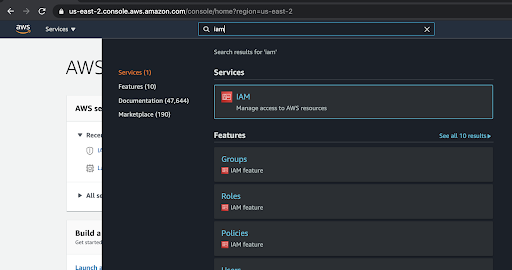

Select "Roles" and search for the New IAM Role Name that you created and recorded earlier. Select it.

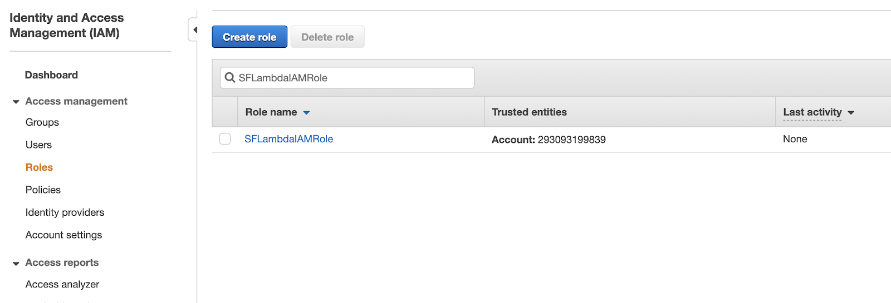

Click on the "Trust relationships" tab, then click on the button to edit the trust relationship.

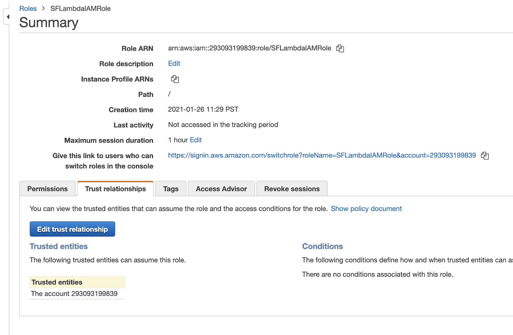

This should open the Policy Document into which you add authentication information. In the Policy Document, find the "Statement.Principal.AWS" field and replace the value (not the key) with the "API_AWS_IAM_USER_ARN" found in your template.

Find the "Statement.Condition" field. Initially, this should contain only curly braces ("{}"). Paste the following between the curly braces:

```
"StringEquals": { "sts:ExternalId": "xxx" }
```

Replace the "xxx" with the value for the "API_AWS_EXTERNAL_ID" recorded in your template.

After you are done editing the "Policy Document" for the trust relationship, it should look similar to the following:

```
{
  "Version": "2012-10-17",
  "Statement": [
    {
      "Effect": "Allow",
      "Principal": {
        "AWS": "arn:aws:iam::582086746320:user/wky2-s-demo164-"
      },
      "Action": "sts:AssumeRole",
      "Condition": {"StringEquals": { "sts:ExternalId": "DEMO164_SFCRole=2_hQJ5yTf+n9fW6cqVllzDLDdzsgw=" }}
    }
  ]
}
```

Click on "Update Trust Policy" to finish setting up the trust relationship between Snowflake and the IAM role.

<!-- ------------------------ -->
## Creating an external function in Snowflake.
Duration: 5

Now go back to the Snowflake console for creating an external function in Snowflake. Type the CREATE EXTERNAL FUNCTION command as shown, with a few customized parameters:

```sql
create external function translate_eng_italian(message string)
    returns variant
    api_integration = <api_integration_name>
    as '< invocation_url >'
    ;
```

The parameters adjustments you need to make are:

* Replace the "<api_integration_name>" with the name of your API integration
* Replace the "<invocation_url>" value with your resource invocation URL.

Once you do so, execute the "CREATE EXTERNAL FUNCTION" command.

<!-- ------------------------ -->
## Calling the external function
Duration: 5

Now it's finally almost time to call the external function!

But before we do so, we need to create a test table and insert some sample data. Paste and execute the below SQL commands in Snowflake:

```sql
create or replace table messages( msg string );
insert into messages (msg) values ('good morning'), ('hello'), ('good night');
```

Now we can call the function! Execute your translate function by calling:

```sql
select msg, translate_en_italian(msg) from messages;
```

If everything has gone smoothly, your output should look like this:

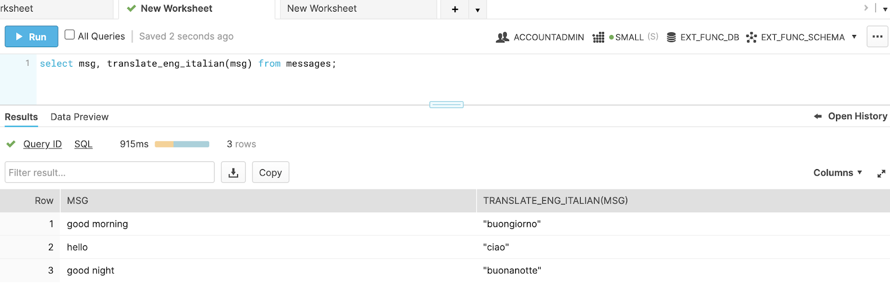

<!-- ------------------------ -->
## Conclusion & Next Steps
Duration: 1

In this tutorial, you learned how to use external functions to invoke an API via AWS API Gateway to trigger a Lambda function. The Lambda function was written in Python and invoked the Amazon Translator API to return the Italian translation for a given input text string.

This solution with external functions eliminates the need to manually export the data out of Snowflake, translate it, and then reimport it, greatly simplifying the workflow.

To see what else you can do with external functions, be sure to check out the Snowflake [Documentation](https://docs.snowflake.com/en/sql-reference/external-functions-introduction.html).