summary: ThoughtSpot 및 Snowflake로 대화형 React 앱 구축 
id: getting_started_thoughtspot_kr
categories: 시작하기
environments: 웹
status: Published
feedback link: https://github.com/Snowflake-Labs/sfguides/issues 
tags: 스노우플레이크 시작하기, 데이터 과학, 데이터 엔지니어링, Twitter
author: Thoughtspot

# ThoughtSpot 및 Snowflake로 ReactJS 앱 구축

## 개요

엄청난 양의 데이터가 매일 생성됩니다. 이 모든 데이터를 저장하고 이해하는 것이 비즈니스 성공에 중대하다는 사실은 놀랍지 않습니다. 데이터를 저장하기 위해 Snowflake는 쉬운 설정, 유지 관리 및 속도로 인해 선도적인 클라우드 데이터 플랫폼 중 하나로 부상했습니다. Snowflake와 더불어 ThoughtSpot은 강력한 AI 기반 검색과 분석 도구를 통한 쉬운 사용이라는 비슷한 개념을 따릅니다. 이 자습서에서는 ThoughtSpot를 사용하여 Snowflake와 연결하고 ThoughtSpot Everywhere 개발자 도구를 사용하여 React 기반 웹앱에 통찰력을 더하는 방법을 알려 드립니다.

이 자습서에서는 React를 사용하지만 ThoughtSpot이 제공하는 오픈 API 접근 방식 덕분에 플랫폼에 관계없이 ThoughtSpot을 모든 앱에 추가하기 위해 비슷한 기술을 사용할 수 있습니다. 확장성이 뛰어난 RESTful API 또는 SDK를 주요 프로그래밍 언어로 사용할 수도 있습니다. 선택은 여러분의 몫입니다.

### 사전 필요 조건 및 지식

- Snowflake 및 React에 대한 이해

### 학습할 내용

- Snowflake 및 ThoughtSpot 연결 방법
- ThoughtSpot을 React 앱에 추가하는 방법

### 필요한 것

- [Snowflake](https://trial.snowflake.com/) 계정
- [ThoughtSpot](https://www.thoughtspot.com/trial?utm=snowtstutorial) 계정
- 설치된 [NodeJS](https://nodejs.org/en/download/)

### 구축할 것

- Snowflake가 지원하는 ThoughtSpot Everywhere 통찰력을 포함한 React 웹앱

## 시작하기

시작하려면 Snowflake를 위한 환경 하나와 ThoughtSpot을 위한 또 다른 환경을 포함한 몇몇 클라우드 환경이 필요합니다. 다행히도 2개의 플랫폼 모두 온라인에서 등록할 수 있는 무료 평가판을 제공합니다. 이 자습서는 각 환경에서 샘플 데이터 세트를 사용합니다. 이미 기존 Snowflake 또는 ThoughtSpot 인스턴스를 보유하고 있다면 새로운 무료 평가판 인스턴스를 생성하는 것이 좋습니다.

### Snowflake 무료 평가판 등록

[Snowflake 무료 평가판 등록 페이지](https://signup.snowflake.com/?utm_source=tsquickstart)로 이동하여 필요한 세부 정보를 입력하고 Continue를 클릭합니다. 필수 단계에 따르고 활성화 링크를 위해 이메일을 확인합니다. 로그인한 후 Worksheets 아이콘을 클릭하고 + 태그를 클릭하여 새로운 워크시트를 생성합니다. 이름을 Snowflake+ThoughtSpot Tutorial로 지정합니다.

워크시트는 데이터를 얻기 위해 SQL 문을 작성할 수 있는 공간입니다. 이를 사용하여 설정을 테스트할 수 있습니다. 우선 사용하고자 하는 데이터베이스와 스키마를 선택해야 합니다. Context 드롭다운을 클릭하고 다음 값을 선택합니다.

<table>
  <tr>
   <td><strong>Warehouse</strong>
   </td>
   <td>COMPUTE_WH(XS)
   </td>
  </tr>
  <tr>
   <td><strong>Database</strong>
   </td>
   <td>SNOWFLAKE_SAMPLE_DATA
   </td>
  </tr>
  <tr>
   <td><strong>Schema</strong>
   </td>
   <td>TPCDS_SF10TCL
   </td>
  </tr>
</table>

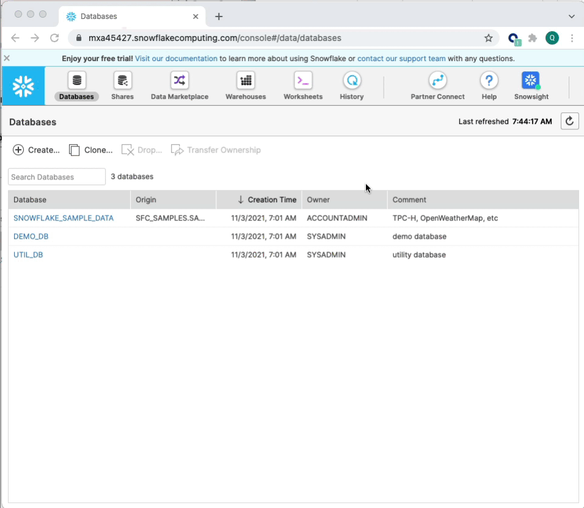

모든 것이 올바르게 구성되었는지 테스트해 보겠습니다. 쿼리 편집기 내에서 다음 문을 실행합니다. 아래에 결과가 채워져야 합니다.

```
select s_store_name, s_hours, s_Manager, s_street_number, s_street_name, s_city, s_county, s_state, s_country from store
```

끝났습니다. 여러분의 Snowflake 인스턴스를 설정했습니다. 자습서를 진행하는 동안 ThoughtSpot 내에서 이 매장 데이터를 사용하여 매출 동향을 분석하겠습니다. 다음 단계로 이동하여 ThoughtSpot을 설정하기 전에 ThoughtSpot 내에서 연결을 생성하는 데 필요할 몇 가지 구성 항목을 기록하는 것이 좋습니다. 다음 항목을 기록합니다.

<table>
  <tr>
   <td>Snowflake URL
   </td>
   <td>Snowflake 인스턴스 URL 중 <code>.snowflakecomputing</code> 바로 앞 부분입니다. 
   예:) 위 스크린샷 같은 경우 <code>mxa45427</code> 입니다.
   </td>
  </tr>
  <tr>
   <td>Username
   </td>
   <td>Snowflake 사용자 이름입니다.
   </td>
  </tr>
  <tr>
   <td>Password
   </td>
   <td>Snowflake 사용자 비밀번호입니다.
   </td>
  </tr>
  <tr>
   <td>Role
   </td>
   <td>이번 튜토리얼에서는 <code>SYSADMIN</code>을 사용합니다.
   </td>
  </tr>
  <tr>
   <td>Warehouse
   </td>
   <td>COMPUTE_WH
   </td>
  </tr>
  <tr>
   <td>Database
   </td>
   <td>SNOWFLAKE_SAMPLE_DATA
   </td>
  </tr>
  <tr>
   <td>Schema
   </td>
   <td>TPCDS_SF10TCL
   </td>
  </tr>
</table>


### ThoughtSpot 무료 평가판 등록

그런 다음 ThoughtSpot 무료 평가판에 등록하겠습니다. [등록 페이지](https://www.thoughtspot.com/trial?utm=snowtstutorial)로 이동하여 필수 필드를 채웁니다. Snowflake를 여러분의 Cloud Data Warehouse 공급자로 선택합니다. 필수는 아니지만 고객 데이터 사용량 동향을 더 잘 이해하는 데 도움이 됩니다. 이전에 이미 ThoughtSpot에 등록했지만 동일한 이메일 주소를 사용하고 싶다면 이메일 이름에 +1을 더하여 기존 이메일로 등록할 수 있습니다. 예를 들어 제 업무 이메일 주소인 [quinton.wall@acmecorp.com](mailto:quinton.wall@acmecorp.com)으로 이전에 등록했었다고 가정하겠습니다. [quinton.wall+1@acmecorp.com](mailto:quinton.wall+1@acmecorp.com)을 사용하여 등록 요구 사항을 충족하고 기존 이메일 주소로 활성화 이메일을 수신할 수 있습니다.

몇 분 안에 활성화 이메일이 수신되어야 합니다. 포함된 지침에 따라 여러분의 평가판 계정 생성을 완료하십시오.

## 연결 생성

이제 클라우드 환경 설정을 완료했으니 ThoughtSpot과 Snowflake의 연결을 생성할 시간입니다. 아직 로그인하지 않았다면 여러분의 ThoughtSpot 계정에 로그인하십시오. 상단 메뉴에서 **Data**를 선택한 다음 왼쪽 메뉴에서 **Connections**를 선택하고 **Snowflake**를 클릭합니다. 연결 이름을 `TutorialSnowStore`라고 지정하고 Continue를 클릭합니다.

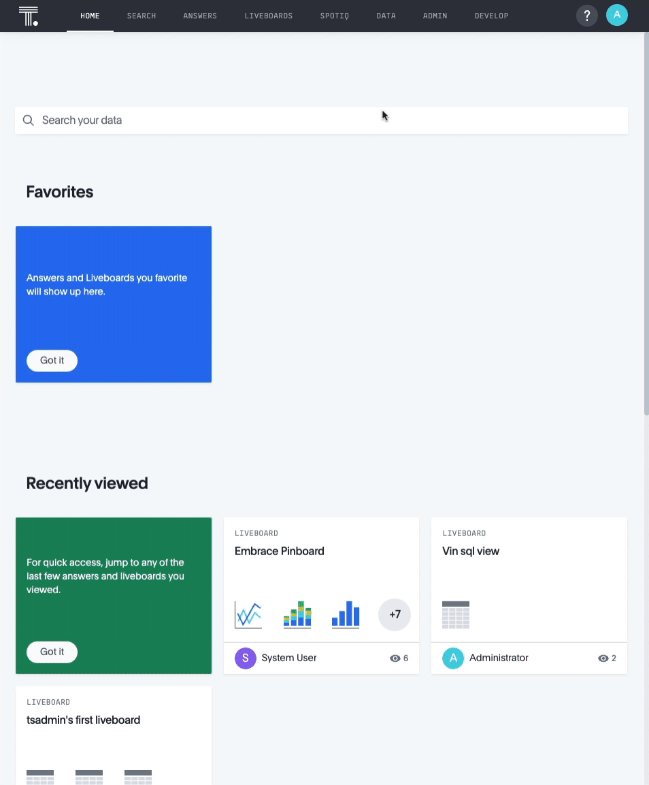

**Continue**를 클릭하면 Snowflake 연결 세부 정보 입력을 요청하는 프롬프트가 나타납니다. 이는 앞서 Snowflake Worksheet Context에서 수집했던 세부 정보입니다. 대/소문자에 주의를 기울이며 양식에 이를 복사합니다. 연결 세부 정보는 대/소문자를 구분하며 Snowflake에서 보이는 대로 나타나야 합니다. 여러분의 세부 정보를 입력했다면 **Continue**를 클릭하여, 연결하고자 하는 테이블을 선택합니다.

이 자습서에 걸쳐 store, item 및 store_sales와 같은 3개의 테이블을 사용하겠습니다. Store 및 item에는 별도의 설명이 그다지 필요하지 않습니다. 샘플 데이터베이스의 제품과 물리적 매장과 관련된 데이터를 포함합니다. Store_sales는 2가지를 합친 것입니다. 어떤 매장에서 어떤 제품이 판매되었는지에 대한 정보를 포함합니다. 데이터베이스 용어로 이는 다대다 관계입니다. 하나의 매장에서 다양한 제품을 판매할 수 있으며 제품은 다양한 매장에서 판매될 수 있습니다.

각 테이블에서 다음 필드를 매핑합니다.

<table>
  <tr>
   <td><strong>Table</strong>
   </td>
   <td><strong>Field</strong>
   </td>
  </tr>
  <tr>
   <td>Store
   </td>
   <td>s_store_sk
   </td>
  </tr>
  <tr>
   <td>Store
   </td>
   <td>s_store_id
   </td>
  </tr>
  <tr>
   <td>Store
   </td>
   <td>s_store_name
   </td>
  </tr>
  <tr>
   <td>Store
   </td>
   <td>s_hours
   </td>
  </tr>
  <tr>
   <td>Store
   </td>
   <td>s_Manager
   </td>
  </tr>
  <tr>
   <td>Store
   </td>
   <td>s_street_number
   </td>
  </tr>
  <tr>
   <td>Store
   </td>
   <td>s_street_name
   </td>
  </tr>
  <tr>
   <td>Store
   </td>
   <td>s_city
   </td>
  </tr>
  <tr>
   <td>Store
   </td>
   <td>s_county
   </td>
  </tr>
  <tr>
   <td>Store
   </td>
   <td>s_state
   </td>
  </tr>
  <tr>
   <td>Store
   </td>
   <td>s_country
   </td>
  </tr>
  <tr>
   <td>Item
   </td>
   <td>i_item_sk
   </td>
  </tr>
  <tr>
   <td>Item
   </td>
   <td>i_item_desc
   </td>
  </tr>
  <tr>
   <td>Item
   </td>
   <td>i_size
   </td>
  </tr>
  <tr>
   <td>Item
   </td>
   <td>i_color
   </td>
  </tr>
  <tr>
   <td>Item
   </td>
   <td>i_product_name
   </td>
  </tr>
  <tr>
   <td>Store_sales
   </td>
   <td>ss_item_sk
   </td>
  </tr>
  <tr>
   <td>Store_sales
   </td>
   <td>ss_quantity
   </td>
  </tr>
  <tr>
   <td>Store_sales
   </td>
   <td>ss_net_paid
   </td>
  </tr>
  <tr>
   <td>Store_sales
   </td>
   <td>ss_store_sk
   </td>
  </tr>
</table>

적절한 모든 필드를 선택했다면 Create Connection을 클릭합니다. 모든 것을 생성했는지 확인하기 위해 상단 메뉴에 있는 Data를 클릭한 다음 Connections를 클릭합니다. 아래와 같은 타일이 나타나야 합니다.


### 데이터 모델링

이제 Snowflake와의 연결을 완료했으니 데이터를 모델링할 시간입니다. ThoughtSpot에서의 데이터 모델링은 기존 데이터베이스에서 진행하는 방법과 비슷합니다. 데이터 즉 조인 간에 관계를 확립하고 사용자가 데이터를 더 쉽게 사용할 수 있도록 어떠한 뷰를 생성하고자 합니다. ThoughtSpot 내에서는 뷰를 `Worksheet`라고 부릅니다. Snowflake의 워크시트 정의와 헷갈리지 마십시오. 2가지는 서로 다릅니다. 데이터베이스에 더 익숙하다면 ThoughtSpot의 Worksheet는 데이터베이스의 구체화된 뷰와 비슷하다는 사실을 기억하십시오. 이를 생성하며 시작하겠습니다.

앞서 연결했던 테이블 중 하나는 `Store_sales`입니다. 이 접합 오브젝트에는 매장과 판매된 항목 간의 관계가 포함되어 있습니다. ThoughtSpot에 어떤 필드가 이 테이블에서 외래 키인지 알려줘야 합니다. 이를 위해 `TutorialSnowStore` 타일을 클릭하고 `Store_Sales`를 선택한 다음 탐색에서 **Joins**를 선택합니다. 2개의 조인을 생성해야 합니다. 하나의 조인에서는 `Store_Sales`와 `Sales`를 연결하고 다른 조인에서는 `Store_Sales`와 `Item`을 연결합니다. 아래 이미지와 같이 연결을 생성합니다. 카디널리티 필드 설정을 기억하십시오.

#### 조인 1: Store_Sales와 Store

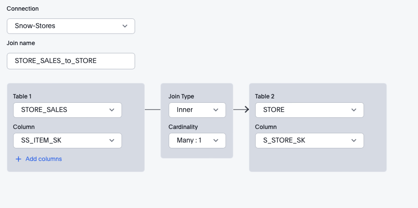

#### 조인 2: Store_Sales와 Item

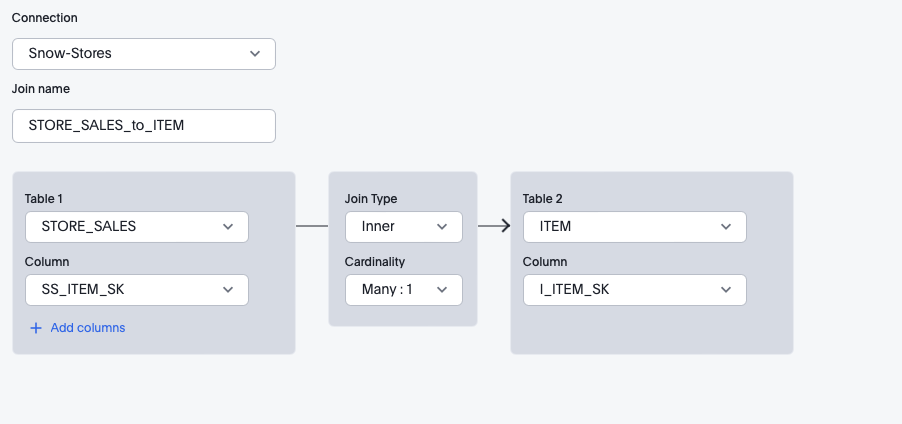

끝났다면 여러분이 참고할 수 있는 유용한 비주얼 ERD와 함께 다음과 같은 최종 구성이 나타나야 합니다. 끝났습니다. SQL 문을 작성할 필요는 없습니다. ThoughtSpot이 여러분을 위해 모든 구문과 최적화를 처리합니다.

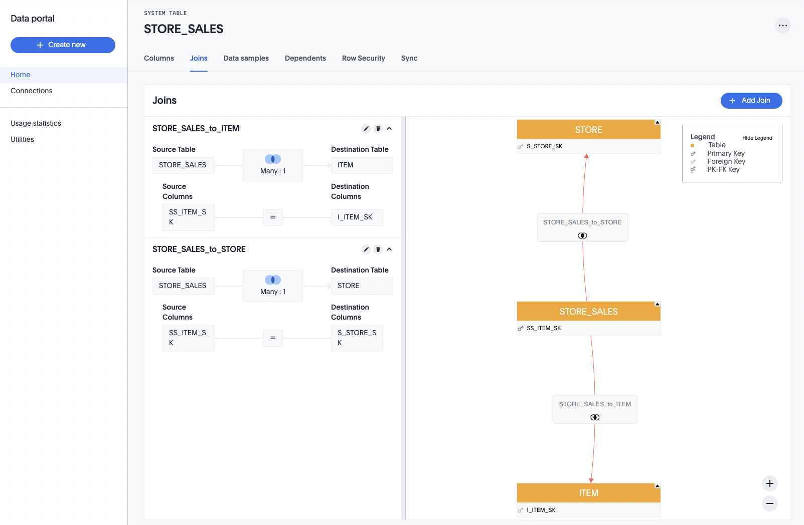

## 워크시트 생성

### 비주얼 디자이너 사용

이제 사용자가 상호 작용할 워크시트를 생성할 시간입니다. ThoughtSpot 기능에서 워크시트는 데이터베이스 뷰와 매우 비슷하다는 사실을 기억하십시오. 좋은 소식은 이제 완벽한 모델링이 있으니 Worksheet 생성이 매우 간단하다는 것입니다. 상단 탐색에서 **Data**, **Worksheets** 및 **New Worksheet**를 차례로 선택합니다. 필요한 테이블을 빠르게 찾기 위해 **Filter by name** 상자를 사용하여 Snowflake에서 가져온 3개의 테이블을 선택합니다. 선택했다면 **Close**를 클릭합니다.


테이블이 선택되었으니 왼쪽에 있는 **Sources** 트리를 확장하고 필요한 열을 선택하여 워크시트를 생성할 수 있습니다. 단순하게 유지하기 위해 모든 열을 선택하겠습니다. 개별 열을 선택하고 싶지 않다면 테이블 이름을 클릭하고 **Add Columns**를 클릭하여 모든 열을 한 번에 추가할 수 있습니다.


### SQL 사용

지금까지는 답변을 생성하기 위해 비주얼 디자이너를 사용했습니다. SQL 문에 익숙하거나 이미 SQL 문이 있다면 또한 베타로 현재 사용 가능한 새로운 SQL 기반 뷰 기능을 사용하여 Worksheet를 생성하기 위해 이를 사용할 수 있습니다. 이 작업을 위해 Data 탭에서 SQL 기반 뷰를 선택하고 TutorialSnowStore 연결을 선택합니다.

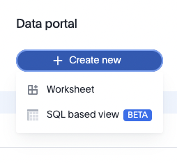

여기에서 익숙한 SQL 구문을 사용하여 여러분의 쿼리를 작성할 수 있습니다. 예를 들어 위 자습서 단계와 비슷한 Worksheet를 생성하고 싶다면 다음 문을 작성할 수 있습니다.

```
SELECT i.i_product_name, s.s_store_name, s.s_state, s.s_country, sales.ss_quantity, sales.ss_net_paid
FROM TPCDS_SF10TCL.STORE as s, TPCDS_SF10TCL.item as i, TPCDS_SF10TCL.STORE_SALES as sales
WHERE sales.ss_store_sk = s.s_store_sk
AND sales.ss_item_sk = i.i_item_sk
```

문을 실행하여 결과를 확인하겠습니다. 여기에서 여러분의 Worksheet에 이름을 지정하고 **Save**를 클릭하여 사용자가 데이터 분석을 위해 사용할 수 있는 Worksheet를 생성합니다. 정말 좋은 점은 이제 ThoughtSpot 내에 나만의 Worksheet가 생성되었으니 비주얼 디자이너 도구도 사용하여 이를 사용자 지정할 수 있다는 것입니다. 이 Worksheet 생성에 대한 하이브리드 접근 방식은 일반적인 SQL에 익숙한 일반 개발자에게는 매우 적합하지만 고급 그룹화 및 함수를 사용하는 전문가에게는 적합하지 않을 수 있습니다. 기존 SQL 문에서 워크시트를 빠르게 생성한 다음 비주얼 디자이너를 사용하여 집계 함수를 조정할 수 있습니다.


## Liveboard로 데이터 시각화

많은 사용자에게는 데이터를 차트로 보는 것이 데이터를 분석하는 가장 효율적인 방법입니다. 대부분 차트 솔루션의 문제는 결과가 매우 고정적이라는 것입니다. 일별 매출을 확인하기 위해 기존 대시보드를 고려해 보겠습니다. 이러한 대시보드에 있는 차트는 효과적으로 사전 정의된 쿼리입니다. 그러나 ThoughtSpot을 사용하면 차트와 대시보드가 완벽하게 동적이며 실시간입니다. 자연어로 필터를 수정하고 더 깊은 통찰력을 확인하기 위해 선택하여 분석하는 등 다양한 작업을 수행할 수 있습니다. 이 자습서에서는 동적 대시보드인 Liveboard를 생성하여 매장별 제품 매출을 나타내겠습니다.  시작하겠습니다.

상단 탐색에서 **Liveboards**를 선택한 다음 오른쪽 상단에 있는 **+Liveboard** 버튼을 클릭하고 여러분의 Liveboard 이름을 `Snow - Store Sales`로 지정합니다. **Create**를 클릭합니다. 여러분의 Liveboard가 이제 여러분의 환경에 보유하고 있을 수 있는 다른 Liveboard와 더불어 사용 가능합니다. `Snow - Store Sales`를 클릭하여 엽니다.


### 누적 세로 막대형 차트 추가

지금은 Liveboard가 그다지 흥미로워 보이지 않습니다. 결과를 나타내기 위해 Answer과 Chart를 생성하여 이를 쉽게 수정할 수 있습니다. Answer는 데이터와 관련된 질문에 대한 답변이라고 생각하시면 됩니다. 이 자습서의 질문은 '모든 매장의 모든 제품 매출을 보여주세요'입니다. ThoughtSpot 플랫폼에서 자연어를 사용하여 이 질문을 제시할 수 있습니다. 그러나 걱정하지 마십시오. SQL 사용을 선호하신다면 이를 사용하셔도 됩니다. 곧 이러한 내용을 다루겠습니다. 지금은 ThoughtSpot 플랫폼을 사용하여 작업을 수행하겠습니다.

**Start Searching** 버튼을 클릭합니다. 왼쪽에 데이터 소스를 표시하는 익숙한 인터페이스가 나타납니다. 이전에 생성했던 StoreSales 워크시트를 활용하겠습니다. 작은

 아이콘을 클릭하고 필터 대화 상자에 StoreSales를 입력한 다음 StoreSales를 선택합니다. STORE_SALES를 선택하지 않도록 주의하십시오. 이는 Snowflake의 접합 오브젝트이며 이 자습서를 진행하는 동안 생성했던 구체화된 View 또는 Worksheet가 아닙니다.

데이터 소스를 선택했으니 이제 다음 열을 검색 조건에 추가합니다. 여기에서 Worksheet 생성이 의미를 가지기 시작합니다. 사용자는 기본 데이터 구조를 이해하거나 조인 및 집계 함수와 같은 복잡한 SQL 문을 완전히 익힐 필요가 없습니다. 모든 것이 여러분을 대신하여 처리됩니다. 또한 가장 좋은 점은 사용자가 단순히 질문을 입력하여 필요한 답변을 검색할 수 있다는 것입니다. 쿼리 상자에 입력하여 다음 필드를 추가하겠습니다. 결과는 실시간으로 업데이트됩니다. 완료되면 **Enter**를 클릭합니다.

```
S_Store_Name, I_Product_Name, Ss_Quantity, S_Country, S_State, S_Net_Paid
```

그런 다음 차트를 추가하겠습니다. ThoughtSpot은 꺾은선형, 도넛 및 세로 막대형 차트와 같은 다양한 일반적인 차트 옵션을 제공합니다. 누적 세로 막대형 차트를 사용하여 상태별로 매출을 그룹으로 묶고 최종 사용자에게 결과를 시각화하기 위한 쉬운 방법을 제공하기 위해 제품 유형을 쌓겠습니다.  화면 오른쪽에 있는 차트 아이콘을 클릭하고 Stacked Column을 선택합니다

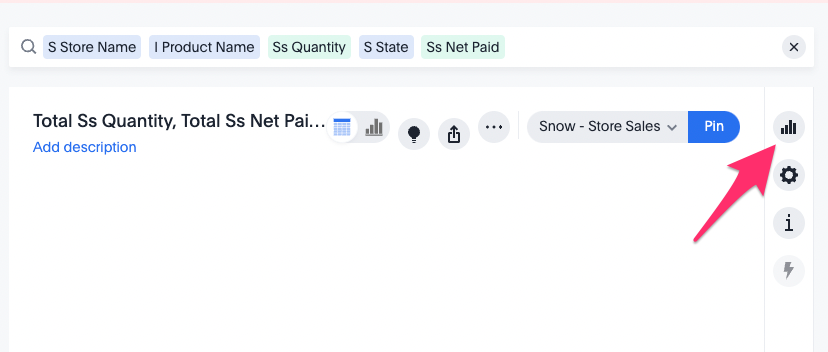

처음에는 차트 레이아웃이 우리가 원하는 모습과 완벽하게 일치하지 않습니다. 방금 클릭했던 차트 아이콘 바로 아래에 있는 **Cog** 아이콘을 클릭하고 아래 설정을 사용하여 차트를 구성합니다. 끝났다면 **Pin**을 클릭하여 여러분의 차트를 Liveboard에 저장합니다.

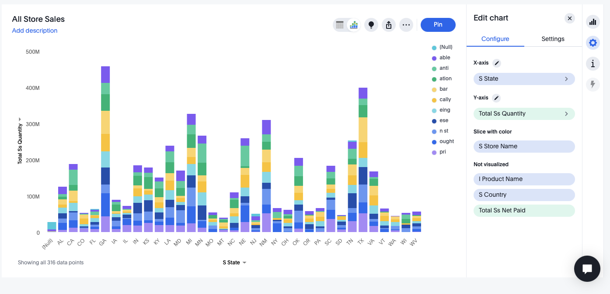

## ThoughtSpot Everywhere로 분석 삽입

ThoughtSpot 플랫폼의 주요 이점 중 하나는 개발 프로세스 범위에 대한 기능입니다. 지금까지 이 자습서에서는 비주얼 도구를 활용했습니다. 이제 몇몇 코드를 작성할 시간입니다. ThoughtSpot는 완전한 RESTful API 세트와 모든 애플리케이션에 분석을 삽입할 수 있도록 하는 SDK를 제공합니다. 일괄적으로 이러한 개발자 도구를 ThoughtSpot Everywhere라고 합니다.

이 자습서에서는 ThoughtSpot Everywhere Visual Embed SDK를 사용하여 방금 생성했던 Liveboard를 가져오고 이를 REACT 기반 웹 애플리케이션에 삽입합니다. 이는 주문, 매출 또는 필요한 기타 정보를 추적하기 위해 직원 또는 고객이 사용하는 기존 포털이 있는 비즈니스에 아주 일반적인 시나리오입니다. ThoughtSpot Everywhere로 분석을 추가하는 것이 매우 쉬워집니다. 시작하겠습니다.

### 로컬 개발 환경 설정

React를 사용하여 웹 애플리케이션을 구축하겠습니다. React를 설치 및 구성합니다. 또한 React의 종속성은 각 환경에서 다릅니다. 이 자습서에서는 Mac 운영 체제를 예시 개발 환경으로 사용하겠습니다. Windows용 React 설치 단계는 [여기](https://docs.microsoft.com/en-us/windows/dev-environment/javascript/react-on-windows)에서 찾을 수 있습니다. Mac의 경우 다음이 필요합니다.

#### Node.js 및 NPM

NPM은 Node.js로 구축된 매우 인기 있는 패키지 관리 솔루션입니다(따라서 이름이 Node Package Manager임). 이 자습서에서는 NPM을 사용하여 React.js 프레임워크를 설치하겠습니다. 많은 Mac에 Node와 NPM이 이미 설치되어 있습니다. 터미널 창을 열고 `$ node -v`를 입력하여 이를 확인할 수 있습니다. 성공적인 응답이 반환되지 않는다면 여러분의 플랫폼에 [이 설치 프로그램을 다운로드](https://nodejs.org/en/download/)하십시오. (LTS 버전을 사용하십시오. 종종 최신 릴리스에 사소한 버그가 있습니다.) 다운로드했다면 이를 두 번 클릭하고 프롬프트에 따라 설치합니다.

#### React 프레임워크

NPM이 설치되었으니 React 프레임워크 설치는 간단합니다. 다음 명령을 여러분의 터미널 창에 입력합니다.

```
$ sudo npm install -g create-react-app
```

다음을 입력하여 설치를 확인할 수 있습니다.

```
$ npm -v$create-react-app — version
```

#### VSCode

필수는 아니지만 좋은 IDE는 많은 개발자의 생산성을 확실히 개선합니다. 모든 사람에게는 각각 선호하는 IDE가 있습니다. 여러분이 원하는 IDE를 사용하십시오. 이 자습서의 예에서는 VSCode를 사용하겠습니다. VSCode가 마음에 드신다면 선호하는 플랫폼으로 [무료로 다운로드](https://code.visualstudio.com/download)할 수 있습니다.

### React 웹앱 생성

#### 1단계: 앱 생성

터미널 창이 열린 상태에서 React 앱 생성을 시작하겠습니다. 다음 명령을 입력합니다.

```
$ npx create-react-app snowsales-app
```

여러분이 즐겨 사용하는 IDE에서 `snowsales-app` 폴더를 엽니다. 기본값으로 React는 localhost:3000을 사용합니다. 이를 `localhost:8000`으로 변경해야 합니다. 이 호스트와 포트 이름은 로컬 개발을 허용하기 위해 ThoughtSpot의 콘텐츠 보안 정책 설정 내에 사전 구성되었습니다. 프로젝트의 루트 내에서 바로 package.json을 열고 스크립트 시작값을 다음으로 변경합니다.

```
 "scripts": {
   "start": "PORT=8000 react-scripts start",
   "build": "react-scripts build",
   "test": "react-scripts test",
   "eject": "react-scripts eject"
 },
```

`App.js`의 콘텐츠를 `App.jsx`로 변경한 다음 컨텍스트를 다음 코드로 대체합니다.

```
import './App.css';

function App() {
 return (
   <div className="App">


   </div>
 );
}
export default App;
```

#### 2단계: 하위 페이지 추가

그런 다음 라우팅을 설정하여 앱 탐색을 지원하겠습니다. 다양한 앱 기능을 캡슐화하기 위해 설계된 별도의 페이지를 포함한 멀티페이지 앱을 생성하겠습니다. 싱글페이지 또는 멀티페이지 앱 구축 여부는 개인 선호도에 달려 있습니다.

새로운 Components 폴더를 src 디렉터리에 생성한 다음 2개의 추가 페이지를 생성합니다.

* storesales.js
* About.js

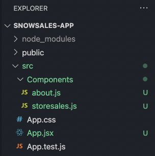

#### 3단계: 프로젝트에 대한 라우팅 지원 추가

터미널의 `snowsales-app` 폴더에 `cd`를 적용하고 다음 명령을 실행해야 합니다.

```
$snowsales-app> npm add react-router-dom@6
```

명령이 완료되면 index.js 콘텐츠를 다음으로 대체합니다.

```
import React from 'react';
import ReactDOM from 'react-dom';
import { BrowserRouter as Router } from 'react-router-dom';
import './index.css';
import App from './App';

ReactDOM.render(
 <Router>
   <App />
 </Router> 
 ,
 document.getElementById('root')
);
```

그런 다음 `App.css`의 임포트 문 바로 아래에 있는 `App.jsx` 상단에 다음 임포트 줄을 추가합니다.

```
import { Route, Routes} from "react-router-dom";
```

#### 4단계: 하위 페이지 구성

관련 하위 페이지에 다음 코드를 복사합니다. 이러한 페이지를 추후에 추가하겠지만 지금은 모든 것을 설정하여 탐색을 지원하고자 합니다.

* storesales.jsx
  
  ```
  import React from 'react'
  
  export default function StoreSales() {
     return (
         <div>
             <h1>Store Sales</h1>
         </div>
     )
  }
  ```

* about.jsx
  
  ```
  import React from 'react'
  
  export default function About() {
     return (
         <div>
             <h1>About</h1>
         </div>
     )
  }
  
  ```

#### 5단계: 햄버거 메뉴 추가

현재 앱은 그다지 유용하지 않습니다. 탐색이 없습니다. [react-hamburger-menu](https://github.com/negomi/react-burger-menu)를 사용하여 햄버거 메뉴를 추가해 이를 해결하겠습니다. 다음을 프로젝트에 추가합니다.

```
$snowsales-app> npm add react-hamburger-menu
```

그런 다음 하위 폴더인 `Burger`를 포함한 새로운 폴더인 `Components`와 `burger.css` 및 `BurgerMenu.js`와 같은 2개의 파일을 생성합니다. 끝났다면 앱 구조는 다음과 같이 나타나야 합니다.

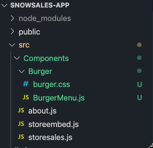

그런 다음 다음 코드를 추가합니다.

##### BurgerMenu.js

```
import React from "react";
import { slide as Menu } from "react-burger-menu";
import "./burger.css";

const toggleMenu = ({ isOpen }) => {
 const menuWrap = document.querySelector(".bm-menu-wrap");
 isOpen
   ? menuWrap.setAttribute("aria-hidden", false)
   : menuWrap.setAttribute("aria-hidden", true);
};

const BurgerMenu = () => {
 return (
   <Menu noOverlay onStateChange={toggleMenu}>     
       <a className="bm-item" href="/">Home</a>
       <a className="bm-item" href="/storesales">Store Sales</a>
       <a className="bm-item" href="/about">About</a>     
   </Menu>
 );
};
export default BurgerMenu;
```

##### burger.css

```
/* Position and sizing of burger button */
.bm-burger-button {
   position: fixed;
   width: 36px;
   height: 30px;
   left: 36px;
   top: 36px;
 }
  /* Color/shape of burger icon bars */
 .bm-burger-bars {
   background: #373a47;
 }
  /* Color/shape of burger icon bars on hover*/
 .bm-burger-bars-hover {
   background: #a90000;
 }
  /* Position and sizing of clickable cross button */
 .bm-cross-button {
   height: 24px;
   width: 24px;
 }
  /* Color/shape of close button cross */
 .bm-cross {
   background: #bdc3c7;
 }
  /*
 Sidebar wrapper styles
 Note: Beware of modifying this element as it can break the animations - you should not need to touch it in most cases
 */
 .bm-menu-wrap {
   position: fixed;
   height: 100%;
 }
  /* General sidebar styles */
 .bm-menu {
   background: #373a47;
   padding: 2.5em 1.5em 0;
   font-size: 1.15em;
 }
  /* Morph shape necessary with bubble or elastic */
 .bm-morph-shape {
   fill: #373a47;
 }
  /* Wrapper for item list */
 .bm-item-list {
   color: #b8b7ad;
   padding: 0.8em;
 }
  /* Individual item */
 .bm-item {
   display: inline-block;
   color: #b8b7ad;
 }
  /* Styling of overlay */
 .bm-overlay {
   background: rgba(0, 0, 0, 0.3);
 }
```

#### 6단계: 경로 탐색 생성

이제 남아 있는 작업은 React 경로를 생성하고 앱에 햄버거 메뉴를 추가하는 것입니다. 모든 것을 마무리하기 위해 다음 임포트를 App.jsx에 추가합니다.

```
import BurgerMenu from './Components/Burger/BurgerMenu';
import { Route, Routes} from 'react-router-dom';
import StoreSales from './Components/storesales'
import About from './Components/about';
```

그런 다음 `&lt;div className="App">` 요소 내에 라우팅 로직과 햄버거 메뉴 요소를 추가합니다.

```
<div className="App">
     <header>
       <BurgerMenu/> 
     </header>

     <Routes>
       <Route path="/" element={<h1>Home</h1>} />
       <Route path="/storesales" element={<StoreSales />} />
       <Route path="/about" element={<About />} />
     </Routes>
 </div> 
```

완벽한 App.jsx 페이지 다음과 같이 나타나야 합니다.

```
import './App.css';
import React from 'react';
import BurgerMenu from './Components/Burger/BurgerMenu';
import { Route, Routes} from 'react-router-dom';
import StoreSales from './Components/storesales'
import About from './Components/about';
function App() {

 return (
   <div className="App">
     <header>
       <BurgerMenu/> 
     </header>

     <Routes>
       <Route path="/" element={<h1>Home</h1>} />
       <Route path="/storesales" element={<StoreSales />} />
       <Route path="/about" element={<About />} />
     </Routes>
 </div>
  );
}
export default App;
```

#### 7단계: 앱 실행

앱을 테스트할 시간입니다. 터미널의 앱 디렉터리 내에서 다음 명령을 실행합니다

```
$snowsales-app> npm start
```

앱이 다음과 같이 나타나야 합니다. 햄버거를 클릭하여 링크를 테스트합니다. 엑스트라 스타일 크레딧을 위해 애니메이션 임포트를 슬라이드에서 [다른 지원 애니메이션](https://www.npmjs.com/package/react-burger-menu)으로 변경할 수 있습니다. 예를 들어 제가 버블 애니메이션을 선호한다면 제 BurgerMenu.js의 임포트 줄은 다음과 같이 나타나야 합니다.

```
import { bubble as Menu } from "react-burger-menu";
```


Error: Invalid Hook Call Warning으로 시작하는 오류 메시지가 나타나면 react-router-dom 버전을 명시적으로 설정해야 할 수 있습니다. 만약 그렇다면 `package.json`을 열고 다음을 종속성 배열에 추가합니다.

```
"react-router-dom": "^6.0.2",
```

파일을 저장하고 다음을 명령줄에서 실행한 다음 프로젝트를 다시 실행합니다.

```
$snowsales-app> npm install
```

### Developer Playground 사용

기본 앱이 실행 중이니 ThoughtSpot 요소를 앱에 추가할 시간입니다. Worksheet를 생성했을 때와 비슷하게 ThoughtSpot 플랫폼은 개발자에게 작업 방법을 선택할 수 있는 자유를 제공합니다. 많은 개발자는 바로 모든 코드를 작성하고 싶어 하지만 나머지 개발자는 비주얼 도구를 사용하여 반복하고 실험하고 싶어 할 수 있습니다. ThoughtSpot은 삽입된 요소를 사용한 반복 및 실험에 매우 유용한 Developer Playground를 제공합니다. Playground를 사용하여 필요한 보일러플레이트 코드를 많이 생성하겠습니다. 그런 다음 모든 것이 올바르게 구성되었을 때 더욱 세부적인 조정을 시작하겠습니다. 이 ThoughtSpot로 개발하는 것에 대한 하이브리드 접근 방식은 필요한 모든 매개 변수와 구성을 위해 설명서 검색에 많은 시간을 허비할 필요가 없는 앱을 빠르게 생성하는 훌륭한 방식입니다.

Thoughtspot 내에서 상단 탐색에 있는 Develop을 클릭한 다음 왼쪽 탐색에 있는 Liveboard를 클릭합니다. 이제 Playground에 있습니다. 화면 왼쪽에는 기능 선택기 또는 삽입하고자 하는 요소와 더불어 구성 가능한 매개 변수가 있습니다. 구성을 변경함에 따라 이는 여러분을 위해 코드를 동적으로 변경합니다. Run을 클릭하면 결과가 오른쪽에 렌더링됩니다.

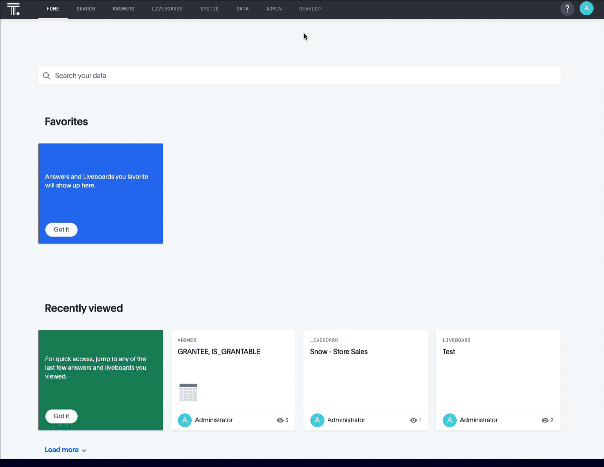

앞서 생성했던 Liveboard를 삽입하여 시작하고자 합니다. Liveboard 선택기에서 **Snow - Store Sales**를 선택합니다. 즉시 해당 코드가 Liveboard의 고유 식별자를 포함하도록 업데이트된 것이 보입니다. Run을 클릭하여 Liveboard를 렌더링합니다. 다음 단계를 시작하기 전에 생성된 코드에서 `pinboardId`를 찾아 복사합니다. 이 자습서에서 추후 사용할 예정입니다. Playground에서 렌더링하고자 하는 요소를 변경할 때 실제 ID가 동적으로 선택됩니다.


```
Information: Pinboards have recently been replaced by Liveboards. This change is taking place in phases. The first phase will be deployed December 2021 and will include product naming, navigation, and UI. Phase two, available in 2022 will update API paths, parameters and SDKs. Until Phase two is deployed, you will still need to refer to pinboards within any code related development. 
```

### ThoughtSpot React 요소 추가

이제 앱 구조를 갖췄으며 Playground를 통해 구성을 했으니 ThoughtSpot Everywhere Embed SDK를 추가하겠습니다. 이 SDK는 여러분에게 Liveboards, Visualizations 및 Search와 같은 ThoughtSpot Everywhere 플랫폼 요소에 대한 액세스를 제공합니다. 이 자습서에서는 Liveboard 요소를 사용하겠습니다. 디렉터리를 `snowsales-app`으로 변경하고 다음 명령을 입력합니다.

```
$ npm i @thoughtspot/visual-embed-sdk
```

그런 다음 ` App.jsx`에 있는 기존 임포트 바로 뒤에 다음을 추가합니다.

```
// ThoughtSpot
import {
 AuthType,
 init,
 Page,
} from "@thoughtspot/visual-embed-sdk";

const TSURL = "https://try.thoughtspot.cloud";
```

또한 App() 함수 내에서 연결을 초기화합니다. ThoughtSpot Everywhere는 [다양한 인증 메커니즘](https://docs.thoughtspot.com/visual-embed-sdk/release/en/?pageid=search-embed#_add_the_embed_domain)을 지원합니다. 이 자습서에서는 `AuthType.None`을 사용합니다. `AuthType.None`은 런타임에 로그인 자격 증명을 요구하며 이를 세션 쿠키로 저장합니다. ` AuthType.None`을 프로덕션에 사용하는 것을 권장하지 않지만 이 데모 앱에서는 사용해도 괜찮습니다.

```
 init({
   thoughtSpotHost: TSURL,
   authType: AuthType.None
 });
```

그런 다음 storesales.js를 업데이트하여 앞서 생성했던 Liveboard를 삽입하겠습니다. 여기에서 Visual Embed SDK의 이점을 누릴 수 있습니다. SDK를 통해 사용할 수 있는 여러 접근 방식이 있습니다. Live 서비스 추가를 위해 React 요소를 사용하겠습니다. 콘텐츠를 다음 코드로 대체합니다.

```
import { PinboardEmbed } from "@thoughtspot/visual-embed-sdk/lib/src/react";
export default function StoreSales() {
   return (
       <div>
           <h1>Store Sales</h1>
           <PinboardEmbed frameParams={{height: "80vw"}}
                       pinboardId={"YOUR-LIVEBOARDID-HERE"}/>
       </div>    
   );
}
```

변경 사항을 저장하고 앱을 실행합니다. 햄버거 아이콘을 클릭한 다음 Store Sales를 클릭합니다. 이제 여러분의 ThoughtSpot 인스턴스에 대한 로그인 페이지가 나타납니다. 여러분의 세부 정보를 입력하면 Liveboard가 여러분의 앱 내에서 렌더링됩니다. 여러 위치를 클릭하여 데이터와 어떻게 상호 작용할 수 있는지 확인하십시오. 멋지지 않나요?

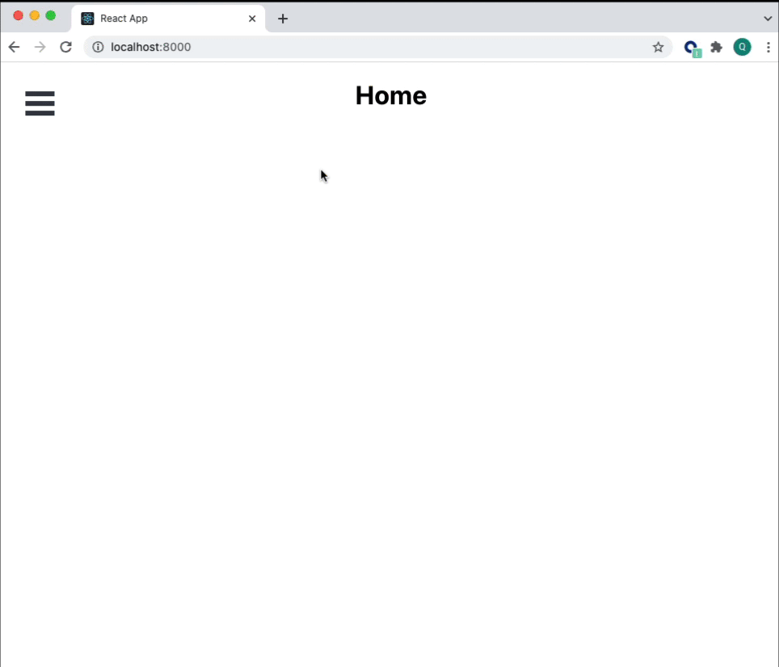

### 추가 Live 요소 추가

지금까지 Liveboard를 React 앱에 삽입했습니다. Search, 기타 Visualization 요소 또는 전체 ThoughtSpot 앱 또한 이렇게 쉽게 삽입할 수 있습니다. 이를 선보이기 위해 새로운 페이지를 생성하고 React 요소를 사용하여 전체 앱을 추가하겠습니다.

#### 1단계: Add fullapp.js

프로젝트의 **Components** 폴더에 새로운 파일인 `fullapp.js`를 생성합니다

```
export default function FullApp() {
   return (
       <div>
           <h1>FullApp</h1>
       </div>
   );
}
```

#### 2단계: 경로 추가

App.jsx 내에서 fullapp을 위한 임포트를 추가합니다.

```
import FullApp from './Components/fullapp';
```

그런 다음 Routes 요소에 경로를 추가합니다

```
<Routes>
       <Route path="/" element={<h1>Home</h1>} />
       <Route path="/storesales" element={<StoreSales />} />
       <Route path="/fullapp" element={<FullApp />} />
       <Route path="/about" element={<About />} />
     </Routes>
```

#### 3단계: 버거 메뉴 추가

이제 `BurgerMenu.js` 링크를 추가하여 사용자가 새로운 페이지를 탐색할 수 있도록 하겠습니다. 여러분의 링크는 다음과 같이 나타나야 합니다.

```
<Menu noOverlay onStateChange={toggleMenu}>


       <a className="bm-item" href="/">Home</a>
       <a className="bm-item" href="/storesales">Store Sales</a>
       <a className="bm-item" href="/fullapp">Full App</a>
       <a className="bm-item" href="/about">About</a> 


 </Menu>
```

#### 4단계: 요소 추가

fullapp.js 콘텐츠를 다음 코드로 대체합니다.

```
import { AppEmbed } from "@thoughtspot/visual-embed-sdk/lib/src/react";
import "../index.css";

export default function FullApp() {
 return (
     <div>
         <h1>Full App</h1>
         <AppEmbed frameParams={{height: "80vw"}} fullHeight="true"
                     pageId="Page.Home" />
     </div>


 );
}
```

끝났습니다. 앱을 실행하고 Full App 페이지로 이동하여 지금까지 진행했던 모든 작업을 확인합니다. 잘 하셨습니다! 전반적인 앱 경험 측면을 수정하고자 한다면 `AppEmbed` 요소에서 구성할 수 있는 몇 가지 매개 변수가 있습니다. 변경할 수 있는 매개 변수를 배우는 가장 좋은 방법은 Developer Playground 사용을 시작하고 옵션을 실험해 보는 것입니다.

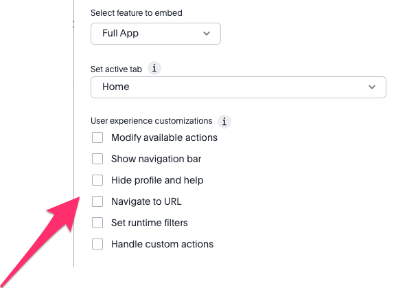

## 요약

이 자습서를 진행하는 동안 최신 데이터 스택의 2가지 기본 요소인 Snowflake를 통한 클라우드 데이터 플랫폼과 ThoughtSpot을 통한 분석 플랫폼을 활용하는 앱을 생성했습니다. 더욱이 ThoughtSpot Everywhere를 사용하여 2개의 플랫폼을 결합하고 통찰력을 React 기반 애플리케이션에 삽입했습니다. 여기에서는 가능한 작업의 극히 일부를 선보였습니다. Search와 같은 기타 ThoughtSpot 요소를 삽입하고, 전반적인 ThoughtSpot 경험을 삽입하고, 데이터 공유 및 습득을 위해 강력한 API를 활용하는 방법을 다뤘습니다. 완벽한 앱을 다운로드하여 여러분만의 앱 개발을 시작할 수 있습니다. ThoughtSpot으로 수행할 수 있는 모든 작업의 이점을 누릴 수 있는 방법에 대해 자세히 알아보려면 [developers.thoughtspot.com](developers.thoughtspot.com)을 확인하십시오.