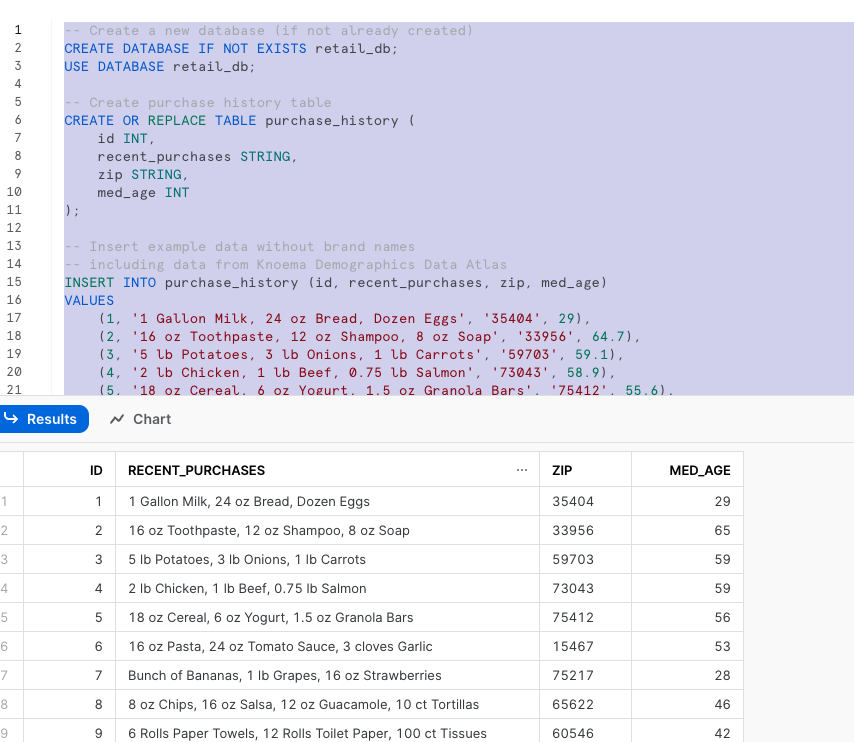
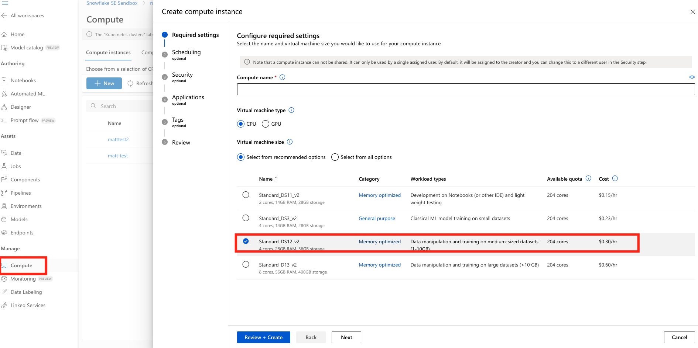
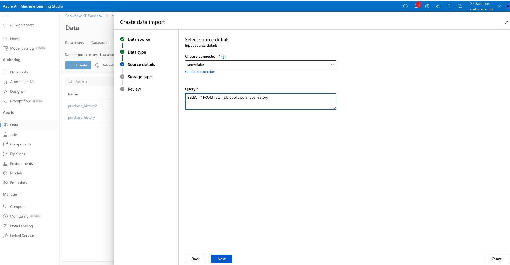
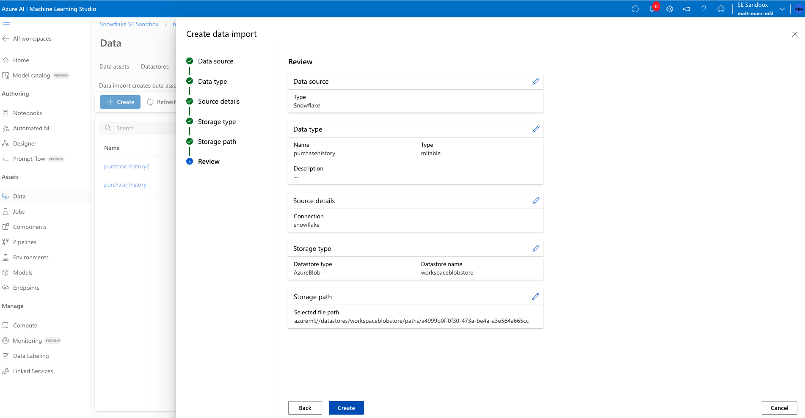
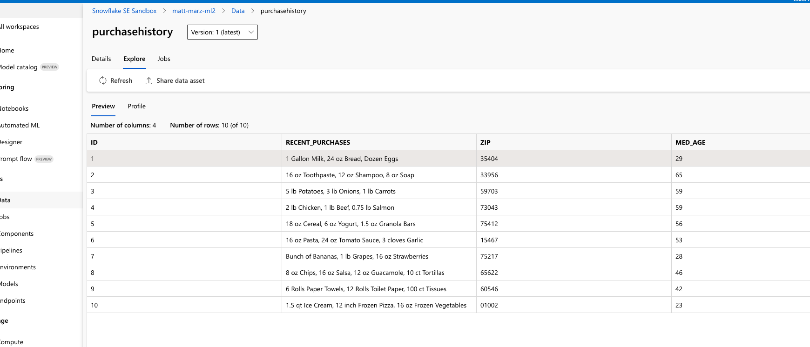
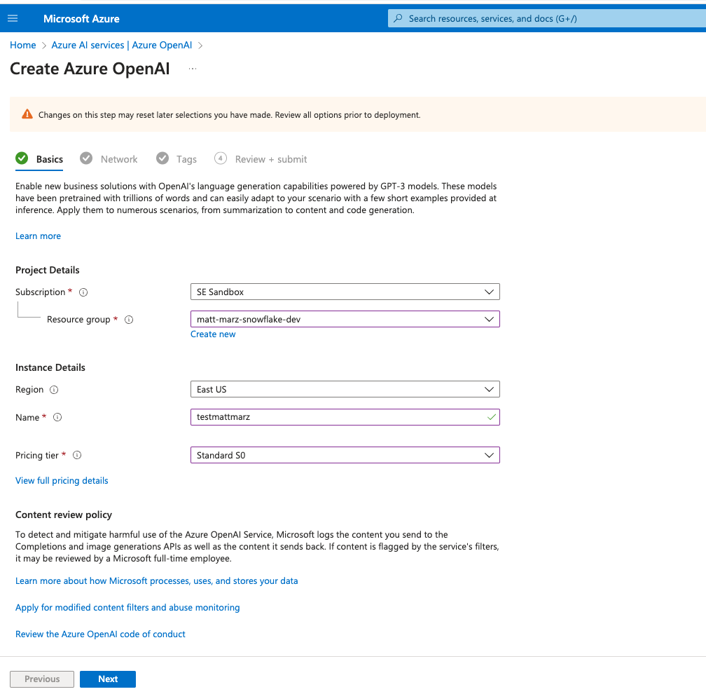
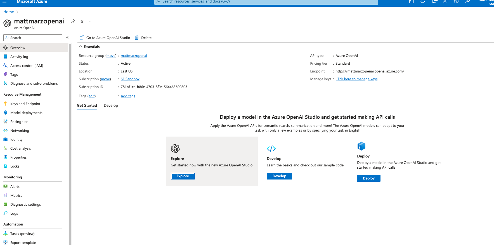

author: marzillo-snow
id: getting_started_with_azure_openai_and_snowflake
summary: This is a qucikstart for using Snowpark for ML on SageMaker
categories: getting-started,data-science-&-ml,data-engineering,app-development
environments: web
status: Published 
feedback link: https://github.com/Snowflake-Labs/sfguides/issues
tags: Getting Started, Data Science, Data Engineering, LLM, GenAI, Azure, OpenAI, Marketplace, Snowpark

# Getting Started with Azure OpenAI and Snowflake
<!-- ------------------------ -->
## Overview 
Duration: 15

Every organization is (at least) considering how to use Generative AI, with OpenAI’s ChatGPT leading the way. Customers are interested in how to tap into this innovation with their data. The answer to that is Azure OpenAI. Azure OpenAI is an enterprise offering OpenAI models as part of Azure Cognitive Services from Microsoft that helps power your apps with large-scale customized AI models with labeled data for your specific scenario using a simple REST API. Azure OpenAI also enables Customers to fine-tune the deployed model’s hyperparameters to increase output accuracy and leverage few-shot learning capability to provide the API with data examples to achieve more relevant results.

In this quickstart we will build an architecture that demonstrates how to use Azure OpenAI with an AzureML Prompt Flow, AzureML Notebooks, Snowflake and the Snowflake + AzureML Connector to quickly generate results.

### Prerequisites
- Familiarity with [Snowflake](https://quickstarts.snowflake.com/guide/getting_started_with_snowflake/index.html#0) and a Snowflake account
- Familiarity with Azure and an Azure account an AzureML workspace.
- Familiarity with [Python](https://www.udemy.com/course/draft/579706/)

### You'll Learn
- How to deploy an Azure OpenAI model with AzureML Prompt Flow
- Utilize the Snowflake + AzureML Connector to bring data from Snowflake into AzureML
- Utilize an AzureML Notebook with Snowpark to coordinate the movement of data from Snowflake to the Prompt Flow and bring results back to Snowflake

### What You’ll Need 
- A free [Snowflake Account](https://signup.snowflake.com/)
- [Azure Account](https://azure.microsoft.com/en-us/free/search/?ef_id=_k_2ba2be3ad9791e57964fda0c62ccd55c_k_&OCID=AIDcmm5edswduu_SEM_k_2ba2be3ad9791e57964fda0c62ccd55c_k_&msclkid=2ba2be3ad9791e57964fda0c62ccd55c)

### What You’ll Build 
You will build an end-to-end Generative AI workflow using Azure OpenAI, AzureML and Snowflake
- Deploy an Azure OpenAI model
- Build an Prompt Flow
- Connect Snowflake data to AzureML
- Coordinate the flow with an AzureML Notebook

The end-to-end workflow will look like this:


<!-- ------------------------ -->
## Use Case
Duration: 5

In this use case you will use purchase history data from a big box store, and leverage Azure Open AI to generate 3 suggested next items that can be marketed to the customer. Developing Next Best Offer (NBO) applications can often take months to devlop, but with Snowflake and Azure we are able to set up this workload in hours. 

Additionally, the data leverages demographic information (Median Age for the zip code the customer lives in). This data was pulled directly from [Knoema Data](https://knoema.com/) via the Snowflake Data Marketplace.

<!-- ------------------------ -->
## Set Up Snowflake Environment
Duration: 5

The first thing we will do is create a database and warehouse in your Snowflake environment. Run the below code in a Snowflake worksheet. We are using the accountadmin role here for demo purposes, but in production you will likely use a different role.
```sql
-- Create a new database (if not already created)
CREATE DATABASE IF NOT EXISTS retail_db;
USE DATABASE retail_db;
CREATE WAREHOUSE IF NOT EXISTS small_wh WITH WAREHOUSE_SIZE='X-SMALL';

-- Create purchase history table
CREATE OR REPLACE TABLE purchase_history (
    id INT,
    recent_purchases STRING,
    zip STRING,
    med_age INT
);

-- Insert example data without brand names
-- including data from Knoema Demographics Data Atlas
INSERT INTO purchase_history (id, recent_purchases, zip, med_age)
VALUES
    (1, '1 Gallon Milk, 24 oz Bread, Dozen Eggs', '35404', 29),
    (2, '16 oz Toothpaste, 12 oz Shampoo, 8 oz Soap', '33956', 64.7),
    (3, '5 lb Potatoes, 3 lb Onions, 1 lb Carrots', '59703', 59.1),
    (4, '2 lb Chicken, 1 lb Beef, 0.75 lb Salmon', '73043', 58.9),
    (5, '18 oz Cereal, 6 oz Yogurt, 1.5 oz Granola Bars', '75412', 55.6),
    (6, '16 oz Pasta, 24 oz Tomato Sauce, 3 cloves Garlic', '15467', 53.1),
    (7, 'Bunch of Bananas, 1 lb Grapes, 16 oz Strawberries', '75217', 28.4),
    (8, '8 oz Chips, 16 oz Salsa, 12 oz Guacamole, 10 ct Tortillas', '65622', 46.1),
    (9, '6 Rolls Paper Towels, 12 Rolls Toilet Paper, 100 ct Tissues', '60546', 41.6),
    (10, '1.5 qt Ice Cream, 12 inch Frozen Pizza, 16 oz Frozen Vegetables', '01002', 23.2);

-- View the generated data
SELECT * FROM retail_db.public.purchase_history;
```
The result of the final select statement should look like this:


<!-- ------------------------ -->
## Set Up AzureML Workspace
Duration: 5

Head over to your Azure ML workspace, go to the Compute blade and make sure you have a Compute Instance running (any of the standard instances will work for this quickstart). 



<!-- ------------------------ -->
## Import and Register data from Snowflake in AzureML
Duration: 10

Next we're going to register and import data from Snowflake in AzureML. In your AzureML Workspace go to the Data blad and click Data Connections tab. Next you will name your connection, select the Snowflake Category and define your target. The target should follow the below syntax:

```bash
jdbc:snowflake://<server>.<region>.azure.snowflakecomputing.com/?db=RETAIL_DB&warehouse=SMALL_WH
```
You will then enter the username and password for your Snowflake account. 
* Note that additional authentication methods will soon be supported in the AzureML + Snowflake Connector.

You can reference the below image for an example of what the target should look like.


Now head to the Data Import tab and let's configure the actual import of the data. Select Snowflake, then name the new dataset something like "purchasehistory" and give it a description if you would like. Next choose the Snowflake connection you just created and enter the below query to retrieve the data from Snowflke (no semicolon in the query).

```sql
SELECT * FROM retail_db.public.purchase_history
```



Next select Other Data Stores and select workspaceblobstore and select any path to place the data. The final review should look like this.



Create the data import.

The Connector is natively connecting to Snowflake and create an MLTable file based off your Connection and query. After several minutes you should head over to the Data Assets tab on the Data blade and see a new asset with the name you provided to the import job. Click on that asset then click explore to verify the data has been imported.



<!-- ------------------------ -->
## Deploy Azure Open AI Model
Duration: 5

Head to your Azure Portal home screen and create an Azure Open AI service if you don't already have one. Place Open AI in a Resource Group (or create a new one), use the East US Region, provide a unique name, select the Standard S0 pricing tier. 


Click Next then leave it open to all networks for this lab. Continue to click next then create the service. Once the service is created, access the explorer from the service by clicking explore.


You can familiarize yourself with the Azure AI Studio later, but for now click on the Models blade then select the gpt-35-turbo model and click deploy. Use the Auto-update to default Model version and name the deployment "gpt35turbo" and click create. The model should deploy in seconds.

<!-- ------------------------ -->
## Build Prompt Flow
Duration: 5

Go back to your Azure ML workspace and access the Prompt Flow blade and click Create then click create on the Standard flow.


Prompt Flow allows you to streamline your LLM-based application development. You can create executable flows that link LLMs, prompts, and Python tools through a ui graph. You can iterate and debug right from the Prompt Flow ui then deploy the LLM application. Here we will creat a simple LLM application.

Once you have your first flow open head to the to and edit the name and make it generate _products. Next delete the output, the echo and the joke prompts as they won't be needed. Next, add an LLM prompt from the top and select a runtime from the top, for this lab it can be the compute instance that you created earlier in the lab (or just use a compute instance that you already have). 
Your flow should now look like this:


IN the LLM window select the Connection as the OpenAI service, slect chat for the API and gpt35turbo for Deployment. Next copy and paste the below text into the prompt section:
```
system:
can you recommend three products to advertise to a customer who recently purchased these items. 
just list the three recommended items no description
{{purchase_history}}
the median age in the zip code of the customer is
{{med_age}}
```


### Troubleshooting `pyarrow` related issues

- If you have `pyarrow` library already installed, uninstall it from terminal before installing Snowpark.
- If you do not have `pyarrow` installed, you do not need to install it yourself; installing Snowpark automatically installs the appropriate version.
- Do not reinstall a different version of `pyarrow` after installing Snowpark.

<!-- ------------------------ -->
## Build and Deploy Model
Duration: 10

Now open and work through the `1_prepare_build_deploy_model.ipynb` workbook to join together the datasets, bring in the training data then build and deploy the model. Once again, make sure to select the correct python environment.

[1_prepare_build_deploy_model.ipynb](https://github.com/Snowflake-Labs/sfguide-getting-started-snowpark-python-sagemaker/blob/main/1_prepare_build_deploy_model.ipynb)

Once that notebook is complete you will have a udf that you can use to generate predictions in your Snowflake environment! you can do this via Snowpark Python code or Snowflake SQL. Let's generate predictions with this udf with Snowflake SQL. Copy and paste the code below into your snowflake environment to generate inference.

```sql
use role accountadmin;
select predict_failure(AIR_TEMPERATURE_K,
       PROCESS_TEMPERATURE, ROTATIONAL_SPEED_RPM, TORQUE_NM,
       TOOL_WEAR_MIN, HUMIDITY_RELATIVE_AVG) as predicted_failure, * from maintenance_hum;
```


<!-- ------------------------ -->
## Conclusion and Additional Considerations
Duration: 5

This quickstart is just that, a quick way to get you started with using SageMaker with Snowflake and Snowpark. For enterprise uses, data scientists and developers will want to consider additional details. Most important is considering the tracking of the mlops lineage from data to model to deployment. A more mature architecture will include the additional steps below which include the registration of the data and the model.


Credit: Chase Ginther

Looking specifically at SageMaker two additional considerations that you may want to consider are:
1. Rather than using an pre-built image then installing packages, you may want to crate your own custom image that includes the Snowpark packages and other packages that you commonly use.
2. You may know that the Snowpark sandbox on Snowflake includes Anaconda supported packages which inludes the scikitlearn package that was used to build the logistic regression model. If you use other packages to build your models that are not supported by Anaconda you will have to install [third party packages in the Snowpark sandbox](https://docs.snowflake.com/en/developer-guide/udf/python/udf-python-packages.html).

### What We covered
- Using a SageMaker Studio with Snowpark
- Loading and transforming data via Snowpark with pushdown compute
- Deploying models to Snowflake via a User Defined Function

### Additional Considerations
- There are some great blogs on Medium regarding Snowpark, SageMaker and using Snowflake with AWS.

- [Snowpark for python with SageMaker](https://medium.com/snowflake/using-snowpark-for-python-with-amazon-sagemaker-44ec7fdb4381)

- [Operationalizing Snowpark](https://medium.com/snowflake/operationalizing-snowpark-python-part-one-892fcb3abba1)

- [AWS and Snowflake](https://aws.amazon.com/financial-services/partner-solutions/snowflake/)

If you have any questions, reach out to your Snowflake account team!