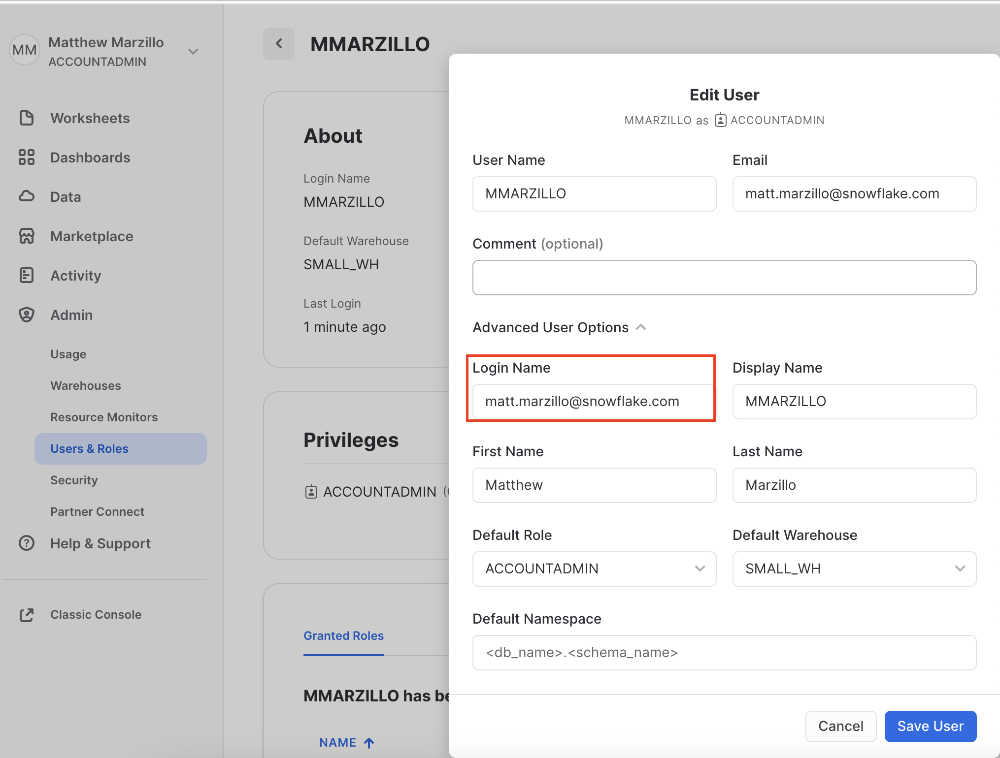

author: marzillo-snow
id: power_platform_snowflake
summary: This is a quickstart for using Microsoft Power Platform and Snowflake
categories: Getting-Started, data-engineering, microsoft, power-apps, power-platform, snowflake
environments: web
status: Published 
feedback link: https://github.com/Snowflake-Labs/sfguides/issues
tags: Getting Started, Data Engineering

# Getting Started with Power Platform and Snowflake
<!-- ------------------------ -->
## Overview 
Duration: 10

### Power Platform

Microsoft Power Apps and Power Automate are part of the Microsoft Power Platform, a suite of tools designed to empower organizations to create custom applications and automate workflows with minimal coding effort. Power Apps is a low-code development platform that enables users to build custom web and mobile applications using a drag-and-drop interface and pre-built templates. It offers seamless integration with various data sources and other Microsoft services, making it a powerful tool for businesses to create tailored solutions without the need for extensive development resources.

Power Automate, formerly known as Microsoft Flow, is a cloud-based service that enables users to automate repetitive tasks and create complex workflows across multiple applications and services. With its intuitive graphical interface and wide range of connectors, users can design and implement automation processes that streamline operations and improve overall efficiency.

### Snowflake

Snowflake is a cloud-based data warehousing and analytics platform that allows organizations to store, process, and analyze massive amounts of structured and semi-structured data. It provides a scalable and fully managed services that support diverse data types, making it an ideal choice for businesses looking to harness the power of their data. Snowflake's unique multi-cluster shared architecture separates storage, compute, and services, allowing users to scale resources independently, while offering robust security, seamless data sharing, and near-instant elasticity. Its platform-agnostic approach and support for various programming languages enable seamless integration with a wide range of tools and applications, making it a versatile solution for data-driven enterprises.

### Power Platform and Snowflake Integration

The Power Platform connector for Snowflake was built by a customer as an open source project. It is a wrapper around the Snowflake SQL API that allows users of both platforms to read and write data to and from Snowflake from their Power Automate flows.

### Prerequisites
- Familiarity with [Snowflake](https://quickstarts.snowflake.com/guide/getting_started_with_snowflake/index.html#0) and a Snowflake account
- Familiarity with [PowerPlatform] (https://learn.microsoft.com/en-us/power-apps/powerapps-overview) and a power apps account

### You'll Learn
- Configure a connection between Power Automate and Snowflake
- Run a simple query from Power Automate to query Snowflake data

### What You’ll Need 
- A free [Snowflake Account](https://signup.snowflake.com/)
- A Power Apps account [PowerPlatform](https://learn.microsoft.com/en-us/power-apps/powerapps-overview)


### What You’ll Build 
A Power Apps and Power Automate flow that will query data from a snowflake table.

<!-- ------------------------ -->
## Set Up Snowflake Environment
Duration: 5

The first thing we will do is create a database and warehouse in your Snowflake environment. Run the below code in a Snowflake worksheet.
```sql
use role accountadmin;

CREATE OR REPLACE WAREHOUSE HOL_WH WITH WAREHOUSE_SIZE='X-SMALL';

CREATE OR REPLACE DATABASE HOL_DB;
```

### Load data
Now we will create a simple table in this database that we will query from the Power Platform connector. Run the below code in a Snowflake worksheet.

```sql
use role accountadmin;
use database HOL_DB;
use warehouse HOL_WH;
CREATE TABLE rockers_table (
  id INT,
  name VARCHAR(50),
  age INT
);

INSERT INTO rockers_table (id, name, age)
VALUES (1, 'Jimi Hendrix', 27),
       (2, 'Janis Joplin', 27),
       (3, 'Elvis Presley', 42),
       (4, 'Freddie Mercury', 45),
       (5, 'Whitney Houston', 48),
       (6, 'Michael Jackson', 50),
       (7, 'Prince', 57),
       (8, 'Amy Winehouse', 27),
       (9, 'Kurt Cobain', 27),
       (10, 'John Lennon', 40);
```

*for this quickstart we will use the ACCOUNTADMIN role to create the Snowflake environment, but in practice you will likely want to use another role when creating databases, tables and warehouses.
<!-- ------------------------ -->
## Create Security Integration in Snowflake
Duration: 10

Copy and paste the below security integration in a Snowflake worksheet. Everything will be left as is other than populating the tenant id for the external_oauth_issuer paramater. This will come from your Power Apps environment

```sql
create or replace security integration powerapps
       type = external_oauth
       enabled = true
       external_oauth_type = azure 
       external_oauth_issuer = 'https://sts.windows.net/<tenant id>/'     
       external_oauth_jws_keys_url = 'https://login.windows.net/common/discovery/keys'
       external_oauth_audience_list = ('https://analysis.windows.net/powerbi/connector/Snowflake','https://analysis.windows.net/powerbi/connector/snowflake')
       external_oauth_token_user_mapping_claim = 'upn'
       external_oauth_snowflake_user_mapping_attribute = 'login_name'
       external_oauth_any_role_mode = 'ENABLE';
```

To find your Power Apps tenant id you will go to your Power Apps environment, click the settings gear button in the top right, click "Session Details" then copy the "Tenant ID" value and paste it into the code from above where <tenant id> is tagged.


For this integration we are using 'login_name' as the mapping attribute. You will want go to your users and roles in the admin section of your Snowflake environment and make sure that there is exactly one user where the login name matches the username (likely an email address) in your Power Apps environment. It must match exactly and is case sensitive. The user must also have a default warehouse and a default role.


<!-- ------------------------ -->
## Build Power Platform Flow
Duration: 15

<!-- ------------------------ -->
## Conclusion and Next Steps
Duration: 15