summary: This is a broad introduction of Snowflake and covers how to login, run queries, and load data.
id: getting_started_with_snowflake_kr
categories: Getting Started
environments: web
status: Hidden
feedback link: https://github.com/Snowflake-Labs/sfguides/issues
tags: Getting Started, Data Science, Data Engineering

# Snowflake 시작하기 - 제로부터 Snowflake까지

<!-- ------------------------ -->

## 개요

Duration: 2

Snowflake에 오신 것을 환영합니다! 데이터베이스와 데이터웨어하우스 관리자 및 설계자를 위한 초급 가이드입니다. Snowflake 인터페이스를 탐색하는 방법과 Snowflake의 핵심 기능들을 소개할 것입니다.  [Snowflake 30일 무료 평가판에 등록](https://trial.snowflake.com/)하여 이 랩 연습을 따라 해보십시오. 기초학습을 모두 완료한 후엔 직접 데이터를 처리하고 Snowflake의 고도화된 기능들을 전문가처럼 이용할 수 있습니다.

### 무료 가상 실습 랩

이 Snowflake 가이드는 무료로 이용하실 수 있으며, 강사 주도형 가상 실습 랩입니다.  [가상 실습 랩에 지금 등록하세요](https://www.snowflake.com/virtual-hands-on-lab/).

### 사전 필요 조건 및 지식

-   [Snowflake 30일 무료 평가판 환경](https://trial.snowflake.com/)  사용
-   SQL, 데이터베이스 개념 및 객체에 대한 기본 지식
-   CSV 쉼표로 구분된 파일 및 JSON 반정형 데이터에 대한 이해

### 학습할 내용:

-   스테이지, 데이터베이스, 테이블, 뷰 및 웨어하우스를 생성하는 방법
-   정형 및 반정형 데이터를 로드하는 방법
-   테이블 간 조인을 포함하여 데이터를 쿼리하는 방법
-   객체를 복제하는 방법
-   사용자 오류를 실행 취소하는 방법
-   역할 및 사용자를 생성하고 권한을 부여하는 방법
-   다른 계정과 안전하고 쉽게 데이터를 공유하는 방법

<!-- ------------------------ -->

## 랩 환경 준비

Duration: 2

### 랩 환경을 준비하는 단계

[Snowflake 30일 무료 평가판](https://trial.snowflake.com/)에 아직 등록하지 않았다면, 지금 등록하세요.

Snowflake 에디션(스탠다드, 엔터프라이즈, 비즈니스 크리티컬 등), 클라우드 공급자(AWS, Azure 등) 및 지역(미국 동부, EU 등)은 이 랩에서 중요하지 않습니다. 물리적으로 가장 가까운 지역과 가장 인기 있는 엔터프라이즈 에디션을 선택하시길 권합니다. 등록 후, 활성화 링크와 Snowflake 계정 URL이 담긴 이메일을 받게 됩니다.


<!-- ------------------------ -->

## Snowflake 사용자 인터페이스 및 랩 스토리

Duration: 8

Negative
: **화면 캡처, 샘플 코드 및 환경에 관하여**  이 랩의 화면 캡처는 사용자가 이 연습을 완료하고 보게 되는 것과는 약간 다른 예시 및 결과를 보여줄 수 있습니다.

#Snowflake 사용자 인터페이스(UI)에 로그인

브라우저 창을 열고 등록 이메일에서 받은 Snowflake 30일 평가판 환경의 URL을 입력합니다.

아래 로그인 화면이 나타납니다. 등록에 사용한 사용자 이름 및 암호를 입력하세요.


**시작 상자 및 자습서는 모두 닫습니다**

첫 로그인 시 시작 및 도우미 상자가 나타날 수 있습니다. 또한 “무료 평가판을 이용해 보세요...” 리본이 화면 상단에 나타납니다. 이런 상자는 최소화하고 닫습니다.

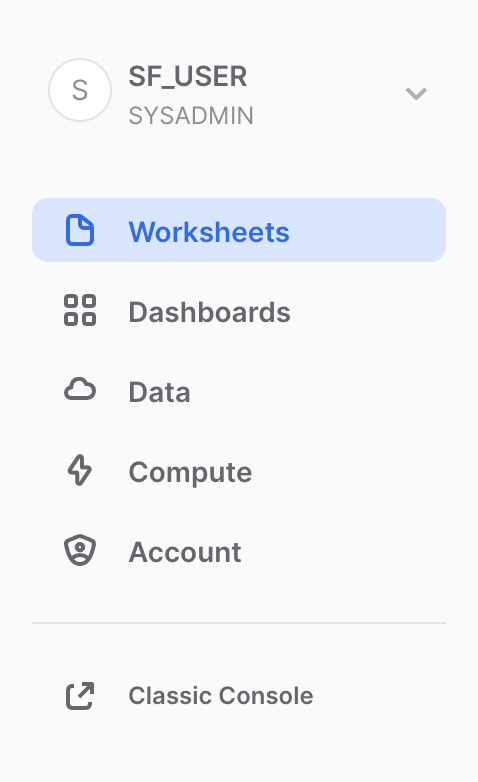

### Snowflake UI 탐색

Snowflake에 대해 알아봅시다! 이 섹션은 사용자 인터페이스의 기본적인 구성 요소를 다룹니다. UI 상단부터 왼쪽에서 오른쪽으로 이동하며 살펴보겠습니다.

탐색 모음을 사용하면 다음과 같이 Snowflake의 다양한 영역 간에 전환할 수 있습니다.


**Databases** 탭은 사용자가 생성했거나 액세스 권한을 지닌 데이터베이스에 관한 정보를 보여줍니다. 데이터베이스의 소유권을 생성, 복제, 삭제 또는 이전할 수 있을 뿐만 아니라 UI에서 데이터를 로드할 수 있습니다. 사용자 환경에 이미 여러 개의 데이터베이스가 존재합니다. 하지만 이 랩에서는 이를 사용하지는 않을 것입니다.


**Shares**  탭은 데이터 복사본을 생성하지 않고, 별도의 Snowflake 계정이나 외부 사용자 간에 쉽고 안전하게 Snowflake 테이블을 공유하도록 데이터 공유를 구성할 수 있는 곳입니다. 데이터 공유에 대해서는 섹션 10에서 다룰 것입니다.

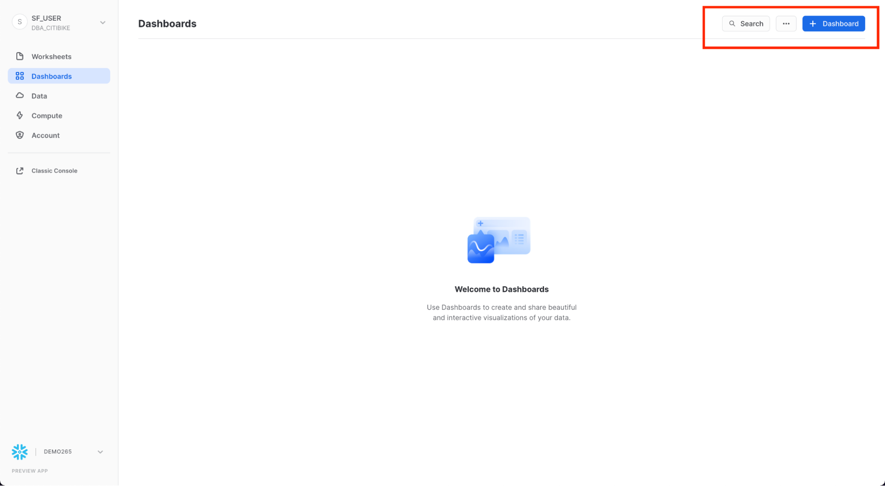

**Warehouses** 탭은 Snowflake에서 데이터를 로드하거나 쿼리하기 위해 가상 웨어하우스라는 컴퓨팅 리소스를 설정하고 관리하는 곳입니다. COMPUTE_WH (X-Small)이라는 웨어하우스가 사용자 환경에 이미 존재합니다.


**Worksheets** 탭은 SQL 쿼리 제출, DDL 및 DML 작업 수행 그리고 쿼리 또는 작업 완료 시 결과 확인을 위한 인터페이스를 제공합니다. 이 탭에 액세스하면 기본 워크시트 1이 나타납니다.

왼쪽 창에는 사용자가 워크시트에 대해 선택한 역할로 액세스할 수 있는 모든 데이터베이스, 스키마, 테이블 및 뷰를 탐색할 수 있는 데이터베이스 객체 브라우저가 포함되어 있습니다. 하단 창에는 쿼리 및 작업 결과가 표시됩니다.

이 페이지의 다양한 섹션은 슬라이더를 조정하여 크기를 조정할 수 있습니다. 랩을 진행하면서 워크시트에 더 많은 공간이 필요한 경우 왼쪽 창에서 데이터베이스 객체 브라우저를 축소합니다. 이 가이드의 많은 스크린샷에서는 이 섹션을 닫은 상태로 둡니다.


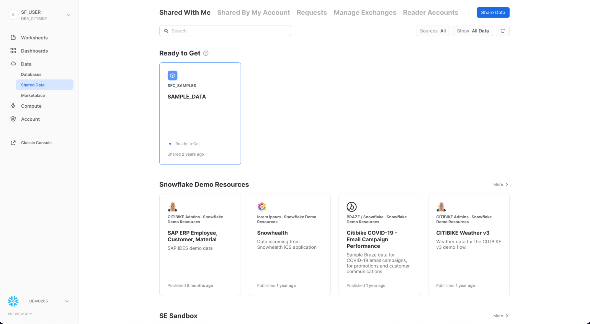


Negative
: **워크시트 vs UI**  이 랩의 많은 구성은 시간을 절약하기 위해 이 워크시트 내에 미리 작성된 SQL을 통해 실행됩니다. 이러한 구성은 또한 덜 기술적인 방식으로 UI를 통해 실행할 수도 있지만 시간이 더 많이 소요됩니다.

**History**  탭에서는 사용자의 Snowflake 계정에서 지난 14일간 수행된 모든 쿼리의 세부사항을 볼 수 있습니다. 자세한 내용을 확인하려면 쿼리 ID를 클릭하십시오.


UI의 우측 상단에서 사용자 이름을 클릭하면 암호, 역할 및 기본 설정을 변경할 수 있습니다. Snowflake에는 여러 가지 시스템에서 정의된 역할이 있습니다. 사용자는 현재 기본 역할인  `SYSADMIN`으로 되어 있으며 대부분의 랩에서 이 역할을 유지할 것입니다.

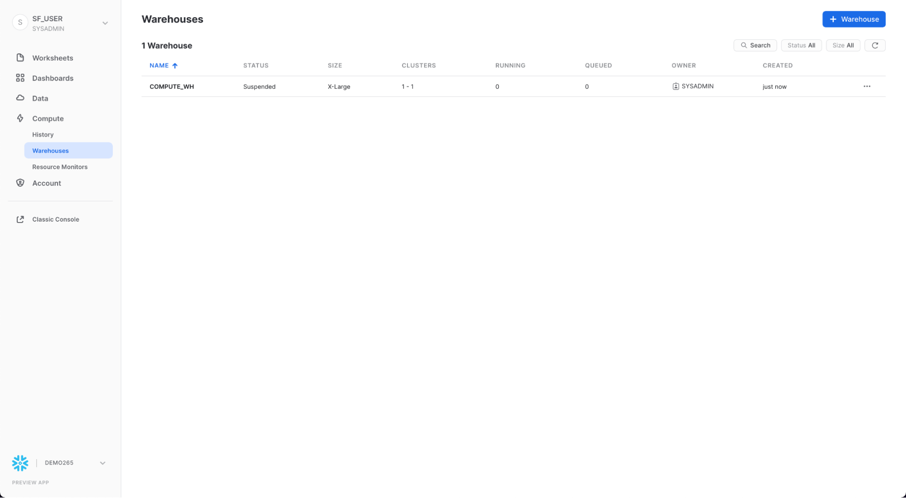

Negative
: **SYSADMIN**  `SYSADMIN`(시스템 관리자라고도 함) 역할은 웨어하우스, 데이터베이스 및 기타 객체를 계정에 생성할 수 있는 권한을 가집니다. 실제 환경에서는 이 랩의 작업에 서로 다른 역할을 사용하고 사용자에게 역할을 할당합니다. Snowflake 액세스 제어에 대한 더 자세한 정보는 섹션 9에서 다룰 것이며 더 자세한 정보는  [Snowflake 설명서](https://docs.snowflake.net/manuals/user-guide/security-access-control.html)에서 확인하실 수 있습니다.


### 랩 스토리

이 랩은 미국 뉴욕시의 실제 도시 전체 자전거 공유 시스템인 Citi Bike의 분석팀을 기반으로 합니다. 이 팀은 내부 트랜잭션 시스템의 데이터에 대한 분석을 실행하여 라이더 및 그들에게 최상의 서비스를 제공하는 방법을 더 잘 이해하고자 합니다.

먼저 정형 csv 데이터를 라이더 트랜잭션에서 Snowflake로 로드할 것입니다. 그다음 오픈 소스, 반정형 JSON 날씨 데이터를 사용해 자전거 이용 횟수와 날씨 사이에 상관관계가 있는지 확인할 것입니다.

<!-- ------------------------ -->

## 데이터 로드 준비

Duration: 14

Citi Bike 라이더 트랜잭션 정형 데이터를 Snowflake에 로드할 준비부터 시작하겠습니다.

이 섹션은 다음과 같은 단계로 진행됩니다.

-   데이터베이스 및 테이블 생성
-   외부 스테이지 생성
-   데이터에 대한 파일 형식 생성

Negative
: **Snowflake로 데이터 가져오기**  다양한 위치로부터 Snowflake로 데이터를 가져오는 방법은 COPY 명령, Snowpipe 자동 수집, 외부 커넥터 또는 타사 ETL/ELT 제품을 포함해 여러 가지가 있습니다. Snowflake로 데이터를 가져오는 것에 관한 더 자세한 정보는  [Snowflake 설명서](https://docs.snowflake.net/manuals/user-guide-data-load.html)를 참조하십시오. 교육 목적으로 COPY 명령과 S3 스토리지를 손으로 직접 입력하도록 하고 있습니다. 고객은 자동화된 프로세스 또는 ETL 제품을 사용할 가능성이 더 높습니다.

사용할 데이터는 Citi Bike NYC가 제공한 자전거 공유 데이터입니다. 이 데이터를 내보내서 미국 동부 지역의 Amazon AWS S3 버킷에 미리 구성했습니다. 데이터는 이동 시간, 위치, 사용자 유형, 성별, 나이 등에 관한 정보로 구성됩니다. AWS S3에서 이 데이터는 6,150만 행, 377개의 객체로 표현되고 1.9GB로 압축되어 있습니다.

아래는 Citi Bike CSV 데이터 파일 중 하나의 한 조각입니다.


헤더 한 행에 큰따옴표로.둘러싸여 쉼표로 구분된 형식입니다. 이는 이 섹션의 뒷부분에서 이 데이터를 저장할 Snowflake 테이블을 구성할 때 적용됩니다.

### 데이터베이스 및 테이블 생성

먼저, 정형 데이터를 로딩하는 데 사용할  `CITIBIKE`라는 이름의 데이터베이스를 만들어봅시다.

Databases 탭으로 이동합니다. 만들기를 클릭하고, 데이터베이스 이름을  `CITIBIKE`로 지정한 뒤, 마침을 클릭합니다.


이제 Worksheets 탭으로 이동합니다. 빈 워크시트가 나타납니다. 아래의 각 단계에서 SQL을 복사해 여기에 붙여넣어 실행할 수 있습니다.


워크시트 내에 컨텍스트를 적절하게 설정해야 합니다. 오른쪽 상단에서, 컨텍스트 섹션 옆의 드롭다운 화살표를 클릭하여 워크시트 컨텍스트 메뉴를 표시합니다. 여기에서 사용자가 각 워크시트에서 보고 실행할 수 있는 요소를 제어합니다. 여기에서는 UI를 사용하여 컨텍스트를 설정하고 있습니다. 랩의 후반부에서는 워크시트 내에서 SQL 명령을 통해 이를 수행할 것입니다.

다음과 같이 컨텍스트 설정을 선택합니다. 
Role: `SYSADMIN`
Warehouse: `COMPUTE_WH (XS)`
Database: `CITIBIKE`
Schema = `PUBLIC`

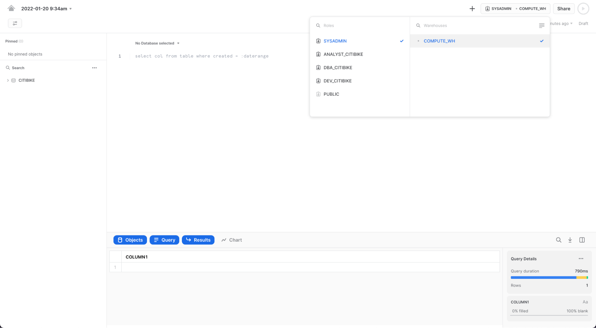

Negative
: **데이터 정의 언어(DDL) 작업은 무료입니다!**  지금까지 수행한 모든 DDL 작업에는 컴퓨팅 리소스가 필요하지 않으므로 모든 객체를 무료로 생성할 수 있습니다.

다음으로 쉼표로 구분된 데이터(CSV)를 로드하는 데 사용할 TRIPS라는 테이블을 만들 것입니다. Worksheets 탭의 UI를 사용하여 TRIPS 테이블을 생성하는 DDL을 실행할 것입니다. 아래의 SQL 텍스트를 워크시트로 복사하십시오.

```SQL
create or replace table trips
(tripduration integer,
starttime timestamp,
stoptime timestamp,
start_station_id integer,
start_station_name string,
start_station_latitude float,
start_station_longitude float,
end_station_id integer,
end_station_name string,
end_station_latitude float,
end_station_longitude float,
bikeid integer,
membership_type string,
usertype string,
birth_year integer,
gender integer);
```

Negative
: **명령을 실행하는 다양한 옵션.**  SQL 명령은 UI를 통해서나, Worksheets 탭을 통해, SnowSQL 명령행 도구를 사용해서, ODBC/JDBC를 통해 선택한 SQL 편집기를 이용해서 또는 Python이나 Spark 커넥터를 통해 실행할 수 있습니다. 앞서 언급했듯이, 이 랩에서는 시간을 절약하기 위해 워크시트 내 미리 작성된 SQL을 통해 작업을 실행할 것입니다.

커서를 명령 내 어디든 두고 페이지 상단의 파란색 실행 버튼을 클릭하여 쿼리를 실행하십시오. 또는 바로 가기 키 Ctrl/Cmd+Enter를 이용하십시오.

Negative
: **경고**  이 랩의 워크시트 상단에 있는 모든 쿼리 상자는 선택하지 마십시오. SQL 쿼리를 모두 한 번에 실행하는 것이 아닌, 한 번에 하나씩 특정한 순서로 실행하고자 합니다.

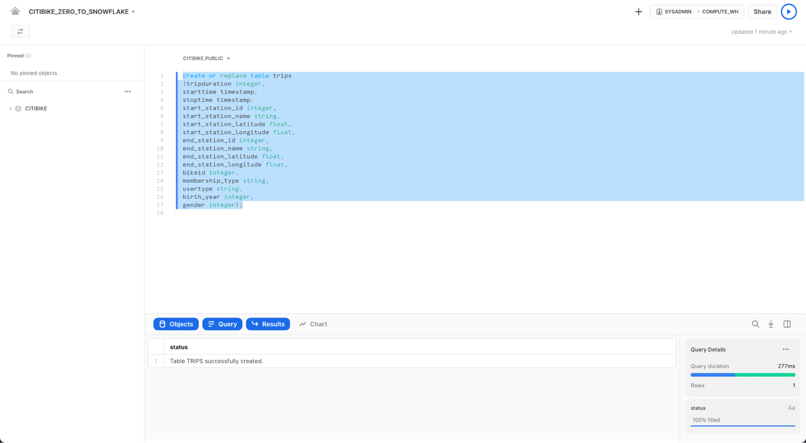

명령의 전체 SQL 텍스트를 강조 표시하여 실행했다면, “다음 쿼리를 실행하시겠습니까?”라고 묻는 확인 상자가 나타납니다. 상자의 파란색 실행 버튼을 클릭하십시오. 앞으로도 이 확인 상자를 계속 사용하거나 “다시 묻지 않음(모든 워크시트)” 옵션을 선택할 수도 있습니다.


TRIPS 테이블이 생성되었는지 확인하십시오. 워크시트 하단의 결과 섹션에 “테이블 TRIPS가 성공적으로 생성되었습니다”라는 메시지가 나타나야 합니다.

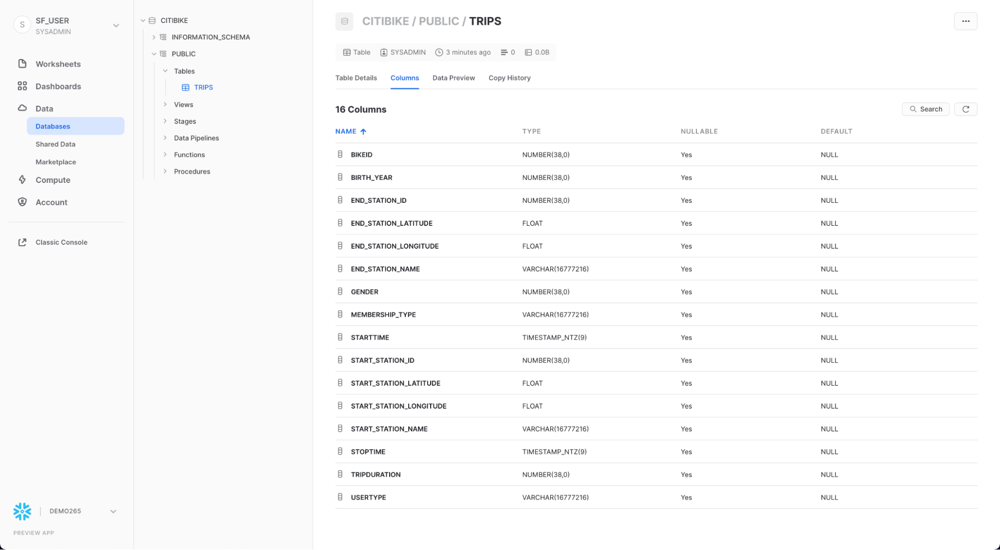

Databases 탭으로 이동하여 CITIBIKE 데이터베이스 링크를 클릭합니다. 새롭게 생성한 TRIPS 테이블이 나타나야 합니다. 데이터베이스가 보이지 않는다면, 숨겨져 있을 수 있으므로 브라우저를 확장하십시오.


방금 구성한 테이블 구조를 보려면 TRIPS 하이퍼링크를 클릭하십시오.


### 외부 스테이지 생성

우리는 공개된 외부 S3 버킷에 미리 스테이지한 쉼표로 구분된 정형 데이터로 작업하고 있습니다. 이 데이터를 사용하려면, 먼저 외부 버킷의 위치를 지정하는 스테이지를 생성해야 합니다.

이 랩에서는 AWS-동부 버킷을 사용하고 있습니다. 향후 데이터 송신/전송 비용 발생을 방지하려면 Snowflake 환경과 동일한 클라우드 공급자 및 지역에서 스테이지 위치를 선택해야 합니다.

Databases 탭에서,  `CITIBIKE`  데이터베이스를 클릭하고 단계를 선택한 다음 생성합니다...


기존의 Amazon S3 위치 옵션을 선택하고 다음을 클릭합니다.


단계 만들기 상자에서, 다음과 같이 설정을 입력하고, 마침을 클릭합니다.

이름: `citibike_trips`
스키마 이름: `PUBLIC`
URL: `s3://snowflake-workshop-lab/citibike-trips`

Positive
: 이 랩의 S3 버킷은 공개되어 있으므로 키 필드를 비운 채로 두셔도 됩니다. 이러한 버킷에는 향후 주요 정보가 필요할 수 있습니다.


이제  `citibike_trips`  단계의 콘텐츠를 살펴보겠습니다. Worksheets 탭으로 이동하여 다음 문을 실행합니다.

```SQL
list @citibike_trips;
```


하단 창의 결과 창에 다음과 같이 결과가 나타나야 합니다.


### 파일 형식 생성

Snowflake로 데이터를 로드하려면, 먼저 데이터 구조와 일치하는 파일 형식을 생성해야 합니다.

Databases 탭에서,  `CITIBIKE`  데이터베이스 하이퍼링크를 클릭합니다. 파일 형식 및 만들기를 선택합니다.


결과 페이지에서 파일 형식을 생성합니다. 표시된 상자에서, 모두 기본 설정 그대로 두고 아래와 같은 부분만 변경합니다.

Name: CSV

Field optionally enclosed by: Double Quote

Null string: 이 필드의 기존 텍스트를 삭제합니다

[] Error on Column Count Mismatch: 이 상자의 선택을 취소합니다

Negative
: “Error on Column Count Mismatch” 상자가 보이지 않는다면, 대화 상자에서 아래로 스크롤 하십시오.

작업을 완료하면, 상자는 다음과 같이 보여야 합니다.


마침을 클릭하여 파일 형식을 생성합니다.

<!-- ------------------------ -->

## 데이터 로딩

Duration: 10

이 섹션에서는 데이터 웨어하우스와 COPY 명령을 사용하여 방금 생성한 Snowflake 테이블에 정형 데이터 대량 로드 (bulk loading)를 시작할 것입니다.

### 데이터 로드를 위한 웨어하우스 크기 조정 및 사용

데이터를 로드하려면 컴퓨팅 파워가 필요합니다. Snowflake의 컴퓨팅 노드는 가상 웨어하우스 (Virtual Warehouse)라고 하며 워크로드가 데이터 로드, 쿼리 실행 또는 DML 작업을 수행하는지 여부에 따라 워크로드에 맞춰 동적으로 크기를 늘리거나 줄일 수 있습니다. 각 워크로드는 자체 데이터 웨어하우스를 보유할 수 있으므로 리소스 경합이 없습니다.

Warehouses 탭으로 이동합니다. 이 곳에서 기존의 모든 웨어하우스를 보고 그 사용 추세를 분석할 수 있습니다.

상단의 Create... 옵션에서 새로운 웨어하우스를 빠르게 추가할 수 있습니다. 하지만 여기서는 30일 무료 평가판 환경에 포함된 기존의 COMPUTE_WH 웨어하우스를 사용하고자 합니다.

이 COMPUTE_WH 행(COMPUTE_WH라고 쓰인 파란색 하이퍼링크가 아닙니다)을 클릭하고 전체 행을 강조 표시합니다. 그 다음 그 위의 Configure...텍스트를 클릭해서 COMPUTE_WH의 구성 세부 사항을 확인합니다. 이 웨어하우스를 사용하여 AWS S3에서 데이터를 로드할 것입니다.

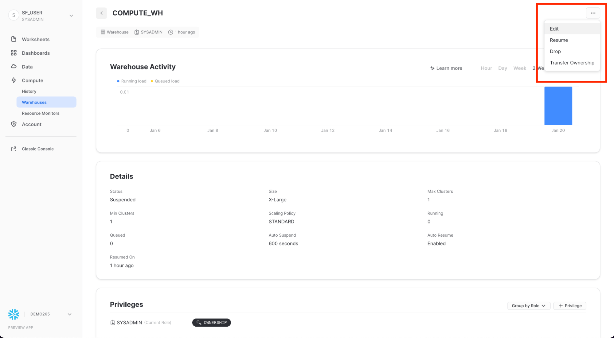

이 웨어하우스의 설정을 살펴보고 Snowflake의 몇 가지 고유한 기능에 대해 알아보겠습니다.

Snowflake 엔터프라이즈 에디션 이상을 갖고 있지 않은 경우, 아래 스크린샷 중 최대 클러스터 또는 조정 정책 구성이 표시되지 않습니다. 이 랩에서는 멀티 클러스터링을 사용하지 않지만, Snowflake의 핵심 클러스터이기 때문에 이에 대해 논의할 것입니다.

-   크기 드롭다운에서 웨어하우스의 용량을 선택합니다. 더 큰 데이터 로드 작업이나 보다 컴퓨팅 집약적인 쿼리의 경우 더 큰 웨어하우스가 필요합니다. 크기는 기본 컴퓨팅 노드인 AWS EC2 또는 Azure 가상 머신으로 변환됩니다. 사이즈가 커질수록, 클라우드 공급자로부터 더 많은 컴퓨팅 리소스가 이 웨어하우스에 할당됩니다. 예를 들어 4-XL 옵션은 128개의 노드를 할당합니다. 이 크기는 간단한 클릭만으로 언제든 늘리거나 줄일 수 있습니다.
-   Snowflake 엔터프라이즈 에디션 이상을 보유하고 있다면 최대 클러스터 섹션이 표시될 것입니다. 여기에서 단일 웨어하우스를 최대 10개의 클러스터로 이뤄진 다중 클러스터로 설정할 수 있습니다. 예를 들어 4-XL 웨어하우스에 최대 클러스터 크기 10이 할당된 경우, 이 웨어하우스를 지원하는 AWS EC2 또는 Azure VM 노드를 1280(128 * 10)개까지 확장할 수 있으며...단 몇 초면 됩니다! 멀티 클러스터는 다수의 비즈니스 분석가가 동일한 웨어하우스를 사용하여 다양한 쿼리를 동시에 실행하는 동시성 시나리오에 이상적입니다. 이 사용 사례에서 다양한 쿼리를 여러 클러스터에 할당하여 빠르게 실행하도록 할 수 있습니다.
-   마지막 섹션은 웨어하우스를 자동으로 일시 중단할 수 있게 해 사용하지 않을 때 자동으로 중단하고 크레딧이 불필요하게 소모되지 않도록 합니다. 일시 중단된 웨어하우스를 자동으로 재개하는 옵션도 있어서 새로운 워크로드가 할당되면 자동으로 다시 시작됩니다. 이 기능으로 고객이 필요할 때 리소스를 확장하고 필요하지 않은 리소스를 자동으로 축소하거나 끌 수 있도록 하는 Snowflake의 효율적인 "사용한 만큼만 지불"하는 청구 모델이 구현됩니다.


Negative
: **Snowflake 컴퓨팅 vs 타사 웨어하우스**  웨어하우스 생성, 스케일 업, 스케일 아웃 및 자동 일시 중단/재개 기능과 같이 우리가 방금 다룬 여러 웨어하우스 및 컴퓨팅 기능이 Snowflake에서는 모두 간단하게 이뤄지며 단 몇 초면 할 수 있습니다. 온프레미스 데이터 웨어하우스의 경우 이러한 기능은 상당한 물리적 하드웨어, 워크로드 급증에 대비한 과한 하드웨어 프로비저닝, 상당한 구성 작업을 필요로 하며 추가적인 도전 과제로 인해 불가능하지는 않더라도 구현하기가 매우 어렵습니다. 심지어 다른 클라우드 데이터 웨어하우스도 훨씬 더 많은 구성 작업과 시간 없이는 Snowflake처럼 스케일 업 및 스케일 아웃을 할 수 없습니다.

Negative
: **경고 - 지출을 조심하십시오!**  이 랩을 진행하는 동안이나 이후에 정당한 이유 없이 다음 작업을 수행하는 걸 권장하지 않습니다. 왜냐면 그렇게 할 경우에는 $400의 무료 크레딧을 원하는 것보다 빨리 소진할 수도 있습니다.

-   자동 일시 중단을 비활성화합니다. 자동 일시 중단이 비활성화되면, 웨어하우스가 계속 실행되어 사용하지 않을 때도 크레딧을 소모합니다.
-   워크로드에 비해 과도하게 큰 웨어하우스를 사용합니다. 웨어하우스가 커질수록 더 많은 크레딧이 소모됩니다.

이 데이터 웨어하우스를 사용하여 정형 데이터를 Snowflake로 로드할 것입니다. 하지만 먼저 웨어하우스 크기를 Small로 변경해 보세요. 그 다음 단계에서는 이 로드에 소요되는 시간을 기록하고 더 큰 웨어하우스에서 동일한 로드 작업을 다시 수행하면서 로드 시간이 더 빨라지는 것을 관찰할 것입니다.

이 데이터 웨어하우스 크기를 X-Small에서  Small로 변경하십시오. 그 다음 마침 버튼을 클릭합니다.


### 데이터 로드

이제 COPY 명령을 실행하여 데이터를 앞서 생성한  `TRIPS`  테이블로 로드할 수 있습니다.

Worksheets 탭으로 다시 이동합니다. 워크시트 오른쪽 상단에서, 컨텍스트가 다음과 같이 올바르게 설정되어 있는지 확인합니다.

Role: `SYSADMIN`
Warehouse: `COMPUTE_WH (S)`
Database: `CITIBIKE`
Schema = `PUBLIC`


워크시트에서 다음의 문을 실행하여 구성한 데이터를 테이블로 로드합니다. 이는 50초 정도 소요됩니다.

```SQL
copy into trips from @citibike_trips
file_format=CSV;
```

결과 창에서, 로드 상태가 다음과 같이 표시됩니다.


로드가 완료되면, 워크시트 오른쪽 하단의 이력 열기 텍스트 옆 작은 화살표를 클릭하여 해당 워크시트에서 수행한 Snowflake 작업 기록을 표시합니다.


이력 창에서 방금 실행한  `copy into trips from @citibike_trips file_format=CSV;`  SQL 쿼리를 확인하고 기간, 스캔한 바이트 및 행에 주목하십시오. 필요하다면 창 왼쪽의 슬라이더를 이용하여 확장하십시오.


워크시트로 돌아가서 TRUNCATE TABLE 명령을 사용하여 모든 데이터와 메타데이터를 지웁니다.

```SQL
truncate table trips;
```

워크시트 컨텍스트 메뉴를 열고 크기 조정 (Resize)을 클릭하여 웨어하우스를 Medium 사이즈로 늘린 뒤 마침을 클릭합니다. 이 웨어하우스는 스몰 사이즈보다 두 배 더 큽니다.


워크시트로 돌아가서 다음 문을 실행하여 동일한 데이터를 다시 로드합니다.

```SQL
copy into trips from @citibike_trips
file_format=CSV;
```

로드가 완료되면, 이력 창의 워크시트 하단에서 두 로드 간 시간을 비교합니다. Medium 웨어하우스를 사용한 로드가 훨씬 더 빨랐습니다.


### 4.3 데이터 분석을 위한 새로운 웨어하우스 생성

랩 스토리로 돌아가서 Citi Bike 팀이 데이터 로드/ETL 워크로드와 BI 도구를 사용하여 Snowflake를 쿼리하는 분석 최종 사용자 간의 리소스 경합을 제거하고자 한다고 가정해 보겠습니다. 앞서 언급했듯이, Snowflake는 다양한 워크로드에 서로 다른 알맞은 크기의 웨어하우스를 할당하여 이를 쉽게 수행할 수 있습니다. Citi Bike는 이미 데이터 로드를 위한 웨어하우스를 보유하고 있기 때문에, 최종 사용자가 분석을 실행하기 위한 새로운 웨어하우스를 생성해 보겠습니다. 다음 섹션에서 이 웨어하우스를 이용하여 분석을 수행할 것입니다.

Warehouses 탭으로 이동하여 만들기...를 클릭하고, 새로운 웨어하우스의 이름을 `ANALYTICS_WH` 로 하고 크기는 Medium으로 지정합니다. Snowflake 엔터프라이즈 에디션 이상을 보유하고 있다면 최대 클러스터에 대한 설정이 나타납니다. 이를 1로 설정하십시오.

다른 설정은 기본 설정으로 남겨 두십시오. 다음과 같이 나타나야 합니다.

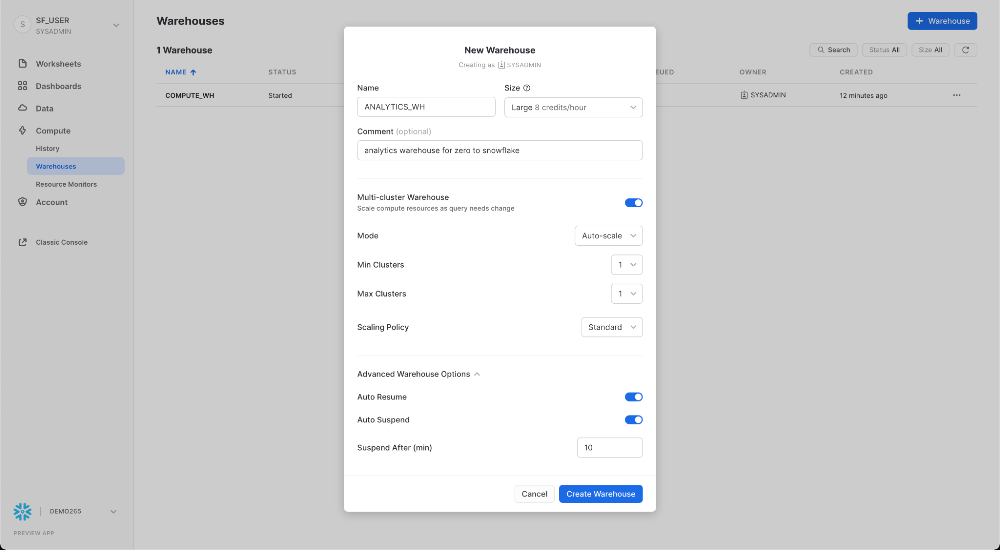

마침 버튼을 크릭하여 웨어하우스를 생성하십시오.

<!-- ------------------------ -->

## 분석 쿼리, 결과 캐시, 클론

Duration: 8

이전 연습에서, Snowflake의 대량 로더인  `COPY`  명령과 웨어하우스  `COMPUTE_WH`를 이용하여 데이터를 두 개의 테이블로 로드했습니다. 이제 워크시트와 두 번째 웨어하우스인  `ANALYTICS_WH`를 이용하여 해당 테이블의 데이터를 쿼리해야 하는 Citi Bike의 분석 사용자 역할을 수행해 보겠습니다.

Negative
: **실제 역할 및 쿼리**  실제 기업에서는, 분석 사용자가 SYSADMIN이 아닌 다른 역할을 수행할 수도 있습니다. 이 랩을 단순하게 유지하기 위해 이 섹션에서는 계속해서 SYSADMIN 역할을 맡을 것입니다. 또한 쿼리는 일반적으로 Tableau, Looker, PowerBI 등과 같은 비즈니스 인텔리전스 제품으로 이뤄집니다. 고급 분석을 위해 Datarobot, Dataiku, AWS Sagemaker와 같은 데이터 과학 도구나 기타 여러 도구가 Snowflake를 쿼리할 수 있습니다. JDBC/ODBC, Spark 또는 Python을 활용하는 모든 기술이 Snowflake의 데이터에 대한 분석을 실행할 수 있습니다. 이 랩을 단순하게 유지하기 위해 모든 쿼리는 Snowflake 워크시트를 통해 수행됩니다.

### SELECT 문 실행 및 결과 캐시

Worksheets 탭으로 가십시오. 워크시트에서 컨텍스트가 다음과 같은지 확인합니다.

Role: `SYSADMIN`
Warehouse: `ANALYTICS_WH (M)`
Database: `CITIBIKE`
Schema = `PUBLIC`

아래의 쿼리를 실행하여 trips 데이터 샘플을 확인합니다.

```SQL
select * from trips limit 20;
```


먼저 Citi Bike 사용에 관한 몇 가지 기본적인 시간별 통계를 살펴보시죠. 아래의 쿼리를 워크시트에서 실행합니다. 이는 시간당 이동 횟수, 평균 이동 기간 및 평균 이동 거리를 보여줍니다.

```SQL
select date_trunc('hour', starttime) as "date",
count(*) as "num trips",
avg(tripduration)/60 as "avg duration (mins)",
avg(haversine(start_station_latitude, start_station_longitude, end_station_latitude, end_station_longitude)) as "avg distance (km)"
from trips
group by 1 order by 1;
```

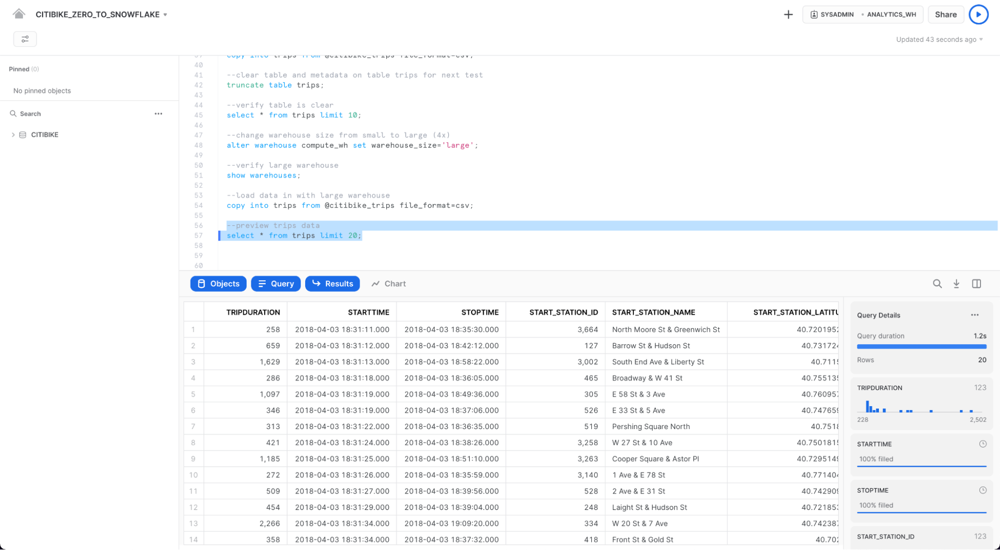

Snowflake에는 지난 24시간 동안 실행된 모든 쿼리의 결과를 보유하고 있는 결과 캐시가 있습니다. 이는 웨어하우스 전반에 걸쳐 사용할 수 있으므로 기본 데이터가 변경되지 않았다면, 한 사용자에게 반환된 쿼리 결과를 동일한 쿼리를 실행하는 해당 시스템의 다른 사용자가 사용할 수 있습니다. 이러한 반복 쿼리는 매우 빠르게 반환될 뿐만 아니라 컴퓨팅 크레딧도 전혀 사용하지 않습니다.

정확히 동일한 쿼리를 다시 실행하여 결과 캐시가 작동하는지 확인해보시죠.

```SQL
select date_trunc('hour', starttime) as "date",
count(*) as "num trips",
avg(tripduration)/60 as "avg duration (mins)",
avg(haversine(start_station_latitude, start_station_longitude, end_station_latitude, end_station_longitude)) as "avg distance (km)"
from trips
group by 1 order by 1;
```

결과가 캐시되었기 때문에 두 번째 쿼리가 훨씬 더 빠르게 실행되었음을 이력 창에서 확인합니다.


다음으로, 다음과 같은 쿼리를 실행하여 몇 월이 가장 바쁜지 확인하겠습니다.

```SQL
select
monthname(starttime) as "month",
count(*) as "num trips"
from trips
group by 1 order by 2 desc;
```

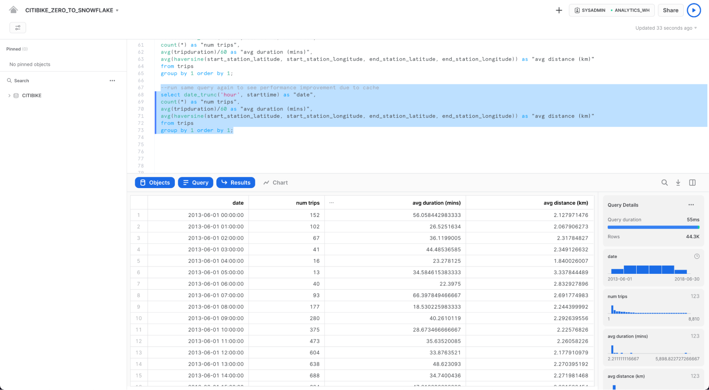

### 테이블 복제

Snowflake를 사용하면 "제로 카피 클론"이라고도 하는 테이블, 스키마 및 데이터베이스의 클론을 몇 초 안에 생성할 수 있습니다. 클론을 생성할 때 원본 객체에 있는 데이터의 스냅샷을 찍으며 복제된 객체에서 이를 사용할 수 있습니다. 복제된 객체는 쓰기 가능하고 클론 원본과는 독립적입니다. 따라서 원본 객체 또는 클론 객체 중 하나에 이뤄진 변경은 다른 객체에는 포함되지 않습니다.

제로 카피 클론 생성의 일반적인 사용 사례는 개발 및 테스팅이 사용하는 운영 환경을 복제하여 운영 환경에 부정적인 영향을 미치지 않게 두 개의 별도 환경을 설정하여 관리할 필요가 없도록 테스트하고 실험하는 것입니다.

Negative
: **제로 카피 클론 생성**  제로 카피 클론 생성의 굉장히 큰 이점은 기본 데이터가 복사되지 않는다는 점입니다. 기본 데이터에 대한 메타데이터와 포인터만 변경됩니다. 이런 이유로 "제로 카피"이며 데이터 복제 시 스토리지 요구 사항이 두 배가 되지 않습니다. 대부분의 데이터 웨어하우스에서는 이렇게 할 수 없지만, Snowflake에서는 쉽게 할 수 있습니다!

워크시트에서 다음 명령을 실행하여 개발(dev) 테이블을 생성합니다.

```SQL
create table trips_dev clone trips
```

닫힌 경우, 워크시트 왼쪽의 데이터베이스 객체 브라우저를 확장합니다. 왼쪽 패널에서 작은 새로 고침 버튼을 클릭하고 CITIBIKE 데이터베이스 아래의 객체 트리를 확장합니다. CITIBIKE 데이터베이스 아래에 TRIPS_DEV라는 새 테이블이 표시되는지 확인합니다. 이제 개발팀은 TRIPS 테이블이나 다른 객체에 영향을 주지 않고 삭제를 포함하여 이 테이블로 원하는 모든 작업을 수행할 수 있습니다.

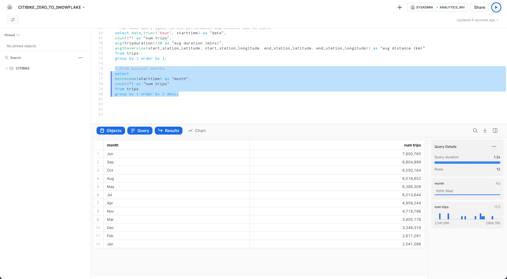

<!-- ------------------------ -->

## 반정형 데이터, 뷰, 조인으로 작업

Duration: 16

Positive
: 이 섹션의 첫 번째 단계에서는 데이터를 로드하는 방법을 검토하지만 대부분은 UI 대신 워크시트에서 SQL을 통해 수행합니다.

랩의 예제로 돌아가서, Citi Bike 분석팀은 날씨가 자전거 이용 횟수에 어떻게 영향을 미치는지 확인하고자 합니다. 이를 위해, 이 섹션에서는 다음을 수행합니다.

-   공개된 S3 버킷에 보관된 JSON 형식의 날씨 데이터 로드
-   뷰 생성 및 SQL 점 표기법 (dot notation)을 사용해 반정형 데이터를 쿼리
-   JSON 데이터를 이전에 로드된  `TRIPS`  데이터에 조인하는 쿼리를 실행
-   날씨 및 자전거 이용 횟수 데이터를 분석하여 관계 파악

JSON 데이터는 OpenWeatherMap에서 제공한 날씨 정보로 구성되며 이는 2016년 7월 5일부터 2019년 6월 25일까지 뉴욕시의 과거 날씨를 상세히 제시합니다. 또한 데이터가 57,900행, 61개 객체 및 2.5MB 압축으로 이뤄진 AWS S3에 구성됩니다. GZ 파일 및 텍스트 편집기의 미가공 JSON은 다음과 같은 모습입니다.


Negative
: **반정형 데이터**  Snowflake는 변환 없이 JSON, Parquet 또는 Avro와 같은 반정형 데이터를 쉽게 로드하고 쿼리할 수 있습니다. 오늘날 점점 더 많은 비즈니스 관련 데이터가 반정형으로 생산되고 있으며, 많은 기존 데이터 웨어하우스는 이러한 데이터를 쉽게 로드하고 쿼리할 수 없기 때문에 중요합니다. Snowflake가 이를 쉽게 만들어 줍니다!

### 데이터베이스 및 테이블 생성

먼저, 워크시트를 통해, 비정형 데이터를 저장하는 데 사용할  `WEATHER`라는 이름의 데이터베이스를 만들어봅시다.

```SQL
create database weather;
```

워크시트 내에 컨텍스트를 적절하게 설정합니다.

```SQL
use role sysadmin;
use warehouse compute_wh;
use database weather;
use schema public;
```

다음, JSON 데이터를 로딩하는 데 사용할  `JSON_WEATHER_DATA`라는 이름의 데이터베이스를 만들어봅시다. 워크시트에서 아래의 SQL 텍스트를 실행합니다. Snowflake에는  `VARIANT`라는 특수 열 유형이 있어 이를 통해 전체 JSON 객체를 저장하고 궁극적으로는 직접 쿼리할 수 있습니다.

```SQL
create table json_weather_data (v variant);
```

Negative
: **반정형 데이터 마법**  VARIANT 데이터 유형을 사용하면 Snowflake가 스키마를 미리 정의하지 않고도 반정형 데이터를 수집할 수 있습니다.

`JSON_WEATHER_DATA`  테이블이 생성되었는지 확인하십시오. 워크시트 하단에 “Table JSON_WEATHER_DATA successfully created.”라는 결과 섹션이 나타나야 합니다.


Databases 탭으로 이동하여  `WEATHER`  데이터베이스 링크를 클릭합니다. 새롭게 생성한  `JSON_WEATHER_DATA`  테이블이 나타나야 합니다.

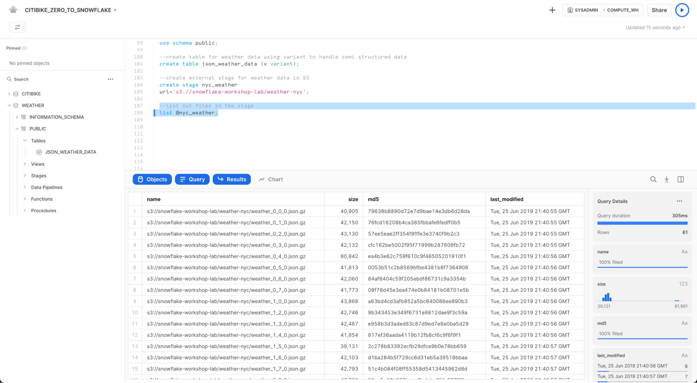

### 외부 스테이지 생성

워크시트를 통해 비정형 데이터가 AWS S3에 저장되는 스테이지를 생성합니다.


```SQL
create stage nyc_weather
url = 's3://snowflake-workshop-lab/weather-nyc';
```

이제  `nyc_weather`  스테이지의 콘텐츠를 살펴보겠습니다. Worksheets 탭으로 이동합니다.  `LIST`  명령과 함께 다음 문을 실행하여 파일 목록을 표시합니다.

```SQL
list @nyc_weather;
```

S3의 여러 gz 파일이 하단 창의 결과 창에 다음과 같이 결과로 나타나야 합니다.


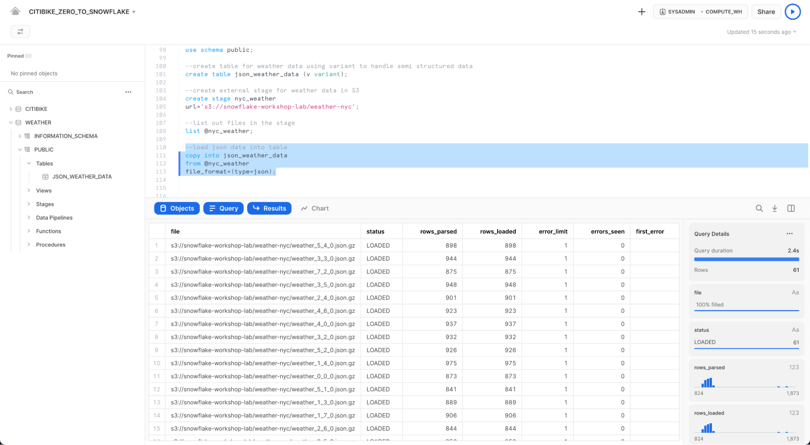

### 비정형 데이터 로드 및 확인

이 섹션에서는 웨어하우스를 사용해 S3 버킷의 데이터를 방금 생성한 Snowflake 테이블로 로드할 것입니다.

워크시트를 통해,  `COPY`  명령을 실행하여 데이터를 앞서 생성한  `JSON_WEATHER_DATA`  테이블로 로드합니다.

SQL 명령에서  `FILE FORMAT`  객체를 인라인으로 지정할 수 있는 방법에 주목하십시오. 정형 데이터를 로드했던 이전 섹션에서 파일 형식을 자세하게 정의해야 했습니다. 여기에 있는 JSON 데이터는 형식이 잘 지정되어 있기 때문에 기본 설정을 사용해 간단하게 JSON 유형을 지정할 수 있습니다.

```SQL
copy into json_weather_data
from @nyc_weather
file_format = (type=json);
```

로드된 데이터를 살펴보십시오.

```SQL
select * from json_weather_data limit 10;
```

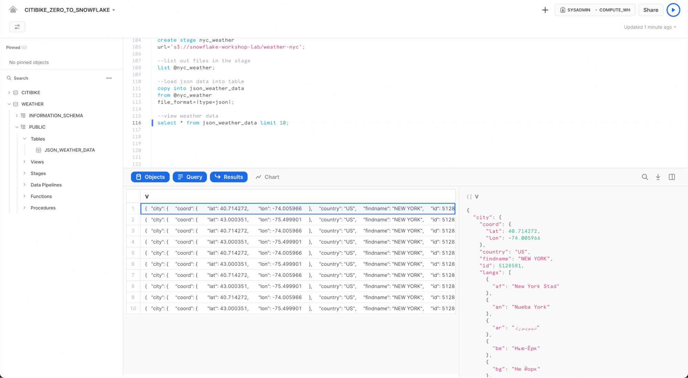

값 중 하나를 클릭합니다. 미가공 JSON에 데이터가 어떻게 저장되는지 확인하십시오. 다 마치면 완료를 클릭합니다.

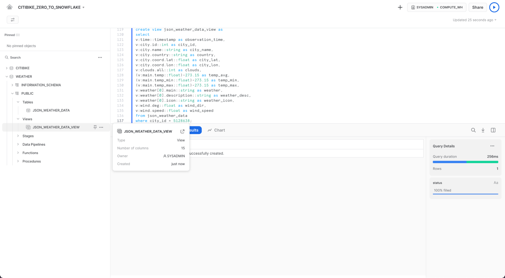

### 뷰 생성 및 반정형 데이터 쿼리

Snowflake를 통해 어떻게 뷰를 생성하고 또 SQL을 이용해 JSON 데이터를 어떻게 직접 쿼리할 수 있는지 살펴봅시다.


Negative
: **뷰 및 구체화된 뷰**  뷰를 사용하면 쿼리 결과에 테이블처럼 액세스할 수 있습니다. 뷰는 최종 사용자에게 보다 깔끔한 방식으로 데이터를 제시하고 소스 테이블에서 최종 사용자가 볼 수 있는 것을 제한하며 더 많은 모듈식 SQL을 작성하는 데 도움이 됩니다. SQL 결과가 테이블처럼 저장되는 구체화된 뷰도 있습니다. 이를 통해 더 빠르게 액세스할 수 있지만, 이는 저장 용량을 필요로 합니다. Snowflake 엔터프라이즈 이상에서 구체화된 뷰에 액세스할 수 있습니다.

Worksheets 탭에서 다음의 명령을 실행하십시오. 비정형 JSON 날씨 데이터에 대한 뷰를 열 형식 뷰로 생성하여 분석가가 더 쉽게 이해하고 쿼리할 수 있도록 할 것입니다. city_id 5128638은 뉴욕시에 해당합니다.

```SQL
create view json_weather_data_view as
select
v:time::timestamp as observation_time,
v:city.id::int as city_id,
v:city.name::string as city_name,
v:city.country::string as country,
v:city.coord.lat::float as city_lat,
v:city.coord.lon::float as city_lon,
v:clouds.all::int as clouds,
(v:main.temp::float)-273.15 as temp_avg,
(v:main.temp_min::float)-273.15 as temp_min,
(v:main.temp_max::float)-273.15 as temp_max,
v:weather[0].main::string as weather,
v:weather[0].description::string as weather_desc,
v:weather[0].icon::string as weather_icon,
v:wind.deg::float as wind_dir,
v:wind.speed::float as wind_speed
from json_weather_data
where city_id = 5128638;
```

SQL dot notation (점 표기법)  `v:city.coord.lat`은 이 명령에서 JSON 계층 구조 내 더 낮은 수준의 값을 가져오는 데 사용됩니다. 이는 각 필드를 관계형 테이블의 열인 것처럼 취급할 수 있도록 합니다.

새로운 뷰가 UI 왼쪽 상단의 테이블  `json_weather_data`  아래에 나타나야 합니다. 이를 보기 위해 데이터베이스 객체 브라우저를 확장 또는 새로 고침해야 할 수도 있습니다.

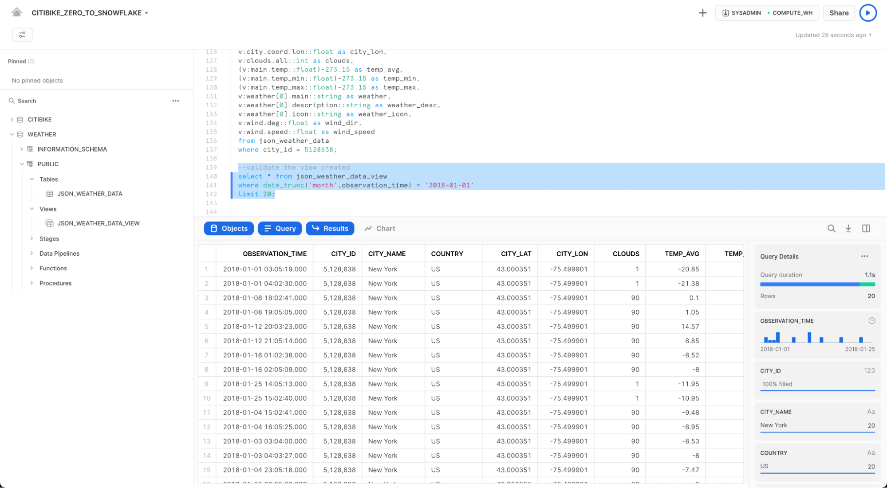

워크시트를 통해 다음 쿼리를 사용하여 뷰를 확인하십시오. 그 결과가 일반적인 정형 데이터 소스처럼 보여야 함에 주목하세요. 결과 세트의 observation_time 값이 다를 수도 있습니다.

```SQL
select * from json_weather_data_view
where date_trunc('month',observation_time) = '2018-01-01'
limit 20;
```

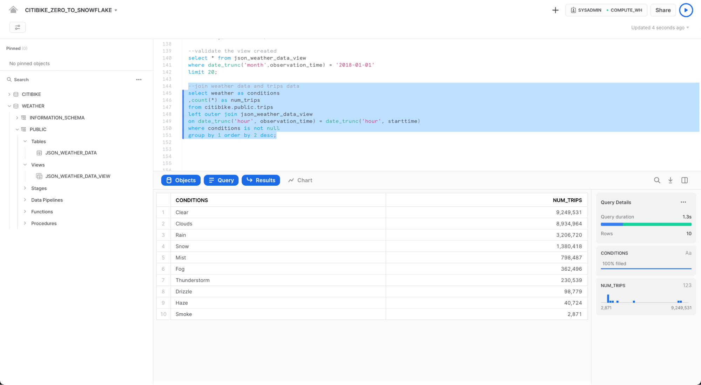

### 데이터 세트에 대한 상관 관계를 보기 위해 조인 작업 사용

이제 JSON 날씨 데이터를  `CITIBIKE.PUBLIC.TRIPS`  데이터에 조인하여 원래 질문인 날씨가 자전거 이용 횟수에 어떻게 영향을 미치는지에 대해 답할 것입니다.

`WEATHER`를  `TRIPS`에 조인하고 특정 날씨 조건과 관련된 이동 횟수를 확인하기 위해 아래의 명령을 실행하십시오.

Positive
: 아직 워크시트에 있기 때문에  `WEATHER`  데이터베이스가 기본값입니다. 데이터베이스와 스키마 이름을 제공하여  `TRIPS`  테이블에 대해 완전히 참조할 수 있을 것입니다.


```SQL
select weather as conditions
,count(*) as num_trips
from citibike.public.trips
left outer join json_weather_data_view
on date_trunc('hour', observation_time) = date_trunc('hour', starttime)
where conditions is not null
group by 1 order by 2 desc;
```


최초의 목적은 이용자 수와 날씨 데이터 모두를 분석하여 자전거 이용 횟수와 날씨 간에 어떤 상관 관계가 있는지 확인하는 것이었습니다. 위의 테이블에 따르면 답이 명확합니다. 상상하는 바와 같이, 날씨가 좋을 때의 이동 횟수가 훨씬 더 많은걸 볼 수 있네요!

<!-- ------------------------ -->

## 타임 트래블 사용

Duration: 6

Snowflake의 타임 트래블 기능으로 사전 구성 가능한 기간 내 어느 시점이든 데이터에 액세스할 수 있습니다. 기본 기간은 24시간이며 Snowflake 엔터프라이즈 에디션으로는 90일까지 가능합니다. 대부분의 데이터 웨어하우스는 이러한 기능을 제공할 수 없지만, 짐작하셨겠지만 Snowflake는 이러한 기능을 쉽게 만들어 줍니다!

몇 가지 유용한 적용례는 다음과 같습니다.

-   삭제되었을 수도 있는 테이블, 스키마 및 데이터베이스 같은 데이터 관련 객체를 복구
-   과거의 주요 시점으로부터 데이터를 복제하고 백업
-   데이터 사용을 분석하고 특정 기간에 대해 조작

### 테이블 삭제 및 복구

먼저 실수로 또는 의도적으로 삭제한 데이터 객체를 어떻게 복구할 수 있는지 살펴보겠습니다.

워크시트에서 다음의 DROP 명령을 실행하여 json_weather_data 테이블을 제거합니다.

```SQL
drop table json_weather_data;
```

json_weather_data 테이블에서 SELECT 문을 실행합니다. 기본 테이블이 삭제되었기 때문에 결과 창에 오류가 나타나야 합니다.

```SQL
select * from json_weather_data limit 10;
```

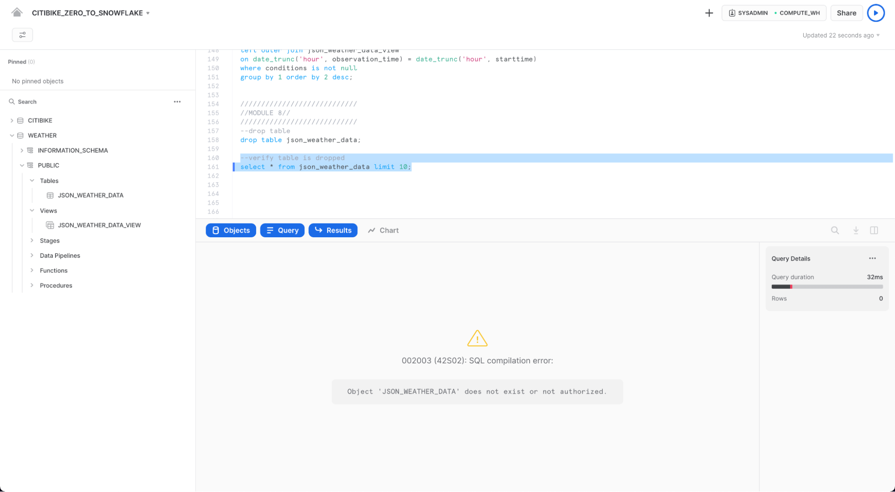

이제 이 테이블을 다음과 같이 복구합니다.

```SQL
undrop table json_weather_data;
```

json_weather_data 테이블을 복구해야 합니다.

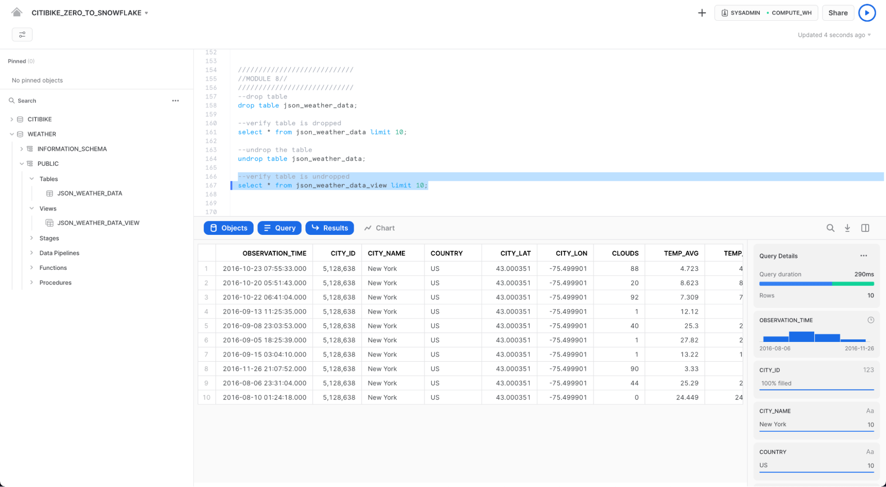

### 테이블 롤백

테이블을 이전 상태로 롤백하여  `CITIBIKE`  데이터베이스의  `TRIPS`  테이블에 있는 모든 스테이션 이름을 "oops"라는 단어로 대체하는 의도하지 않은 DML 오류를 수정하겠습니다.

먼저 워크시트의 컨텍스트가 적절한지 다음과 같이 확인합니다.

```SQL
use role sysadmin;
use warehouse compute_wh;
use database citibike;
use schema public;
```

다음의 명령을 실행하여 테이블의 모든 스테이션 이름을 "oops"라는 단어로 대체합니다.

```SQL
update trips set start_station_name = 'oops';
```

이제 자전거 이용 횟수별로 상위 20개 스테이션을 반환하는 쿼리를 실행합니다. 스테이션 이름 결과는 단 하나의 행으로 나옴에 주의하세요.

```SQL
select
start_station_name as "station",
count(*) as "rides"
from trips
group by 1
order by 2 desc
limit 20;
```


보통의 상황이라면 놀라는것도 잠시뿐 빨리 백업이 주변에 있기를 바랄 것입니다. Snowflake에서는, 단순히 명령을 실행하여 마지막 UPDATE 명령의 쿼리 ID를 찾아 $QUERY_ID라는 변수에 저장하면 됩니다.

```SQL
set query_id =
(select query_id from table(information_schema.query_history_by_session (result_limit=>5))
where query_text like 'update%' order by start_time limit 1);
```

올바른 스테이션 이름을 가진 테이블을 다음과 같이 다시 만듭니다.

```SQL
create or replace table trips as
(select * from trips before (statement => $query_id));
```

다음과 같이 SELECT 문을 다시 실행하여 스테이션 이름이 복구되었는지 확인합니다.

```SQL
select
start_station_name as "station",
count(*) as "rides"
from trips
group by 1
order by 2 desc
limit 20;
```


<!-- ------------------------ -->

## 역할 기반 액세스 제어, 계정 사용 및 계정 관리자

Duration: 8

이 섹션에서는 새로운 역할 생성 및 특정 권한 부여와 같은 Snowflake의 역할 기반 액세스 제어(RBAC) 측면을 살펴보고자 합니다. 또한  `ACCOUNTADMIN`(계정 관리자) 역할도 다뤄볼 것입니다.

Citi Bike 이야기를 계속하기 위해 주니어 DBA가 Citi Bike에 합류하여 시스템에서 정의한 기본 역할인  `SYSADMIN`보다 적은 권한을 지닌 새로운 역할을 만들고 싶다고 가정해 보겠습니다.

Negative
: **역할 기반 액세스 제어**  Snowflake는 사용자가 액세스할 수 있는 객체 및 기능과 액세스 수준을 지정하는 매우 강력하고 세분화된 RBAC를 제공합니다. 더 자세한 사항은  [Snowflake 설명서](https://docs.snowflake.net/manuals/user-guide/security-access-control.html)를 확인하십시오.

### 새로운 역할 생성 및 사용자 추가

워크시트에서  `ACCOUNTADMIN`  역할을 새로운 역할로 전환합니다.  `ACCOUNTADMIN` 은  `SYSADMIN`  및  `SECURITYADMIN`  시스템 정의 역할을 캡슐화합니다. 이는 시스템의 최상위 역할이며 계정에서 제한된 수의 사용자에게만 부여되어야 합니다. 워크시트에서 다음을 실행합니다.

```SQL
use role accountadmin;
```

워크시트의 오른쪽 상단에서 컨텍스트가  `ACCOUNTADMIN`

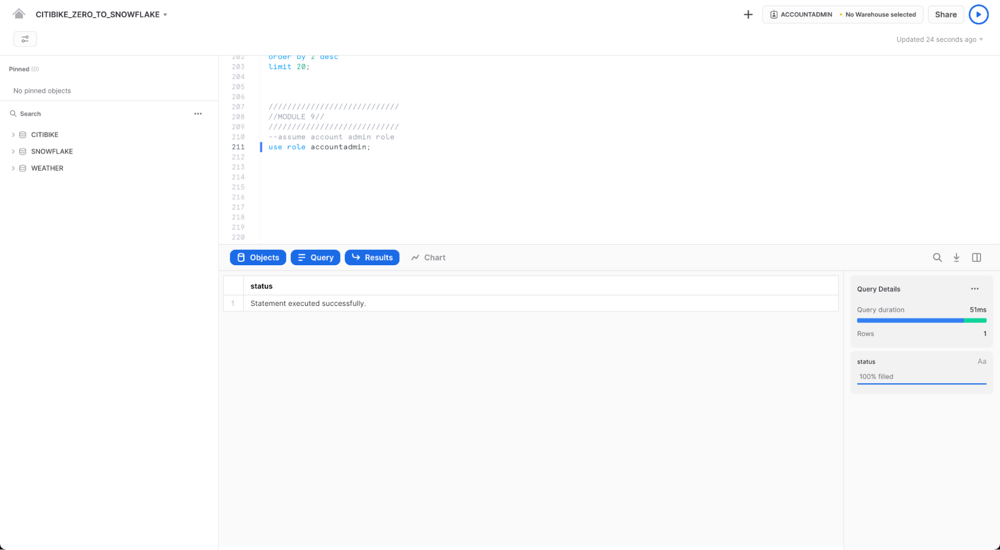

역할이 작동하려면 최소한 한 명의 사용자를 여기에 할당해야 합니다. 따라서  `junior_dba`  라는 새로운 역할을 생성해서 이를 사용자 이름에 할당하겠습니다. 사용자 이름은 UI의 오른쪽 상단에 나타납니다. 아래의 스크린샷에서 사용자 이름은  `USER123`입니다.


다음과 같이 역할을 생성하고 이를 사용자 이름에 부여합니다.

```SQL
create role junior_dba;
grant role junior_dba to user 유저 이름을 여기에 기입하세요;
```

Positive
: `SYSADMIN`과 같은 역할로 이 작업을 수행하려고 하면, 권한이 부족하여 실패할 것입니다. 기본적으로  `SYSADMIN`  역할은 새로운 역할이나 사용자를 생성할 수 없습니다.

워크시트 컨텍스트를 다음과 같이  `junior_dba`  역할로 변경합니다.

```SQL
use role junior_dba;
```

워크시트의 오른쪽 상단에서 컨텍스트가.`junior_dba`  역할을 반영하여 변경되었음에 주목하세요.

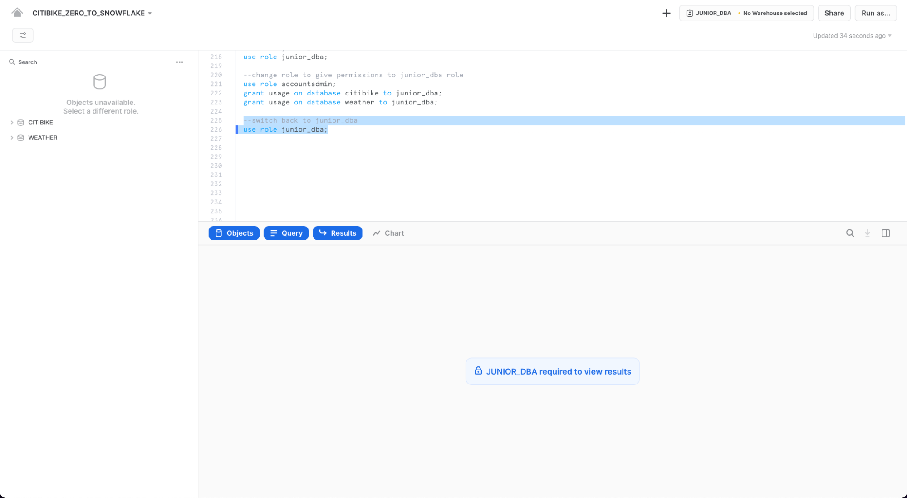

데이터베이스 객체 브라우저 창의 UI 왼쪽에  `CITIBIKE`  및  `WEATHER`  데이터베이스가 더 이상 나타나지 않습니다. 이는  `junior_dba`  역할이 이를 볼 수 있는 권한을 갖고 있지 않기 때문입니다.


`ACCOUNTADMIN`  역할로 다시 전환하고  `junior_dba`에  `CITIBIKE`와  `WEATHER`  데이터베이스를 볼 수 있는 권한을 부여합니다.

```SQL
use role accountadmin;
grant usage on database citibike to role junior_dba;
grant usage on database weather to role junior_dba;
```

`junior_dba`  역할로 다음과 같이 전환합니다.

```SQL
use role junior_dba;
```

이제  `CITIBIKE`  및  `WEATHER`  데이터베이스가 나타나는지 확인하십시오. 나타나지 않는다면 새로 고침 아이콘을 클릭하여 시도하십시오.

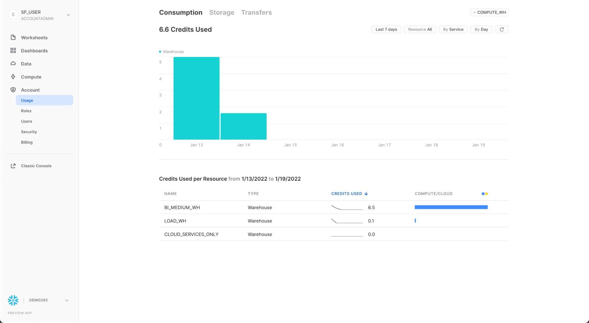

### 계정 관리자 뷰

보안 역할을  `ACCOUNTADMIN`로 변경하여 UI의 다른 부분이 이 역할에서만 접근 가능한 것인지 확인해보겠습니다.

UI의 오른쪽 상단 모서리에서, 사용자 이름을 클릭하여 사용자 기본 설정 메뉴를 표시합니다. 역할 전환으로 가서,  `ACCOUNTADMIN`  역할을 선택합니다.

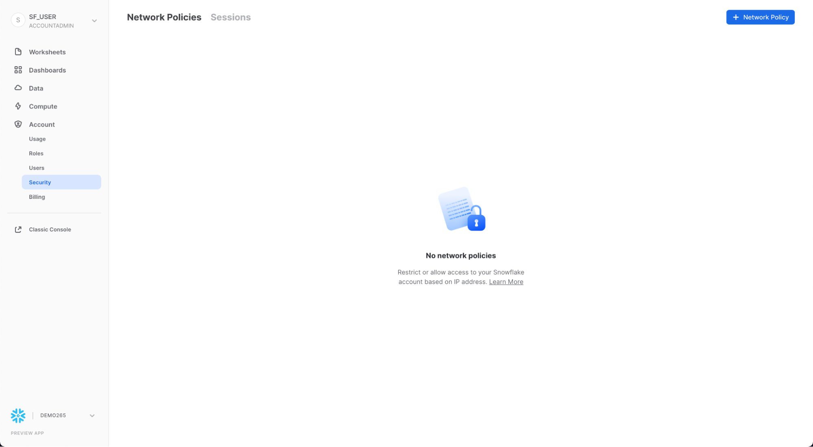

Negative
: **사용자 기본 설정의 역할 vs 워크시트**  사용자 기본 설정 메뉴에서 세션에 대한 보안 역할을 변경했습니다. 이는 특정 워크시트에 적용되는 역할을 할당하는 워크시트 컨텍스트 메뉴와는 다릅니다. 또한, 같은 시기의 세션 보안 역할이 워크시트에 사용된 역할과 다를 수 있습니다.

UI 상단에 이제  `ACCOUNTADMIN`  역할에서만 볼 수 있는 "Account"이라는 여섯 번째 탭이 표시될 것입니다.

이 Account 탭을 클릭합니다. 페이지 상단 쪽의 사용을 클릭합니다. 여기에서 클라우드 서비스를 포함하여 각 웨어하우스의 크레딧, 스토리지, 일별 또는 시간별 사용량에 대한 정보를 찾을 수 있습니다. 날짜를 선택하여 사용량을 검토하십시오.


사용량 오른쪽의 청구는 무료 평가판의 $400 크레딧에 이어 계속 사용할 수 있도록 신용 카드를 추가할 수 있는 곳입니다. 오른쪽으로 더 가면 사용자, 역할 및 리소스 모니터링에 관한 정보가 있습니다. 후자는 계정의 크레딧 소비에 대한 제한을 설정하여 크레딧을 적절하게 모니터링하고 관리할 수 있습니다.

다음 섹션을 위해  `ACCOUNTADMIN`  역할을 유지하십시오.

<!-- ------------------------ -->
## 안전한 데이터 공유 및 데이터 마켓플레이스
Duration:12

Snowflake는 공유를 통해 계정 간 데이터 액세스를 가능하게 합니다. 공유는 데이터 공급자가 생성하고 데이터 소비자가 자신의 Snowflake 계정 또는 프로비저닝된 Snowflake 읽기 전용 계정을 통해 가져옵니다. 소비자는 외부 엔터티 또는 고유한 Snowflake 계정이 필요한 다른 내부 비즈니스 단위일 수 있습니다.

다음을 통해 안전하게 데이터를 공유합니다.

-   데이터 사본은 하나뿐이며 데이터 제공자의 계정에 있음
-   공유 데이터는 항상 활성화되어 있고, 실시간이며 소비자가 즉시 사용할 수 있음
-   공급자가 공유에 대한 취소 가능하고 세분화된 액세스 권한을 설정할 수 있음
-   데이터 공유는 특히 인터넷을 통한 대용량  `.csv`  파일 전송을 포함하는 수동의 안전하지 않은 이전 데이터 공유 방법과 비교하여 간단하고 안전함

Positive
: 지역 또는 클라우드 공급자 간에 데이터를 공유하려면 복제(replication) 를 반드시 설정해야 합니다. 이는 이 랩의 범위를 벗어나는 것이지만, 더 상세한 정보를  [이 Snowflake 문서](https://www.snowflake.com/trending/what-is-data-replication)에서 확인하실 수 있습니다.

Snowflake는 보안 데이터 공유를 사용하여 모든 Snowflake 계정에 계정 사용량 데이터 및 샘플 데이터 세트를 제공합니다. 이러한 기능으로 보면, Snowflake는 데이터 제공자 역할을 하고 다른 모든 계정은 소비자 역할을 합니다.

보안 데이터 공유는 또한 Snowflake 데이터 마켓플레이스를 지원하며, 이는 모든 Snowflake 고객이 사용할 수 있는 것으로 여기에서 수많은 데이터 제공업체 및 SaaS 공급업체의 타사 데이터 세트를 검색하고 액세스할 수 있습니다. 다시 말하지만 이 예제에서 데이터는 공급자의 계정을 떠나지 않으며 변환 없이 데이터 세트를 사용할 수 있습니다.

### 기존 공유 보기

UI 최상단 왼쪽의 파란색 Snowflake 로고를 클릭합니다. 데이터베이스 객체 브라우저 페이지의 왼쪽에서  `SNOWFLAKE_SAMPLE_DATA`  데이터베이스를 확인하세요. 데이터베이스 아이콘에 있는 작은 화살표는 이것이 공유된 데이터베이스임을 나타냅니다.


UI의 상단 오른쪽에서 현재  `ACCOUNTADMIN`  역할로 되어 있음을 확인합니다. Shares 탭으로 이동하여 인바운드 보안 공유를 보고 있는지 확인합니다. Snowflake가 제공하는 공유에는 두 가지가 있습니다. 하나는 사용자 계정 사용량을 담고 있고, 다른 하나에는 샘플 데이터가 담겨 있습니다. 이것은 실행 중인 데이터 공유입니다 - Snowflake 계정은 Snowflake에서 공유하는 데이터의 소비자입니다!

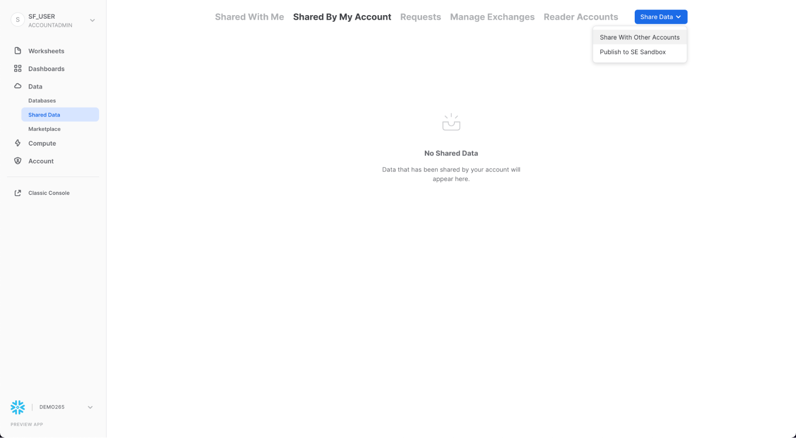

### 아웃바운드 공유 생성

Citi Bike 이야기로 돌아가서 우리가 Citi Bike의 Snowflake 계정 관리자라고 가정하겠습니다. TRIPS 데이터베이스의 데이터를 거의 실시간으로 분석하길 원하는 신뢰할 수 있는 파트너가 있습니다. 이 파트너는 또한 우리 지역에 속한 고유한 Snowflake 계정도 갖고 있습니다. 따라서 Snowflake 데이터 공유를 이용하여 그들이 이 정보에 액세스할 수 있도록 해보겠습니다.

Shares 탭으로 이동합니다. 페이지의 하단으로 더 내려가 아웃바운드 버튼을 클릭합니다.


만들기 버튼을 클릭하고 다음과 같이 필드를 채웁니다.

Secure Share Name: `TRIPS_SHARE`
Database: `CITIBIKE`
Tables & Views: `CITIBIKE` > `PUBLIC` > `TRIPS`.

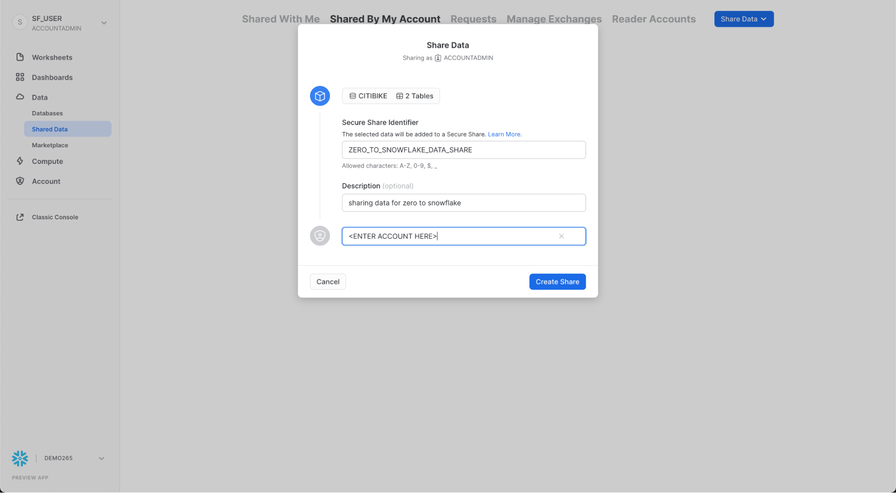

적용을 클릭한 뒤 만들기를 클릭합니다.

창에 보안 공유가 성공적으로 생성되었다고 나타났는지 확인합니다.

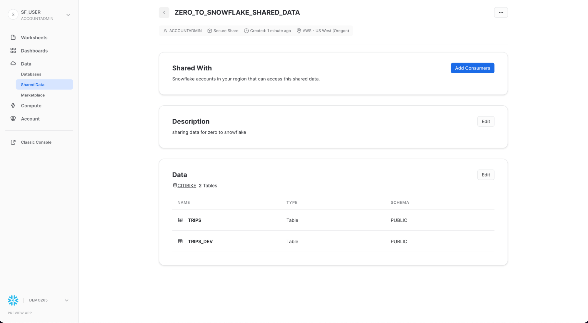

현실에서는, Citi Bike계정 관리자가 다음을 클릭할 것입니다. 소비자 추가 버튼을 클릭하여 파트너의 Snowflake 계정 이름과 유형을 입력합니다. 이 랩의 목적에 따라 여기까지 하겠습니다.

상자 하단의 완료 버튼을 클릭합니다.

이 페이지에 이제 TRIPS_SHARE 보안 공유가 표시됨을 확인합니다. 단 몇 초만에 다른 계정에 데이터 복사본이 필요 없는 안전한 방식으로 Snowflake의 데이터에 액세스 권한을 부여했습니다!


Snowflake는 기밀성을 해치지 않고 데이터를 안전하게 공유하는 여러 방법을 제공합니다. 테이블과 뷰뿐만 아니라 안전한 뷰, 안전한 UDF(사용자 정의 함수) 및 안전한 조인도 공유할 수 있습니다. 민감한 정보에 대한 액세스를 막으면서 이러한 방법을 데이터 공유에 사용하는 방법에 관한 더 자세한 내용은  [Snowflake 설명서](https://docs.snowflake.com/en/user-guide/data-sharing-secure-views.html)에서 확인하십시오.


### Snowflake 데이터 마켓플레이스

#### Data Marketplace 탭으로 이동합니다.


“Snowflake 데이터 마켓플레이스 탐색”을 선택합니다. 데이터 마켓플레이스를 처음 사용하는 경우 아래와 같은 로그인 화면이 나타납니다.


자격 증명을 입력하여 Snowflake 데이터 마켓플레이스에 액세스합니다.

Positive
:  `ACCOUNTADMIN`  역할로 되어 있는지 확인하십시오.


역할을 변경하려면, 다음 단계를 따라 하십시오.


#### 목록 찾기
상단 중앙의 검색 창을 사용하여 목록을 검색할 수 있습니다. 검색 상자 아래의 메뉴를 사용하면 공급자, 비즈니스 요구 사항 및 범주별로 데이터 목록을 필터링할 수 있습니다. 검색 상자에  **COVID**를 입력한 다음, Starschema COVID-19 Epidemiological Data 타일을 선택하십시오.

  


여기에서 데이터 세트에 대해 자세히 알아보고 몇 가지 사용 예제 쿼리를 볼 수 있습니다. 이제 데이터 얻기 버튼을 클릭하여 Snowflake 계정 내 이 정보에 액세스합니다.


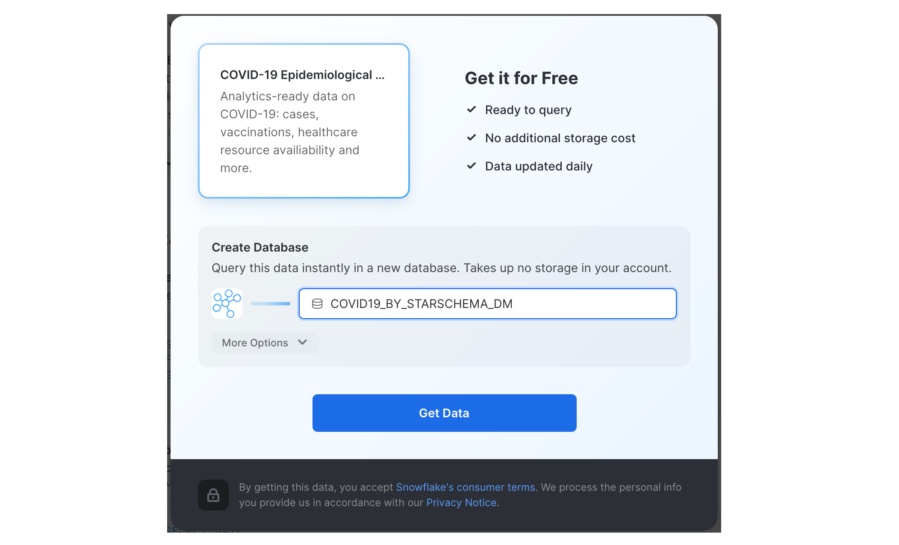


Positive
: 이제 새로운 Snowsight 사용자 인터페이스를 사용하고 있습니다. 이 새로운 사용자 인터페이스를 어떻게 사용하는지 더 자세히 알고 싶다면 여기로 이동하십시오.  [Snowsight Docs](https://docs.snowflake.com/en/user-guide/ui-snowsight.html#using-snowsight)

이제 Star Schema가 공급한 모든 샘플 쿼리를 실행할 수 있습니다. 실행하고자 하는 쿼리를 선택하고 오른쪽 상단 모서리의 실행 버튼을 클릭합니다. 하단 창에서 데이터 결과를 볼 수 있습니다. 샘플 쿼리를 실행하고 나면, 왼쪽 상단 모서리의  **집 아이콘**을 클릭합니다.


이제 왼쪽의 탐색 패널에서 데이터베이스 뷰로 이동합니다. 데이터, 그다음 데이터베이스를 클릭하고, COVID19_BY_STARSCHEMA_DM 데이터베이스를 클릭합니다. 이제 스키마, 테이블 및 뷰를 볼 수 있고 이를 쿼리에 사용할 수 있습니다.


이제 전 세계 COVID 데이터로 매일 업데이트되는 StarSchema의 COVID-19 데이터 세트를 성공적으로 구독하게 되었습니다. 데이터베이스, 테이블, 뷰 또는 ETL 프로세스를 생성할 필요가 없었음을 기억하세요. 단지 검색을 통해 Snowflake 데이터 마켓플레이스에서 공유된 데이터에 액세스하기만 하면 됩니다.

Snowsight 사용자 인터페이스를 사용하여 모든 쿼리를 실행하기를 강력히 권장드립니다. 이 새로운 사용자 인터페이스를 어떻게 사용하는지 더 자세히 알고 싶다면 여기로 이동하십시오.  [Snowsight Docs](https://docs.snowflake.com/en/user-guide/ui-snowsight.html#using-snowsight)


<!-- ------------------------ -->
## Snowflake 환경 초기화
Duration: 2

이 랩의 일부로 생성된 모든 객체를 삭제하여 환경을 초기화하려면 워크시트에서 아래의 SQL을 실행하십시오.

먼저 워크시트 컨텍스트를 다음과 같이 설정합니다.

```SQL
use role accountadmin;
use warehouse compute_wh;
use database weather;
use schema public;
```

그다음 이 SQL을 실행하여 이 랩에서 생성한 모든 객체를 삭제합니다.

```SQL
drop share if exists trips_share;
drop database if exists citibike;
drop database if exists weather;
drop warehouse if exists analytics_wh;
drop role if exists junior_dba;
```

<!-- ------------------------ -->

## 종료 및 다음 단계

Duration: 2

이 기초 랩 연습을 완료하신 것을 축하드립니다! Snowflake 기본 사항을 마스터했으며 이러한 기본 사항을 자신의 데이터에 적용할 준비가 되었습니다. 언제라도 기억을 떠올릴 때 필요하다면 이 안내서를 참조하십시오.

자체 샘플 또는 제품 데이터를 로드하고 이 랩에서 다루지 않은 Snowflake의 고급 기능 중 일부를 사용하여 무료 평가판을 계속 사용해 보시길 권해 드립니다.

### 추가 리소스:

-   새로운 Snowsight 사용자 인터페이스인  [Snowsight Docs](https://docs.snowflake.com/en/user-guide/ui-snowsight.html#using-snowsight)를 자세히 알아보십시오
-   [무료 평가판 극대화를 위한 가이드](https://www.snowflake.com/test-driving-snowflake-the-definitive-guide-to-maximizing-your-free-trial/)  문서를 확인하십시오
-   [Snowflake 가상 또는 현장 이벤트](https://www.snowflake.com/about/events/)에 참석하여 Snowflake의 기능 및 고객에 관해 자세히 알아보십시오.
-   [Snowflake 커뮤니티에 참여하세요](https://community.snowflake.com/s/topic/0TO0Z000000wmFQWAY/getting-started-with-snowflake)
-   [Snowflake University에 등록하세요](https://community.snowflake.com/s/article/Getting-Access-to-Snowflake-University)
-   더 자세한 내용은  [Snowflake 영업팀에 문의](https://www.snowflake.com/free-trial-contact-sales/)하시기 바랍니다

### 다룬 내용:

-   스테이지, 데이터베이스, 테이블, 뷰 및 웨어하우스를 생성하는 방법
-   정형 및 반정형 데이터를 로드하는 방법
-   테이블 간 조인을 포함하여 데이터를 쿼리하는 방법
-   객체를 복제하는 방법
-   사용자 오류를 실행 취소하는 방법
-   역할 및 사용자를 생성하고 권한을 부여하는 방법
-   다른 계정과 안전하고 쉽게 데이터를 공유하는 방법
