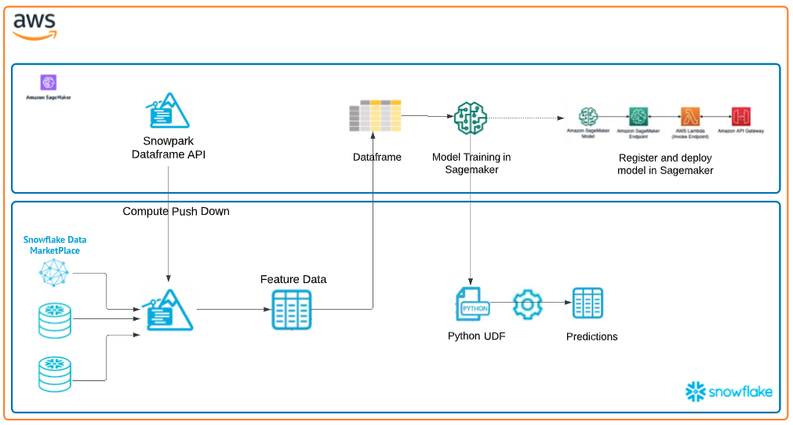
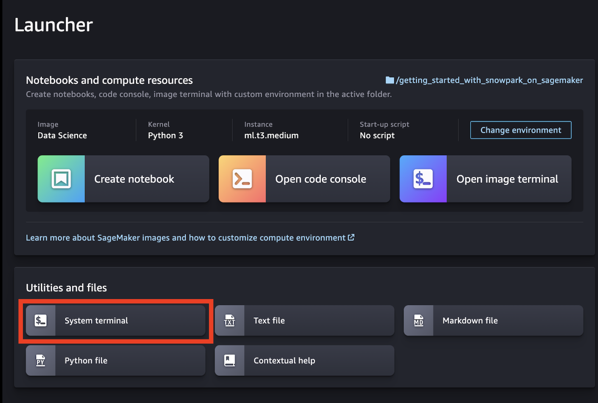
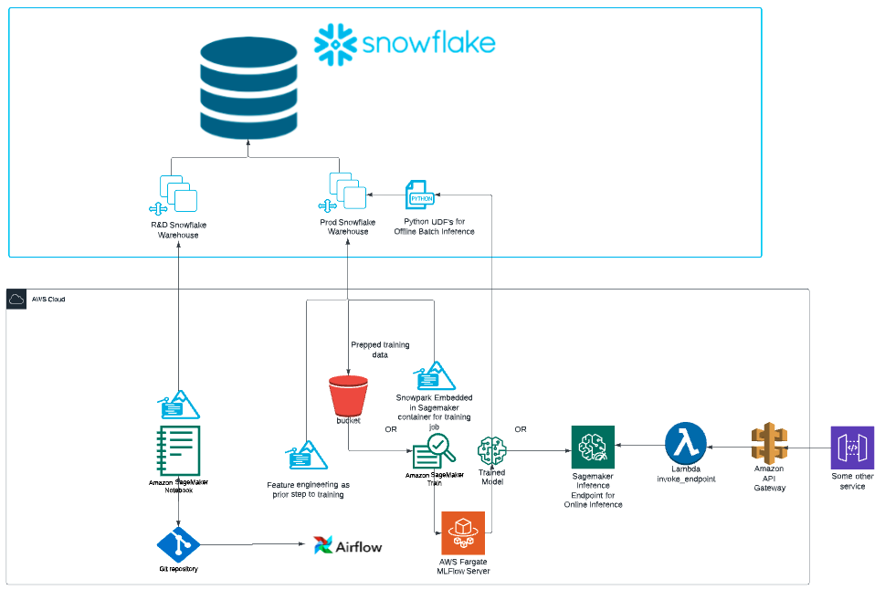

author: marzillo-snow
id: example_matt_marzillo
summary: This is a qucikstart for using Snowpark for ML on Sagemaker
categories: Getting-Started, data-science, data-engineering, aws, sagemaker
environments: web
status: Published 
feedback link: https://github.com/Snowflake-Labs/sfguides/issues
tags: Getting Started, Data Science, Data Engineering

# Getting Started with Snowpark for Machine Learning on Sagemaker
<!-- ------------------------ -->
## Overview 
Duration: 15

Python is the language of choice for Data Science and Machine Learning workloads. Snowflake has long supported Python via the Python Connector, allowing data scientists to interact with data stored in Snowflake from their preferred Python environment. This did, however, require data scientists to write verbose SQL queries. To provide a more friendly, expressive, and extensible interface to Snowflake, we built Snowpark Python, a native Python experience with a pandas and PySpark-like API for data manipulation. This includes a client-side API to allow users to write Python code in a Spark-like API without the need to write verbose SQL. Python UDF and Stored Procedure support also provides more general additional capabilities for compute pushdown.

Snowpark includes client-side APIs and server-side runtimes that extends Snowflake to popular programming languages including Scala, Java, and Python. Ultimately, this offering provides a richer set of tools for Snowflake users (e.g. Python's extensibility and expressiveness) while still leveraging all of Snowflake's core features, and the underlying power of SQL, and provides a clear path to production for machine learning products and workflows.

A key component of Snowpark for Python is that you can "Bring Your Own IDE"- anywhere that you can run a Python kernel, you can run client-side Snowpark Python. You can use it in your code development the exact same way as any other Python library or module. In this quickstart, we will be using Jupyter Notebooks, but you could easily replace Jupyter with any IDE of your choosing.

Amazon SageMaker is a fully managed machine learning service. With SageMaker, data scientists and developers can quickly and easily build and train machine learning models, and then directly deploy them into a production-ready hosted environment. It provides an integrated Jupyter authoring notebook instance for easy access to your data sources for exploration and analysis, so you don't have to manage servers. It also provides common machine learning algorithms that are optimized to run efficiently against extremely large data in a distributed environment. With native support for bring-your-own-algorithms and frameworks, SageMaker offers flexible distributed training options that adjust to your specific workflows.

This quickstart is designed to service as an introduction to using Sagemaker with Snowpark for model development and deployment to Snowflake. The idea is that users can build off this quickstart or integrate components into their existing Sagemaker workloads.

[GitHub](https://github.com/Snowflake-Labs/getting_started_with_snowpark_for_machine_learning_on_sagemaker)

### Prerequisites
- Familiarity with [Snowflake](https://quickstarts.snowflake.com/guide/getting_started_with_snowflake/index.html#0) and a Snowflake account
- Familiarity with Sagemaker and an AWS account
- Familiarity with [Python](https://www.udemy.com/course/draft/579706/)

### You'll Learn
- Using a Sagemaker Notebook with Snowpark
- Loading and transforming data via Snowpark
- Defining User Defined Functions for distributed scoring of machine learning models

### What You’ll Need 
- A free [Snowflake Account](https://signup.snowflake.com/)
- [AWS Account](https://aws.amazon.com/premiumsupport/knowledge-center/create-and-activate-aws-account/)
- The AWS account should be a sandbox account with open network policies or you you should [create a VPC](https://docs.aws.amazon.com/vpc/latest/userguide/working-with-vpcs.html) in the same region as the Snowflake account
- In the VPC [create subnets](https://docs.aws.amazon.com/vpc/latest/userguide/VPC_Internet_Gateway.html) in a few AZs with an internet gateway to allow egress traffic to the internet by using a routing table and security group for outbound traffic

### What You’ll Build 
You will build an end-to-end data science workflow leveraging Snowpark for Python
- to load, clean and prepare data
- to train a machine learning model using Python in a Sagemaker notebook
- to deploy the trained models in Snowflake using Python User Defined Functions (UDFs)

The end-to-end workflow will look like this:


<!-- ------------------------ -->
## Use Case
Duration: 5

In this use case you will build a binary model based on the 'Machine Predictive Maintenance Classification' dataset from [Kaggle](https://www.kaggle.com/datasets/shivamb/machine-predictive-maintenance-classification). We supplement this dataset with data from the Snowflake [data marketplace](https://www.snowflake.com/en/data-cloud/marketplace/).

The use case uses information related to machine diagnostics (torque, rotational speed) and environmental features (air temperature, humidity) to predict the likelihood of a failure.

<!-- ------------------------ -->
## Set Up and Load Data
Duration: 15

First, you will access your AWS Sagemaker Studio and change the environment so that you are using an image that utilizes Python version 3.8. The Pytorch 3.8 or Tensorflow 3.8 will work for this quickstart.


Now open up a terminal window: 


In the terminal window you will copy the public repo that contains the data and scripts needed for this quickstart.
```bash
git clone https://github.com/marzillo-snow/getting_started_with_snowpark_on_sagemaker
cd getting_started_with_snowpark_on_sagemaker
```

Work through the set up script here to crate a database, warehouse and load the data: 
[0_setup.ipynb](https://github.com/marzillo-snow/getting_started_with_snowpark_on_sagemaker/blob/main/0_setup.ipynb).

Once complete with the script, check back to your Snowflake environment to make sure that your data has loaded. You just a little bit of Snowpark to get that data loaded!


<!-- ------------------------ -->
## Build and Deploy model
Duration: 10
Work through the 1_prepare_build_deploy_model.ipynb workbook to join together the datasets, bring in the training data then build and deploy the model. 

[1_prepare_build_deploy_model.ipynb](https://github.com/marzillo-snow/getting_started_with_snowpark_on_sagemaker/blob/main/1_prepare_build_deploy_model.ipynb)

Once that notebook is complete you will have a udf that you can use to generate predictions in your Snowflake environment! you can do this via Snowpark Python code or Snowflake SQL. Let's generate predictions with this udf with Snowflake SQL. Copy and paste the code below into your snowflake environment to generate inference.

```bash
use role accountadmin;
select predict_failure(AIR_TEMPERATURE_K,
       PROCESS_TEMPERATURE, ROTATIONAL_SPEED_RPM, TORQUE_NM,
       TOOL_WEAR_MIN, HUMIDITY_RELATIVE_AVG) as predicted_failure, * from maintenance_hum;
```


<!-- ------------------------ -->
## Conclusion and Additional Considerations
Duration: 5

This quickstart is just that, a quick way to get you started with using Sagemaker with Snowflake and Snowpark. For enterprise uses, data scientists and developers will want to consider additional details. Most important is considering the tracking of the mlops lineage from data to model to deployment. A more mature architecture will include the additional steps below which include the registration of the data and the model.


Credit: Chase Ginther

Looking specifically at Sagemaker two additional considerations that you may want to consider are:
1. Rather than using an pre-built image then installing packages, you may want to crate your own custom image that includes the Snowpark packages and other packages that you commonly use.
2. You may know that the Snowpark sandbox on Snowflake includes Anaconda supported packages which inludes the scikitlearn package that was used to build the logistic regression model. If you use other packages to build your models that are not supported by Anaconda you will have to install [third party packages in the Snowpark sandbox](https://docs.snowflake.com/en/developer-guide/udf/python/udf-python-packages.html).

### What We covered
- Using a Sagemaker Studio with Snowpark
- Loading and transforming data via Snowpark with pushdown compute
- Deploying models to Snowflake via a User Defined Function

### Additional Considerations
- There are some great blogs on Medium regarding Snowpark, Sagemaker and using Snowflake with AWS.

- [Snowpark for python with Sagemaker](https://medium.com/snowflake/using-snowpark-for-python-with-amazon-sagemaker-44ec7fdb4381)

- [Operationalizing Snowpark](https://medium.com/snowflake/operationalizing-snowpark-python-part-one-892fcb3abba1)

- [AWS and Snowflake](https://aws.amazon.com/financial-services/partner-solutions/snowflake/)

If you have any questions, reach out to your Snowflake account team!