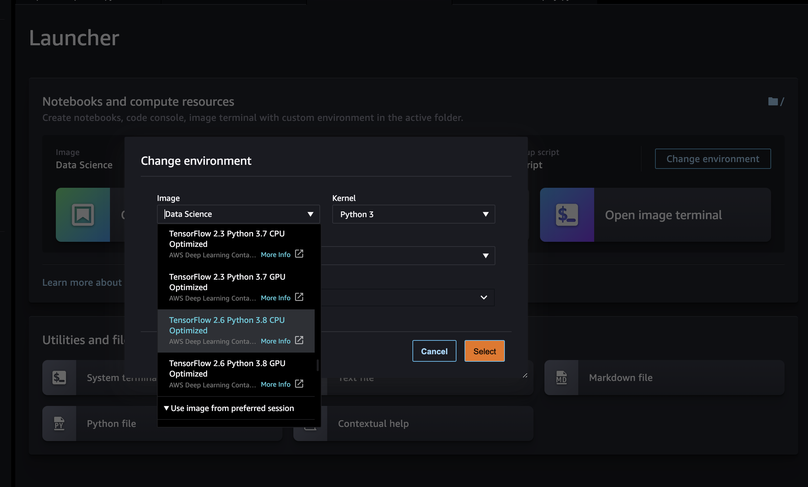
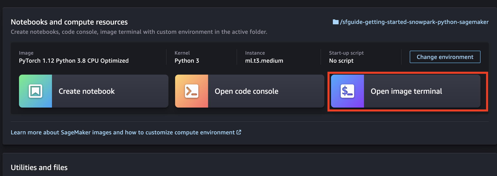

author: marzillo-snow
id: getting_started_with_snowpark_for_machine_learning_on_sagemaker
summary: This is a qucikstart for using Snowpark for ML on SageMaker
categories: getting-started,data-science-&-ml,data-engineering,app-development
environments: web
status: Published 
feedback link: https://github.com/Snowflake-Labs/sfguides/issues
tags: Getting Started, Data Science, Data Engineering

# Getting Started with Snowpark for Machine Learning on SageMaker
<!-- ------------------------ -->
## Overview 
Duration: 15

Python is the language of choice for Data Science and Machine Learning workloads. Snowflake has long supported Python via the Python Connector, allowing data scientists to interact with data stored in Snowflake from their preferred Python environment. This did, however, require data scientists to write verbose SQL queries. To provide a more friendly, expressive, and extensible interface to Snowflake, we built Snowpark Python, a native Python experience with a pandas and PySpark-like API for data manipulation. This includes a client-side API to allow users to write Python code in a Spark-like API without the need to write verbose SQL. Python UDF and Stored Procedure support also provides more general additional capabilities for compute pushdown.

Snowpark includes client-side APIs and server-side runtimes that extends Snowflake to popular programming languages including Scala, Java, and Python. Ultimately, this offering provides a richer set of tools for Snowflake users (e.g. Python's extensibility and expressiveness) while still leveraging all of Snowflake's core features, and the underlying power of SQL, and provides a clear path to production for machine learning products and workflows.

A key component of Snowpark for Python is that you can "Bring Your Own IDE"- anywhere that you can run a Python kernel, you can run client-side Snowpark Python. You can use it in your code development the exact same way as any other Python library or module. In this quickstart, we will be using Jupyter Notebooks, but you could easily replace Jupyter with any IDE of your choosing.

Amazon SageMaker is a fully managed machine learning service. With SageMaker, data scientists and developers can quickly and easily build and train machine learning models, and then directly deploy them into a production-ready hosted environment. It provides an integrated Jupyter authoring notebook instance for easy access to your data sources for exploration and analysis, so you don't have to manage servers. It also provides common machine learning algorithms that are optimized to run efficiently against extremely large data in a distributed environment. With native support for bring-your-own-algorithms and frameworks, SageMaker offers flexible distributed training options that adjust to your specific workflows.

This quickstart is designed to service as an introduction to using SageMaker with Snowpark for model development and deployment to Snowflake. The idea is that users can build off this quickstart or integrate components into their existing SageMaker workloads.

### Prerequisites
- Familiarity with [Snowflake](https://quickstarts.snowflake.com/guide/getting_started_with_snowflake/index.html#0) and a Snowflake account
- Familiarity with SageMaker and an AWS account
- Familiarity with [Python](https://www.udemy.com/course/draft/579706/)

### You'll Learn
- Using a SageMaker Notebook with Snowpark
- Loading and transforming data via Snowpark
- Defining User Defined Functions for distributed scoring of machine learning models

### What You’ll Need 
- A free [Snowflake Account](https://signup.snowflake.com/)
- [AWS Account](https://aws.amazon.com/premiumsupport/knowledge-center/create-and-activate-aws-account/)
- The AWS account should be a sandbox account with open network policies or you you should [create a VPC](https://docs.aws.amazon.com/vpc/latest/userguide/working-with-vpcs.html) in the same region as the Snowflake account
- In the VPC [create subnets](https://docs.aws.amazon.com/vpc/latest/userguide/VPC_Internet_Gateway.html) in a few AZs with an internet gateway to allow egress traffic to the internet by using a routing table and security group for outbound traffic

### What You’ll Build 
You will build an end-to-end data science workflow leveraging Snowpark for Python
- to load, clean and prepare data
- to train a machine learning model using Python in a SageMaker notebook
- to deploy the trained models in Snowflake using Python User Defined Functions (UDFs)

The end-to-end workflow will look like this:


<!-- ------------------------ -->
## Use Case
Duration: 5

In this use case you will build a binary model based on the 'Machine Predictive Maintenance Classification' dataset from [Kaggle](https://www.kaggle.com/datasets/shivamb/machine-predictive-maintenance-classification). We supplement this dataset with data from the Snowflake [data marketplace](https://www.snowflake.com/en/data-cloud/marketplace/).

The use case uses information related to machine diagnostics (torque, rotational speed) and environmental features (air temperature, humidity) to predict the likelihood of a failure.

<!-- ------------------------ -->
## Set Up Snowflake Environment
Duration: 5

The first thing we will do is create a database and warehouse in your Snowflake environment. Run the below code in a Snowflake worksheet.
```sql
use role accountadmin;

CREATE OR REPLACE WAREHOUSE HOL_WH WITH WAREHOUSE_SIZE='X-SMALL';

CREATE OR REPLACE DATABASE HOL_DB;
```

# Double check Anaconda Terms. Instructions provided here
https://docs.snowflake.com/en/developer-guide/udf/python/udf-python-packages#using-third-party-packages-from-anaconda

1. Sign in to Snowsight.
2. Select Admin » Billing & Terms.
3. In the Anaconda section, select Enable.
4. In the Anaconda Packages dialog, click the link to review the Snowflake Third Party Terms page.
5. If you agree to the terms, select Acknowledge & Continue.

<!-- ------------------------ -->
## Set Up Sagemaker Environment
Duration: 5

If you haven't used SageMaker Studio before, for first time setup you will need to create a SageMaker Studio domain by following the [Quick setup](https://docs.aws.amazon.com/sagemaker/latest/dg/onboard-quick-start.html) process. After creating your domain you should be able to [Launch SageMaker Studio from the Domain details page](https://docs.aws.amazon.com/sagemaker/latest/dg/studio-launch.html#studio-launch-console-domain).

Once you've opened SageMaker Studio, our first step will be to launch a Python 3.8 notebook environment for Snowpark compatibility. To do this, select the 'Open Launcher' tile from the Home tab and then 'Change environment' so that you are using an image that utilizes Python version 3.8. The following images will work well for this quickstart:
- PyTorch 1.12 Python 3.8 CPU Optimized
- TensorFlow 2.6 Python 3.8 CPU Optimized



> Notes: 
New AWS accounts will come with VPC & subnets with internet gateway for egress. 
SageMaker is slow and it's good to double check things for each SageMaker step.

<!-- ------------------------ -->
## Clone Github Repo
Duration: 5

Now open up a terminal window:


In the terminal window you will copy the public repo that contains the data and scripts needed for this quickstart.
```bash
git clone https://github.com/Snowflake-Labs/sfguide-getting-started-snowpark-python-sagemaker.git
cd sfguide-getting-started-snowpark-python-sagemaker
```

Next, Open up the image terminal to install packages from the Snowflake Conda channel:


```bash
conda install -c https://repo.anaconda.com/pkgs/snowflake snowflake-snowpark-python pandas notebook scikit-learn cachetools
```

> Note: The versions at the time of writing this -- snowflake-snowpark-python 1.0.0


<!-- ------------------------ -->
## Load data into Snowflake
Duration: 5

You should now be able to navigate back to the 'File Browser' tab on the left and see your clone repo. Open the first notebook (ensure that you select the correct notebook environment), [0_setup.ipynb](https://github.com/Snowflake-Labs/sfguide-getting-started-snowpark-python-sagemaker/blob/main/0_setup.ipynb) and work through the set up script here to create a database, warehouse and load the data. Your chosen role will need to have permissions to create these objects - if you are in a fresh lab account, the `ACCOUNTADMIN` role will work, but note that this wouldn't be used in a production setting.

You will need to enter your user and account credentials, and it is important that your `account` is in the correct format as outlined in the [Snowflake documentation](https://docs.snowflake.com/en/user-guide/admin-account-identifier#non-vps-account-locator-formats-by-cloud-platform-and-region). Your `host` will be your `account` ID followed by `.snowflakecomputing.com`, for example:
```python
connection_parameters = {
    "account": "hk12345.eu-west-2.aws",
    "host": "hk12345.eu-west-2.aws.snowflakecomputing.com",
    "user": <your_user>, 
    "password": <your_password>,
    "role": <your_role>, # using "ACCOUNTADMIN" may simplify things in an isolated lab environment
    }
```
> Tip for finding Snowflake account ID:
```sql
use role orgadmin;
show organization accounts;
```
Scroll to account_url and copy the URL

i.e. https://hvxehhp-bxb87833.snowflakecomputing.com

Account = hvxehhp-bxb87833
Host = hvxehhp-bxb87833.snowflakecomputing.com

> Note: for simplicity in this lab you will need to enter your account and user credentials directly in your notebook. For a production setup, this would be a security risk so AWS Secrets Manager or a similar tool would be appropriate.

Once complete with the script, check back to your Snowflake environment to make sure that your data has loaded. Review the steps as you go: you just used a little bit of Snowpark to get that data loaded via the `session.write_pandas` function!


### Troubleshooting `pyarrow` related issues

- If you have `pyarrow` library already installed, uninstall it before installing Snowpark.
- If you do not have `pyarrow` installed, you do not need to install it yourself; installing Snowpark automatically installs the appropriate version.
- Do not reinstall a different version of `pyarrow` after installing Snowpark.

<!-- ------------------------ -->
## Build and Deploy Model
Duration: 10

Now open and work through the `1_prepare_build_deploy_model.ipynb` workbook to join together the datasets, bring in the training data then build and deploy the model. Once again, make sure to select the correct python environment.

[1_prepare_build_deploy_model.ipynb](https://github.com/Snowflake-Labs/sfguide-getting-started-snowpark-python-sagemaker/blob/main/1_prepare_build_deploy_model.ipynb)

Once that notebook is complete you will have a udf that you can use to generate predictions in your Snowflake environment! you can do this via Snowpark Python code or Snowflake SQL. Let's generate predictions with this udf with Snowflake SQL. Copy and paste the code below into your snowflake environment to generate inference.

```sql
use role accountadmin;
select predict_failure(AIR_TEMPERATURE_K,
       PROCESS_TEMPERATURE, ROTATIONAL_SPEED_RPM, TORQUE_NM,
       TOOL_WEAR_MIN, HUMIDITY_RELATIVE_AVG) as predicted_failure, * from maintenance_hum;
```


<!-- ------------------------ -->
## Conclusion and Additional Considerations
Duration: 5

This quickstart is just that, a quick way to get you started with using SageMaker with Snowflake and Snowpark. For enterprise uses, data scientists and developers will want to consider additional details. Most important is considering the tracking of the mlops lineage from data to model to deployment. A more mature architecture will include the additional steps below which include the registration of the data and the model.


Credit: Chase Ginther

Looking specifically at SageMaker two additional considerations that you may want to consider are:
1. Rather than using an pre-built image then installing packages, you may want to crate your own custom image that includes the Snowpark packages and other packages that you commonly use.
2. You may know that the Snowpark sandbox on Snowflake includes Anaconda supported packages which inludes the scikitlearn package that was used to build the logistic regression model. If you use other packages to build your models that are not supported by Anaconda you will have to install [third party packages in the Snowpark sandbox](https://docs.snowflake.com/en/developer-guide/udf/python/udf-python-packages.html).

### What We covered
- Using a SageMaker Studio with Snowpark
- Loading and transforming data via Snowpark with pushdown compute
- Deploying models to Snowflake via a User Defined Function

### Additional Considerations
- There are some great blogs on Medium regarding Snowpark, SageMaker and using Snowflake with AWS.

- [Snowpark for python with SageMaker](https://medium.com/snowflake/using-snowpark-for-python-with-amazon-sagemaker-44ec7fdb4381)

- [Operationalizing Snowpark](https://medium.com/snowflake/operationalizing-snowpark-python-part-one-892fcb3abba1)

- [AWS and Snowflake](https://aws.amazon.com/financial-services/partner-solutions/snowflake/)

If you have any questions, reach out to your Snowflake account team!